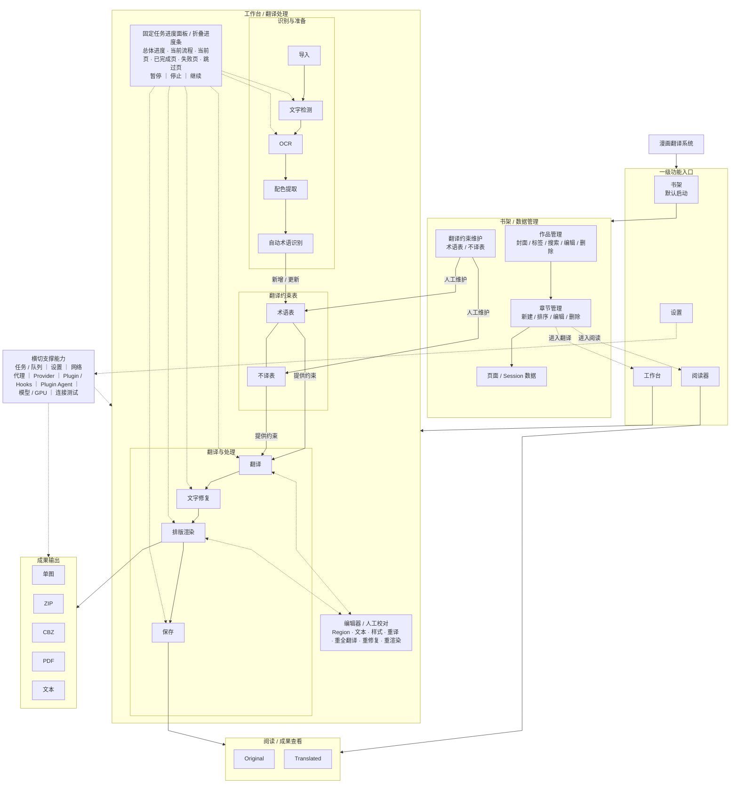

# 01 目标系统功能架构(Target Functional Architecture)

> 本文件定义新漫画翻译软件的**目标功能架构（To-Be）**。
> 功能设计综合来源于现有代码能力、现有 UI、已确认需求及新增规划；本文件重点定义“系统应具备什么能力，以及各能力之间如何关联”。
> 具体技术实现、数据模型、UI 映射、接口设计、测试与验收标准由后续专项文档定义。

## 1. 目标功能总览图(To-Be)

> 软件启动默认进入**书架**。书架、工作台、阅读器、设置为四个同级一级页面；书架中的章节可跳转到工作台或阅读器，但不构成上下级关系。除四个一级页面之间的切换外，其他业务内容优先使用当前页面固定区域，不适合固定展示的内容使用悬浮窗。

---

## 2. 目标功能范围

| 提问概念 |
|---|
| 书架 |
| 作品(Book) |
| 章节(Chapter) |
| 页面(Page) |
| Viewer |
| Region |
| OCR |
| 翻译 |
| 图片处理 |
| 排版 |
| 校对 |
| 导出 |
| 设置 |
| 网络代理 |
| Provider |
| Plugin |
| 任务/队列(Pipeline/Queue) |
| 任务进度面板 / 进度条 |

补充扩展能力：PDF/MOBI 导入解析、AI 生成插件 Agent、字体上传、Sakura 本地服务监控。

网络代理作为目标横切能力，支持 `Direct / System / HTTP / HTTPS / SOCKS5`，并允许 Provider 级覆盖、直连/绕过规则和连接测试；本地服务默认可配置为直连。

---

## 3. 目标能力关系说明

- **层级 1 一级入口**：书架、工作台、阅读器、设置为四个同级一级页面；软件默认启动进入书架。书架中的章节可跳转到工作台或阅读器，但不构成上下级关系。
- **层级 2 翻译处理**：工作台负责导入、文字检测、OCR、配色提取、自动术语识别、翻译、文字修复、排版渲染和保存。
- **层级 3 翻译约束**：自动识别的术语写入或更新作品级翻译约束表；术语表和不译表持续为后续翻译提供约束，同时支持人工维护。
- **层级 4 编辑与校对**：编辑器用于气泡、文本、样式、重译、重渲染等人工修正，并与翻译处理流程双向协作。
- **层级 5 数据与成果**：书架负责作品、章节、页面和翻译约束等数据管理；阅读器负责查看原图和译图；成果输出负责单图、ZIP、CBZ、PDF 和文本导出。
- **层级 6 横切支撑**：统一任务 / 队列、任务进度面板、设置、网络代理、Provider、Plugin / Hooks、Plugin Agent、模型 / GPU、连接测试等能力为核心业务提供统一支撑；长耗时任务统一进入任务系统，外部网络访问统一遵循软件代理策略。任务运行时，工作台固定进度面板（折叠时显示为进度条）同步显示总体进度、当前处理流程、当前页、已完成页、失败页、跳过页，并提供暂停、停止、继续操作。

## 4. 任务进度面板（目标功能）

工作台必须提供统一的**任务进度面板**，推荐固定在工作台底部，可折叠为紧凑进度条，不作为独立页面或临时弹窗。

面板至少显示：

- 当前任务名称与作用范围。
- 总体进度百分比。
- 当前翻译流程 / 当前 Step，例如：`检测 → OCR → 配色 → 术语 → 翻译 → Mask → 修复 → 渲染 → 保存`。
- 当前正在处理的 Page（文件名 / 页序，可显示小缩略图）。
- 已完成页数及对应页面。
- 失败页数及对应页面。
- 跳过页数及对应页面。
- 等待处理页数。
- `暂停 / 停止 / 继续` 控制。

交互规则：

- **暂停**：不再启动新的 Page / Step；当前不可安全中断的 Step 可完成后进入暂停状态。
- **继续**：从已保存的断点恢复，不重新执行已经成功且仍有效的步骤。
- **停止**：停止当前 PipelineRun 的剩余任务；已完成页面与 Artifact / Revision 全部保留，不回滚已完成成果。
- 点击“已完成 / 失败 / 跳过”统计，可筛选或定位对应页面。
- 点击“当前页”，页面列表应定位到当前正在处理的 Page。
- 页面列表同步显示 `等待 / 处理中 / 已完成 / 失败 / 跳过 / 已锁定`。
- 批量任务中存在少量失败页，但其他页面已处理完成时，任务汇总显示为**已完成（有失败）**，而不是把全部成果视为失败。

---

## 5. OCR / 翻译 / 修复 / 检测 目标能力矩阵

> 本仓库未提供下表引用的旧源码路径；它们仅是历史材料中的迁移参考，当前不可核验，也不构成本仓库已实现能力。除明确写为目标规划的条目外，具体引擎、Provider 数量、默认值与阈值均须由后续源码或实验重新证明。

### OCR（历史迁移参考 + 目标扩展）
| 引擎 ID | 目标能力 / 实现方式 | 历史材料引用（本仓库无此文件）/ 目标规划 |
|---|---|---|
| `manga_ocr` | manga_ocr 库,GPU 自动检测 | `manga_ocr_interface.py:44-67` |
| `48px_ocr` | 本地 ckpt,含文字色预测 | `ocr_48px/interface.py:121` |
| `paddle_ocr` | RapidOCR ONNX(无 paddle 本体) | `paddle_ocr_onnx_interface.py:33` |
| `paddleocr_vl` | VLM(transformers) | `paddleocr_vl_interface.py:68` |
| `baidu_ocr` | 百度云 API | `baidu_ocr_interface.py:11` |
| `ai_vision` | 任意 visionOcr 能力 LLM | `vision_interface.py:50` |
| 混合 | manga_ocr↔48px 置信度回退(阈值默认 0.2) | `ocr_hybrid_manga_48.py:24-32,250-274` |
| `paddleocr_korean` | **韩国条漫优先 OCR**：使用 PaddleOCR 韩文专用识别模型，面向韩文横排对白、旁白及常规拟声词；长条 Webtoon 建议先切片/分区后识别，复杂艺术字可回退到 Vision OCR | **目标规划**；韩国条漫 OCR 专项能力 |
| `openai_compatible_vision_ocr` | **OpenAI-compatible Vision OCR 接入层**：支持配置 `base_url`、`api_key`、`model`，通过 OpenAI 兼容图片输入格式提交 URL/Base64 图片；用于接入 OpenAI 及其他兼容 Vision API 服务 | **目标规划**；作为通用 Provider 适配层，不与单一厂商绑定 |

### 翻译 Provider（历史材料称 15 个、manifest 驱动；当前仓库不可核验）
- 批量 LLM(OpenAI 兼容):siliconflow、deepseek、volcano、gemini、custom、ollama、openai、qwen
- 本地特殊:sakura(硬编码轻小说提示词,`translation.py:318-325`)
- 逐条 adapter:caiyun、baidu_translate、youdao_translate
- 非 translation 能力:gpt2api/newapi(imageGen)、jina/cohere(rerank)
- 历史材料引用（本仓库无此文件）：`src/shared/ai_provider_manifest.json`；`ai_providers.py:52-230`

### 图片文字消除 / 修复（目标多级策略）

图片修复采用“**文字分割 / Mask 精修 + 多级修复路由**”，不再把所有场景固定交给单一模型。

| 场景 / 能力 | 目标路线 | 定位 |
|---|---|---|
| 文字像素提取 | Text Segmentation | 从文字检测区域中进一步提取真实文字像素，减少误伤背景 |
| Mask 精修 | OpenCV Mask Refinement | 膨胀、去噪、边界保护、线稿保护，为后续修复生成更准确 Mask |
| 白色/纯色气泡、小面积文字 | Simple Fill / 局部颜色采样 | 极速、稳定，避免不必要的生成式重建 |
| 普通黑白日漫、常规线稿 | Anime / Manga LaMa | 默认本地修复路线 |
| 网点、结构连续区域 | AOT-GAN / Manga LaMa | 作为结构型备用路线 |
| 韩国彩色 Webtoon、渐变、特效、复杂背景 | BrushNet / PowerPaint | 高质量复杂背景修复 |
| 文字覆盖人物、建筑、关键纹理或前述路线失败 | FLUX Fill | 最高质量回退，不作为默认批处理模型 |

修复链路：

`文字检测 → 文字分割 → Mask 精修 → Inpaint Router → 自动选择修复路线`

Router 应根据背景复杂度、Mask 面积、线稿/网点、彩色 Webtoon、结构穿越、质量模式、设备能力和 Provider 可用性选择合适方案。

自动修复不得覆盖已经人工确认的修复结果；原图必须保留，允许按 Region / Page 重跑与回退。

### 检测（历史迁移参考 + 目标衔接）
历史材料引用（本仓库无此文件）：`default`(DBNet ResNet34,**默认**)、`ctd`、`yolo`(YSGYolo)、`saber_yolo`(仅二阶段纠错);辅助:aux_yolo 融合(默认关,`constants.py:455`)、大图切片(缩放比>2.5 或长宽比>3.0 时,`constants.py:494-495`)——`detector/registry.py:18-33`。

目标架构中，文字检测结果继续进入 **Text Segmentation → Mask Refinement**，为图片文字消除/修复提供高质量 Mask。
