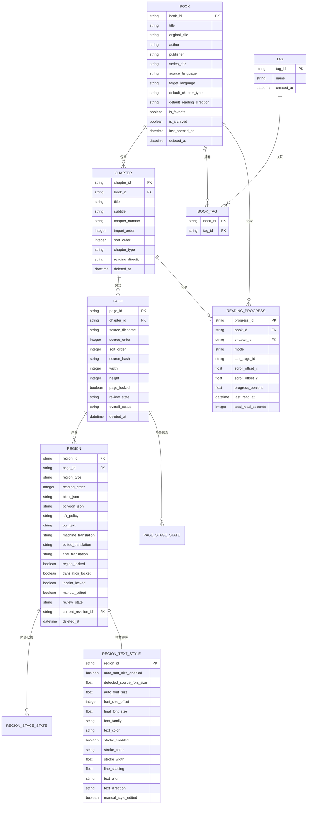
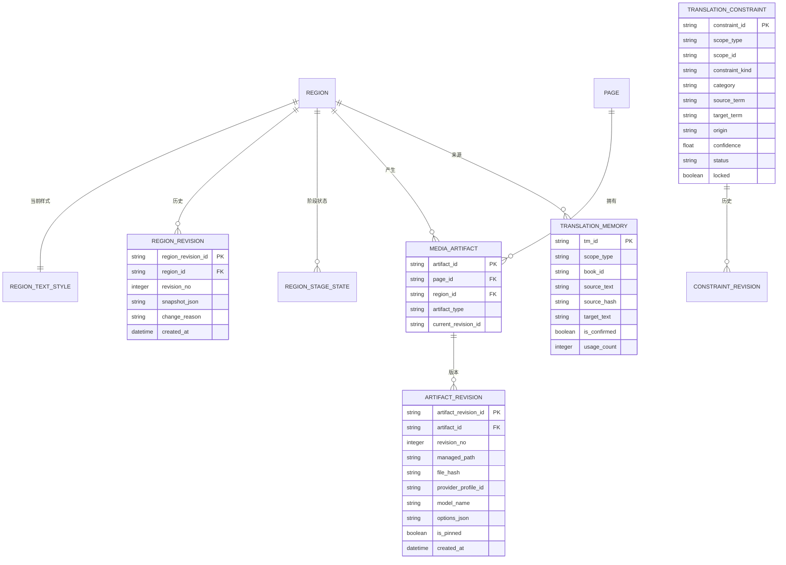
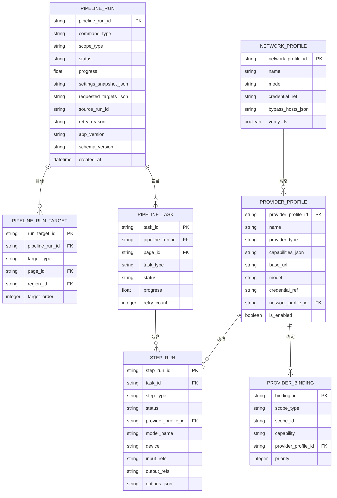

# 03 数据模型与 ER 设计（Target Data Model）

> 本文件定义新漫画翻译软件的目标数据模型（To-Be），用于指导 SQLite Schema、Repository、Domain Model、Pipeline 状态、Revision、Managed Copy、阅读进度、Provider/Profile、网络代理与后续 UI 映射设计。
>
> 本文件基于：
> - `01_FUNCTIONAL_ARCHITECTURE.md`
> - `02_TECHNICAL_ARCHITECTURE_.md`
> - 已确认的产品规则与交互规则
>
> 本文件描述“什么数据是系统真值、实体之间如何关联、状态如何演进、哪些数据进入 SQLite、哪些数据进入 Managed File Storage”。
> G06～G13 涉及的最小字段、枚举、约束和原子写回规则以 [TASK-002 最小契约](contracts/TASK-002_MINIMUM_DATA_EXECUTION_CONTRACT.md) 为冻结解释。
>
> 核心约束：
> 1. 单用户、本机架构，不引入 User / Account / Permission 业务表。
> 2. SQLite 保存结构化真值；图片、Mask、清理图、译图、缩略图、导出文件等大型二进制资产保存到 Managed File Storage。
> 3. 原始用户文件永不因项目内部处理被修改。
> 4. 人工确认、人工编辑、人工锁定的内容不得被自动流程静默覆盖。
> 5. 所有可重跑 AI 步骤都必须保留来源、Provider、模型、参数与 Revision/Provenance。
> 6. UI 综合状态可以缓存，但底层阶段状态才是处理真值。
> 7. 软件启动默认进入“书架”；一级独立页面仅：书架、工作台、阅读器、设置。其他业务内容不建立新的一级导航实体。

---

## 1. 数据模型总览

### 1.1 核心领域

```text
作品内容
Book
└─ Chapter
   └─ Page
      └─ Region

翻译与校对
Region
├─ OCR 文本
├─ 机器译文
├─ 人工编辑译文
├─ 最终译文
├─ RegionTextStyle
├─ RegionStageState
└─ RegionRevision

翻译知识
TranslationConstraint
├─ 全局
├─ 作品级
└─ 章节级

TranslationMemory
├─ 作品级
└─ 全局共享

媒体与版本
Page / Region
└─ MediaArtifact
   └─ ArtifactRevision

任务系统
PipelineRun
├─ PipelineRunTarget
└─ PipelineTask
   └─ StepRun

配置与外部能力
ProviderProfile
├─ ProviderBinding
└─ NetworkProfile

辅助数据
Tag / BookTag
ReadingProgress
ExportHistory
RecycleBinEntry
AuditEvent
SettingOverride
SchemaMigration
```

---

## 2. 核心内容 ER 图



---

## 3. Book（作品）

### 3.1 定义

一个 `Book` 表示一部漫画。

同一个 Book 允许同时包含：

- 日漫分页章节
- 普通单页章节
- 韩国 Webtoon 长条章节

不建立 `Volume` 独立实体。

“第 1 卷”“第 12 话”“番外”“特别篇”等均作为 Chapter 的标题、编号和排序信息处理。

### 3.2 字段

| 字段 | 类型 | 说明 |
|---|---|---|
| `book_id` | UUID / TEXT | 主键 |
| `title` | TEXT | 中文显示名称 |
| `original_title` | TEXT | 原始标题 |
| `author` | TEXT | 作者 |
| `publisher` | TEXT | 出版社，可空 |
| `series_title` | TEXT | 系列名称，可空 |
| `description` | TEXT | 简介 |
| `source_language` | TEXT | 默认源语言 |
| `target_language` | TEXT | 默认目标语言 |
| `source_url` | TEXT | 来源网址，可空 |
| `notes` | TEXT | 用户备注 |
| `cover_artifact_id` | FK / NULL | 当前封面 Artifact |
| `default_chapter_type` | ENUM | `paged / webtoon` |
| `default_reading_direction` | ENUM | `rtl / ltr / vertical` |
| `is_favorite` | BOOL | 收藏，系统状态，不作为普通 Tag |
| `is_archived` | BOOL | 归档 |
| `last_opened_at` | DATETIME | 最近打开时间 |
| `created_at` | DATETIME | 创建时间 |
| `updated_at` | DATETIME | 更新时间 |
| `deleted_at` | DATETIME / NULL | 软删除时间 |

### 3.3 规则

- 标签使用 `Tag + BookTag` 多对多关系。
- 收藏、归档、最近打开不是用户 Tag。
- 自定义标签允许用户自由新增、删除、重命名。
- Book 保存默认章节类型与默认阅读方向，Chapter 可以覆盖。
- 书籍详情页的“阅读进度、最近阅读时间”来自 `ReadingProgress`，不直接塞在 Book 主表中。

---

## 4. Chapter（章节 / 话 / 卷）

### 4.1 层级

固定采用：

```text
Book
└─ Chapter
   └─ Page
```

不增加 Volume 层。

### 4.2 Chapter 类型

```text
chapter_type:
- paged      分页漫画
- webtoon    长条漫画
```

阅读方向：

```text
reading_direction:
- rtl        单页右→左
- ltr        单页左→右
- vertical   条漫纵向
```

默认关系：

```text
Book 默认值
    ↓
Chapter 可覆盖
```

### 4.3 字段

| 字段 | 类型 | 说明 |
|---|---|---|
| `chapter_id` | UUID / TEXT | 主键 |
| `book_id` | FK | 所属作品 |
| `title` | TEXT | 章节标题 |
| `subtitle` | TEXT | 副标题，可空 |
| `chapter_number` | TEXT | 支持 `10.5`、`番外` 等非纯整数形式 |
| `import_order` | INTEGER | 原始导入顺序 |
| `sort_order` | INTEGER | 用户当前排序 |
| `chapter_type` | ENUM | `paged / webtoon` |
| `reading_direction` | ENUM | `rtl / ltr / vertical` |
| `notes` | TEXT | 备注 |
| `created_at` | DATETIME | 创建 |
| `updated_at` | DATETIME | 更新 |
| `deleted_at` | DATETIME / NULL | 软删除 |

### 4.4 规则

- 用户创建/编辑章节时可明确选择“分页章节 / 条漫”。
- `webtoon` 默认阅读方向为 `vertical`。
- `paged` 默认方向由作品设置继承，可为 `rtl / ltr`。
- 同一个 Book 中不同 Chapter 可以使用不同类型。
- Page 多选仅限当前 Chapter。
- 整部作品批处理通过 Book/Chapter 级命令执行，不通过跨章节 Ctrl 多选实现。

---

## 5. Page（页面）

### 5.1 Page 与 Webtoon

对于超长 Webtoon：

> 数据库里仍然是一张逻辑 Page。

处理过程中可临时切片，但临时切片属于 Cache，不改变逻辑 Page，不改变阅读顺序，不进入永久 Artifact 历史。

阅读时：

```text
以条漫宽度作为缩放基准
→ 根据阅读区域宽度自适应缩放
→ 高度自然延伸
→ 使用纵向 scroll_offset_y 恢复阅读位置
```

### 5.2 字段

| 字段 | 类型 | 说明 |
|---|---|---|
| `page_id` | UUID / TEXT | 主键 |
| `chapter_id` | FK | 所属章节 |
| `source_filename` | TEXT | 原始文件名 |
| `source_order` | INTEGER | 原始导入顺序 |
| `sort_order` | INTEGER | 当前用户排序 |
| `source_hash` | TEXT | 原始资源 Hash，用于重复检测 |
| `source_size_bytes` | INTEGER | 文件大小 |
| `width` | INTEGER | 原图宽 |
| `height` | INTEGER | 原图高 |
| `managed_original_artifact_id` | FK | Managed Copy 原图 |
| `page_locked` | BOOL | Page Lock |
| `review_state` | ENUM | 校对状态 |
| `overall_status` | ENUM | UI 综合状态缓存 |
| `created_at` | DATETIME | 创建 |
| `updated_at` | DATETIME | 更新 |
| `deleted_at` | DATETIME / NULL | 软删除 |

### 5.3 顺序

同时保存：

- `source_order`：原始导入顺序
- `sort_order`：用户调整后的顺序

允许页面列表拖拽排序。

### 5.4 Page Lock

`page_locked=true` 时：

- 整页自动 OCR / 翻译 / 修复 / 自动编辑默认跳过。
- 页面仍允许用户查看。
- 用户明确解除锁定后才恢复自动处理。

---

## 6. Region（统一文字区域模型）

### 6.1 定义

第一版不拆成 `Bubble → TextRegion` 两层。

一个 `Region` 表示：

> 一个可以独立执行 OCR、翻译、Mask、修复、排版、校对和重跑的漫画文字区域。

### 6.2 Region 类型

中文 UI 显示：

| Enum | 中文显示 |
|---|---|
| `speech` | 对白 |
| `narration` | 旁白 |
| `sfx` | 拟声词 |
| `title` | 标题 |
| `note` | 注释 |
| `other` | 其他 |

### 6.3 几何

同时支持：

1. `bbox`
   - x
   - y
   - width
   - height

2. `polygon`
   - 多边形点集
   - 用于不规则文本、Mask、复杂气泡、竖排与拟声词

原则：

> Polygon 是正式几何能力；BBox 是高频查询、命中测试和快速布局的快捷表示。

### 6.4 人工编辑能力

Region 必须支持：

- 新建
- 删除
- 移动
- 缩放
- 修改 Polygon
- 合并
- 拆分
- 调整阅读顺序
- 单 Region OCR
- 单 Region 重译
- 单 Region 重全翻译
- 单 Region 重新修复
- 单 Region 重渲染

其中 **单 Region 重全翻译** 定义为：

```text
OCR
→ 配色提取
→ 自动术语识别
→ 翻译
→ Text Segmentation
→ Mask Refinement
→ Inpaint
→ Rendering
→ 保存
```

即从目标 Region 的 **OCR 开始，一直重新执行到重新渲染并保存**。  
该操作只作用于当前 Region，不得修改同页其他 Region；执行过程中仍必须遵守 Page Lock / Region Lock、人工修改保护、Translation Lock / Inpaint Lock 与 Revision 规则。若用户明确发起“单 Region 重全翻译”，可在确认后对当前 Region 的 Translation / Inpaint 专项锁进行本次任务级临时覆盖，但不得静默永久解除锁。

### 6.5 阅读 / 翻译顺序

字段：

```text
reading_order
```

OCR 自动检测顺序只作为初始值。

用户可人工修改。

上下文翻译必须使用最终 `reading_order`，不能盲目使用检测器返回顺序。

### 6.6 Current Revision 与校对状态

`Region.current_revision_id` 指向当前可见的 `RegionRevision`，在 Region 创建事务提交时必须非空。Current Revision 的 `review_state` 只允许 `unreviewed / needs_review / confirmed`；机器写回默认 needs_review，人工明确确认后才是 confirmed。完整约束见 TASK-002 契约 §2。

---

## 7. 拟声词 SFX 策略

默认：

```text
skip
```

可选：

| 值 | 中文 |
|---|---|
| `skip` | 默认跳过 |
| `translate` | 正常翻译 |
| `manual` | 仅人工处理 |

继承关系：

```text
作品默认策略
    ↓
章节覆盖
    ↓
Region 单独覆盖
```

---

## 8. Region 文本数据模型

### 8.1 四级文本

明确区分：

```text
ocr_text
    ↓
machine_translation
    ↓
edited_translation
    ↓
final_translation
```

### 8.2 字段含义

| 字段 | 说明 |
|---|---|
| `ocr_text` | OCR 得到的原文 |
| `machine_translation` | AI / Provider 最新机器译文，可被明确重译覆盖 |
| `edited_translation` | 用户人工编辑后的译文，自动流程不得静默覆盖 |
| `final_translation` | 当前渲染与导出的最终译文 |

### 8.3 final_translation 解析规则

```text
如果人工确认 edited_translation 存在
→ final_translation = 人工确认值

否则
→ final_translation = machine_translation
```

`final_translation` 应保存实际当前值或确认引用，以确保渲染结果可复现。

### 8.4 人工修改保护

人工修改译文后自动：

```text
manual_edited = true
translation_locked = true
```

用户可明确解除 `Translation Lock`。

---

## 9. Lock 模型

### 9.1 Page Lock

```text
page_locked
```

整个 Page 自动处理跳过。

### 9.2 Region Lock

```text
region_locked
```

该 Region 的全部自动处理默认跳过。

### 9.3 Translation Lock

```text
translation_locked
```

禁止自动翻译/重译覆盖译文。

不阻止重新渲染。

### 9.4 Inpaint Lock

```text
inpaint_locked
```

禁止自动重新图片修复。

不阻止使用现有 clean artifact 重新渲染。

### 9.5 锁定优先级

```text
Page Lock
    >
Region Lock
    >
Translation / Inpaint 专项 Lock
```

---

## 10. 阶段状态模型

### 10.1 UI 综合状态

```text
未处理
处理中
部分完成
已完成
需校对
失败
已锁定
```

数据库保存细粒度状态。

### 10.2 PageStageState

```text
PageStageState
- page_id
- stage
- status
- last_run_id
- last_step_run_id
- error_code
- error_message
- updated_at
```

阶段：

```text
detect
ocr
color
term_extract
translate
segment
mask_refine
inpaint
render
review
export
```

状态：

```text
not_started
pending
running
completed
stale
failed
skipped
interrupted
cancelled
```

其中：

- `completed`：该阶段当前结果有效。
- `stale`：该阶段曾成功完成，但由于上游输入、Region 几何、OCR、Mask、Clean、TextStyle 等发生变化，现有结果已不是当前有效结果；历史 Revision 仍保留。
- `not_started`：从未执行，与 `stale` 严格区分。
- `failed / interrupted / cancelled`：表示实际执行未形成新的有效完成结果。

`stale` 只表示“当前有效性失效”，不得因此删除历史 Revision / ArtifactRevision。

### 10.3 RegionStageState

与 PageStageState 同构，但粒度为 Region。

这样可表达：

> 同一页 10 个 Region，9 个完成，1 个翻译失败。

### 10.4 overall_status

`Page.overall_status` 只是 UI 查询加速的派生/缓存字段。

底层 Stage State 才是真值。

---

## 11. RegionTextStyle（区域排版样式）

### 11.1 自动字号

目标逻辑：

```text
原图文字大小估算
        ↓
detected_source_font_size
        ↓
自动基准字号 auto_font_size
        ↓
人工偏移 font_size_offset
        ↓
溢出检测 / shrink-to-fit
        ↓
final_font_size
```

### 11.2 人工字号微调

允许：

```text
-5 -4 -3 -2 -1 0 +1 +2 +3 +4 +5
```

字段约束：

```text
font_size_offset INTEGER CHECK(-5 <= value AND value <= 5)
```

例如：

```text
自动字号 = 28
用户偏移 = +3
候选字号 = 31
```

### 11.3 溢出策略

采用：

> 原图字号优先，但翻译后文字若放不下，自动缩小到完整适配 Region。

默认：

```text
overflow_policy = shrink_to_fit
```

自动模式下：

- 可以自动缩小。
- 不因译文较短而自动放大超过原图字号估算值。
- 用户手动设置仍可显式突破自动限制。

### 11.4 Region 单独关闭自动字号

继承关系：

```text
全局默认
  ↓
作品覆盖
  ↓
章节覆盖
  ↓
Region 独立设置
```

Region 可：

```text
auto_font_size_enabled = false
```

并锁定手动字号。

### 11.5 TextStyle 字段

| 字段 | 说明 |
|---|---|
| `region_id` | Region FK |
| `auto_font_size_enabled` | 是否自动字号 |
| `detected_source_font_size` | 原图字号估算 |
| `source_font_size_confidence` | 原图字号估算置信度 |
| `auto_font_size` | 自动计算的基准字号 |
| `font_size_offset` | `-5..+5` 人工偏移 |
| `final_font_size` | 最终实际渲染字号 |
| `font_family` | 字体 |
| `text_color` | 文字颜色 |
| `fill_color` | 填充/背景相关颜色 |
| `stroke_enabled` | 是否描边 |
| `stroke_color` | 描边颜色 |
| `stroke_width` | 描边宽度 |
| `line_spacing` | 行距 |
| `text_align` | 对齐 |
| `text_direction` | `auto / horizontal / vertical` |
| `overflow_policy` | 默认 `shrink_to_fit` |
| `manual_style_edited` | 是否人工修改样式 |
| `updated_at` | 更新时间 |

### 11.6 默认样式参考

默认文字样式参照 `MashiroSaber03/Saber-Translator` 的文字默认值设计：

```text
自动字号：开启
基准字号：26（仅作为无法可靠估算原图字号时的 fallback）
默认字体：Source Han Sans K Bold / 思源黑体粗体
排版方向：auto
文字颜色：#000000
填充颜色：#FFFFFF
描边：开启
描边颜色：#FFFFFF
描边宽度：3
行距：1.0
对齐：start
```

说明：

- 本项目只参考其文字样式默认值。
- 图片修复继续采用本项目的 Inpaint Router 多级修复架构。
- 不将字体文件直接内嵌进数据表；数据库只保存 font family / resource reference。

---

## 12. TranslationConstraint（翻译约束）

### 12.1 三层作用域

```text
章节级
   >
作品级
   >
全局
```

越具体优先级越高。

### 12.2 类型

```text
constraint_kind:
- terminology
- do_not_translate
```

### 12.3 术语分类

中文 UI：

```text
人物
地名
组织
技能
物品
称谓
普通术语
自定义
```

### 12.4 字段

| 字段 | 说明 |
|---|---|
| `constraint_id` | 主键 |
| `current_revision_id` | 当前 ConstraintRevision；创建事务提交时非空 |
| `scope_type` | `global / book / chapter` |
| `scope_id` | Book/Chapter ID；global 时为空 |
| `constraint_kind` | 术语 / 不译 |
| `category` | 分类 |
| `source_term` | 原词 |
| `target_term` | 目标译法 |
| `normalized_key` | 标准化键 |
| `note` | 备注 |
| `origin` | `manual / auto` |
| `confidence` | 自动识别置信度 |
| `status` | `active / pending / rejected / disabled` |
| `locked` | 人工锁定 |
| `created_at` | 创建 |
| `updated_at` | 更新 |

### 12.5 自动术语规则

```text
高置信度
→ 自动 active

低置信度
→ pending 待确认
```

用户拒绝：

```text
status = rejected
```

Rejected 保留标准化键，避免 AI 反复推荐同一错误术语。

实现参数登记：`AUTO_ACTIVE_CONFIDENCE` 默认值为 `0.90`，用于区分自动
`active` 与 `pending`。该值是可调实现参数，不是冻结的产品契约；变更需有
批准的规格或 Task 依据。

### 12.6 人工优先

```text
人工锁定
>
人工未锁定
>
自动高置信度
>
自动待确认
```

---

## 13. ConstraintRevision（约束历史）

字段：

```text
constraint_revision_id
constraint_id
revision_no
snapshot_json
change_reason
source_run_id
is_pinned
created_at
```

触发：

- 人工修改译法
- 自动更新正式生效值
- 锁定/解除锁定
- 启用/禁用
- 层级迁移

---

## 14. TranslationMemory（翻译记忆）

### 14.1 目标

术语解决：

> 固定词怎么翻。

TM 解决：

> 类似句子过去怎么翻。

### 14.2 作用域

```text
作品 TM
  ↓ 优先
全局 TM
```

允许跨作品共享。

### 14.3 写入规则

只有：

- 人工确认的 `final_translation`
- 已校对内容

才进入 TM。

未经确认的机器翻译不得自动污染 TM。

### 14.4 匹配

第一版：

```text
Exact Match
Fuzzy Match
```

不要求 Embedding / Vector DB。

实现参数登记：`DEFAULT_FUZZY_THRESHOLD` 默认值为 `0.80`，作为 Fuzzy
相似度下限，调用方可覆盖。该值是可调实现参数，不是冻结的产品契约；
Exact + Fuzzy 且不要求 Embedding / Vector DB 的边界不变。

### 14.5 字段

| 字段 | 说明 |
|---|---|
| `tm_id` | 主键 |
| `scope_type` | `book / global` |
| `book_id` | 作品级时使用 |
| `source_language` | 源语言 |
| `target_language` | 目标语言 |
| `source_text` | 原文 |
| `source_normalized` | 标准化原文 |
| `source_hash` | Exact Match |
| `target_text` | 人工确认译文 |
| `source_region_id` | 来源 Region，可空 |
| `source_region_revision_id` | 来源版本，可空 |
| `is_confirmed` | 正式 TM 必须为 true |
| `status` | `active / disabled`；disabled 不参与匹配但保留历史 |
| `usage_count` | 使用次数 |
| `last_used_at` | 最近使用 |
| `created_at` | 创建 |
| `updated_at` | 更新 |

---

## 15. RegionRevision（Region 历史）

### 15.1 保存范围

至少覆盖：

- OCR 文本
- 机器译文
- 人工译文
- 最终译文
- BBox / Polygon
- 阅读顺序
- Region 类型
- SFX Policy
- TextStyle
- Lock
- Review State

最小 Revision 元数据还包括 `origin / review_state / source_run_id / source_step_run_id / restored_from_revision_id / is_pinned`；枚举与约束见 TASK-002 契约 §2。

### 15.2 建版本时机

不采用“每输入一个字就建 Revision”。

推荐：

- 保存编辑时
- 确认校对时
- 执行重译并接受结果时
- 修改几何并保存时
- 修改样式并保存时
- 批处理开始前需要保护人工内容时

---

## 16. MediaArtifact（媒体资产）

### 16.1 类型

```text
original
thumbnail
detection_overlay
mask
clean
translated
render_preview
export
debug_ocr
debug_detection
```

说明：

- `debug_ocr / debug_detection` 为可清理 Debug Artifact。
- Webtoon 临时切片属于 Cache，不进入永久 Artifact 历史。

### 16.2 字段

| 字段 | 说明 |
|---|---|
| `artifact_id` | 主键 |
| `book_id` | 所属 Book |
| `chapter_id` | 所属 Chapter |
| `page_id` | 所属 Page |
| `region_id` | Region 级资产时使用 |
| `artifact_type` | 类型 |
| `current_revision_id` | 当前版本 |
| `created_at` | 创建 |
| `updated_at` | 更新 |

---

## 17. ArtifactRevision（资产版本）

### 17.1 字段

| 字段 | 说明 |
|---|---|
| `artifact_revision_id` | 主键 |
| `artifact_id` | FK |
| `revision_no` | 版本序号 |
| `managed_path` | Managed File Storage 路径 |
| `file_hash` | Hash |
| `mime_type` | MIME |
| `width` | 宽 |
| `height` | 高 |
| `size_bytes` | 文件大小 |
| `integrity_status` | `unknown / valid / missing / corrupted`；完整性检查状态 |
| `last_verified_at` | 最近一次文件存在性 / Hash 完整性验证时间，可空 |
| `provider_profile_id` | 产生该结果的 Provider |
| `model_name` | 模型 |
| `options_json` | 参数快照 |
| `source_artifact_revision_id` | 上游资产版本 |
| `pipeline_run_id` | 所属 PipelineRun |
| `step_run_id` | 所属 StepRun |
| `provenance_json` | 来源信息 |
| `is_pinned` | 用户标记永久保留 |
| `created_at` | 创建 |

### 17.2 Mask

Mask 必须永久可追溯。

保存：

- 原始 Mask（如存在）
- Refinement 后最终 Mask
- Provider / 算法
- 参数
- Region
- Artifact Revision

### 17.3 Revision 保留策略

默认：

```text
当前版本：保留
最近 3~5 个历史版本：保留
更老版本：允许一键清理
Pinned：永不自动清理
```

具体保留数量作为设置项。

### 17.4 Artifact 完整性元数据

07 的文件完整性要求在 `ArtifactRevision` 中通过以下字段落实：

```text
managed_path
file_hash
mime_type
width
height
size_bytes
integrity_status
last_verified_at
```

规则：

- 新 Revision Commit 成功后，至少记录路径、Hash、大小和 MIME。
- Backup / Restore / 故障恢复可以按需重新验证，并更新 `integrity_status / last_verified_at`。
- `missing / corrupted` 不得被当作当前可用输入继续执行 Pipeline。
- 完整性失败不得自动删除历史 metadata，应保留用于诊断和恢复。

---

## 18. Managed File Storage

### 18.1 Windows 桌面装配的数据根默认

Windows 桌面入口默认使用 `%LOCALAPPDATA%/New Manga` 作为数据根，根内保存
`library.db` 与 `managed/`。环境变量 `NEWMANGA_DATA_ROOT` 或入口参数
`--data-root` 可覆盖该默认；正式的路径设置 UI 与迁移属于 TASK-022。该默认与
下述 `books/{book_id}/chapters/{chapter_id}/original/` 的受托管文件布局配套。

```text
data/
├─ app.db
├─ books/
│  └─ {book_id}/
│     ├─ cover/
│     ├─ chapters/
│     │  └─ {chapter_id}/
│     │     ├─ original/
│     │     ├─ masks/
│     │     ├─ clean/
│     │     ├─ translated/
│     │     ├─ thumbnails/
│     │     ├─ previews/
│     │     └─ debug/
│     └─ exports/
├─ cache/
│  ├─ webtoon_tiles/
│  ├─ model_temp/
│  └─ render_temp/
└─ backups/
```

目录归属约束：`detection_overlay` 归置于 `books/{book_id}/chapters/{chapter_id}/previews/`，与 `render_preview` 共用 `previews/`；两者通过 `artifact_type` 区分。该归置使 D03 §16.1 的类型枚举与本节固定目录集保持一致，且不新增第二套目录定义。

Webtoon 切片：

- 仅为处理缓存。
- 可以随时重建。
- 不作为 Page。
- 不作为正式 ArtifactRevision。

---

## 19. 图片修复数据

Region / Artifact Revision 至少记录：

```text
mask_artifact_revision_id
inpaint_provider_profile_id
model_name
options_json
router_reason
fallback_chain
source_clean_revision_id
manual_confirmed
```

Inpaint Router 可使用：

- Mask 面积
- 背景复杂度
- 是否气泡
- 是否纯色
- 是否线稿
- 是否网点
- 是否彩色 Webtoon
- Mask 是否穿过关键结构
- 质量偏好
- 设备能力
- Provider 可用性

---

## 20. Pipeline 三层任务模型

### 20.1 结构

```text
PipelineRun
├─ PipelineRunTarget
└─ PipelineTask
   └─ StepRun
```

### 20.2 PipelineRun 命令

- 当前章节全部翻译
- 全部翻译（跳过已翻译）
- 选择页翻译
- 单页翻译
- 全部重新渲染
- 选择页重新渲染
- 单页重新渲染
- 全部重新修复
- 选择页重新修复
- 单页重新修复
- 全部重新 OCR
- 选择页重新 OCR
- 单页重新 OCR
- 单 Region 重全翻译

### 20.3 command_type

```text
translate_all
translate_untranslated
translate_selected
translate_single

rerender_all
rerender_selected
rerender_single

reinpaint_all
reinpaint_selected
reinpaint_single

reocr_all
reocr_selected
reocr_single

ocr_region
retranslate_region
retranslate_region_full
reinpaint_region
rerender_region
```

### 20.4 “全部翻译”

```text
沿用已有 OCR
→ 重新执行翻译及需要的后续步骤
→ 仍保护人工锁定内容
```

需要重做 OCR 时使用独立“重新 OCR”。

### 20.5 “全部翻译（跳过已翻译）”

只处理：

- 未翻译
- 翻译失败
- 缺失译文

跳过：

- 已完成
- 已锁定
- 人工保护

### 20.6 “重新渲染”

```text
现有 final_translation
+
现有 clean artifact
→ Rendering
```

不重新执行：

- OCR
- 翻译
- Inpaint

---

## 21. PipelineRunTarget（任务目标快照）

页面多选可能是非连续选择，因此不能只存 `page_range`。原始选择保存在 `PipelineRun.requested_targets_json`；Run 创建事务将 Book/Chapter/PageSelection 展开为稳定叶子目标：

```text
PipelineRunTarget
- run_target_id
- pipeline_run_id
- target_type: page | region
- page_id
- region_id?
- target_order
```

`page_id` 始终非空；`region_id` 仅 Region 目标非空。`UNIQUE(pipeline_run_id, target_order)`，相同叶子不得重复。空选择或展开后无叶子不创建 Run。这样既能恢复用户当时的选择，也不会因后续书库增删改变既有 Run。

---

## 22. PipelineRun 字段

| 字段 | 说明 |
|---|---|
| `pipeline_run_id` | 主键 |
| `command_type` | 命令 |
| `scope_type` | Book/Chapter/PageSelection/Page/Region |
| `book_id` | Book |
| `chapter_id` | Chapter |
| `requested_targets_json` | 用户原始 scope 与选择；RunTarget 保存展开后的叶子 |
| `status` | Run 聚合状态 |
| `progress` | 综合进度（缓存 / 投影值） |
| `pause_requested` | 是否请求在安全边界暂停 |
| `cancel_requested` | 是否请求停止整个 Run |
| `settings_snapshot_json` | 本次任务设置快照 |
| `provider_binding_snapshot_json` | Provider 绑定快照 |
| `constraint_snapshot_ref` | 翻译约束快照/版本 |
| `context_policy_json` | 上下文策略 |
| `source_run_id` | 可空；失败页重试 / 派生 Run 的来源 PipelineRun |
| `retry_reason` | 可空；本次重试或派生 Run 的原因 |
| `interruption_disposition` | 可空；`restarted` 表示原 interrupted Run 已由新 Run 取代 |
| `termination_reason` | 可空；含 `abandoned_after_interruption` 等终止原因 |
| `app_version` | 创建本 Run 时的软件版本，用于诊断与复现 |
| `schema_version` | 创建本 Run 时的数据库 Schema 版本 |
| `created_at` | 创建 |
| `started_at` | 开始 |
| `finished_at` | 完成 |
| `summary_json` | 长期保留摘要 |

保留策略：

- PipelineRun 摘要长期保留。
- 成功任务的低价值详细日志允许定期清理。
- 失败记录保留更久。
- 人工干预记录保留更久。
- 用户点击“重试失败页”时应创建新的 PipelineRun，并通过 `source_run_id + retry_reason` 追溯来源；原失败 Run 不被覆盖或改写。
- `app_version + schema_version` 用于复现历史 Run 所处的软件 / 数据库版本环境。

---


## 22.1 PipelineRun 聚合状态与任务进度投影

PipelineRun 聚合状态：

```text
pending
running
paused
blocked
completed
completed_with_failures
failed
cancelled
interrupted
```

说明：

- `completed`：目标全部成功完成或按规则正常跳过。
- `completed_with_failures`：Run 已结束，但存在一个或多个失败 Page / Task；成功成果仍然有效。
- `failed`：Run 发生无法继续的致命错误。
- `cancelled`：用户主动停止剩余任务；已完成成果保留。
- `interrupted`：程序异常退出等导致运行中断。
- `blocked`：无可运行单元且存在可由用户解除的前置阻塞；不是 failed 或 skipped。

工作台“任务进度面板”不新增独立业务表，而由以下真值实时投影：

```text
PipelineRun
+ PipelineRunTarget
+ PipelineTask
+ StepRun
+ Page
+ Thumbnail Artifact
    ↓
TaskProgressSnapshot（派生）
```

`TaskProgressSnapshot` 推荐包含：

```text
active_run_id
run_title
run_status
overall_progress

total_page_count
completed_page_count
failed_page_count
skipped_page_count
blocked_page_count
waiting_page_count
processing_page_count

current_task_id
current_page_id
current_page_name
current_page_thumbnail_artifact_id
current_step_type
step_flow

can_pause
can_continue
can_stop
```

其中：

- 已完成 / 失败 / 跳过 / 等待页数根据 PipelineRunTarget + PipelineTask / PageStageState 聚合。
- 当前 Page 根据当前活动 Task 投影。
- 当前 Step 根据活动 StepRun 投影。
- 页缩略图从 Page 的 Thumbnail Artifact 获取。
- `TaskProgressSnapshot` 可由 ViewModel 缓存，但**不得成为独立业务真值**。

### 控制请求

Run 级控制：

```text
暂停：
pause_requested = true
→ 不再启动新 Step / Page
→ 当前不可安全中断的 Step 完成
→ run.status = paused

继续：
pause_requested = false
→ paused → running
→ 从持久化断点继续

停止：
cancel_requested = true
→ 不再启动后续 Step / Page
→ 剩余 Pending Task → cancelled
→ 已完成 ArtifactRevision / RegionRevision 保留
→ 不回滚已完成页面
```

页面列表状态与进度面板必须来自同一 Task Projection，避免“进度面板显示完成、页面列表仍显示处理中”的双重真值。

---

## 23. PipelineTask

字段：

```text
task_id
pipeline_run_id
book_id
chapter_id
page_id
task_type
status
progress
retry_count
cancel_requested
error_code
error_message
created_at
started_at
finished_at
```

状态：

```text
pending
running
completed
failed
blocked
skipped
cancelled
interrupted
```

异常退出：

```text
running → interrupted
```

---

## 24. StepRun

步骤：

```text
detect
ocr
color
term_extract
translate
segment
mask_refine
inpaint
render
save
export
```

字段：

```text
step_run_id
task_id
step_type
status
provider_profile_id
model_name
device
input_artifact_revision_ids
output_artifact_revision_ids
input_refs
output_refs
options_json
started_at
finished_at
duration_ms
error_code
error_message
retry_no
```

状态只允许 `pending / running / completed / failed / cancelled / interrupted`。`blocked / skipped` 属 PlanDecision 或 PipelineTask；Pause 只属于 PipelineRun。多 Region Context 使用有序 `StepRunInputRef / StepRunOutputRef`，不能压回单个 revision 字段。

价值：

- 断点恢复
- 单步重跑
- 模型来源追踪
- Provider 比较
- Bug 诊断
- 数据复现

### 24.1 Optimistic Write Guard

对于会写回 Region 的异步 Step（尤其 OCR / Translation / Geometry / Style 相关操作），Step 开始时为每个 primary 目标记录 `StepRunInputRef.region_revision_id`；Context 输入只读。

写回前在同一数据库事务中再次读取全部 primary Region 当前 Revision 与 Lock：

```text
Step 启动时：primary StepRunInputRef.region_revision_id = 10

Provider 返回时：
current_region_revision_id = 10
→ 可以按正常规则提交

current_region_revision_id = 12
→ 说明任务执行期间发生人工编辑或其他写入
→ 不得直接覆盖 Revision 12
→ 保存 StepResultCandidate，ReviewState 标记需要人工检查
```

任一 primary 输入不匹配时，本次提交对所有目标均不更新 current。Provider 输出存在未知、重复或缺失目标时以 `OUTPUT_MAPPING_MISMATCH` 失败。该检查与 Lock Gate 同时存在：

- 任务开始前检查 Lock；
- 实际写入前再次检查 Lock；
- 实际写入前比较 Region Revision。

因此，即使后台请求已经发出，用户在请求返回前完成了人工修改，后台结果也不能静默覆盖最新人工内容。

---

## 25. ProviderProfile

同一 Provider 允许多个 Profile：

```text
OpenAI-翻译
OpenAI-VisionOCR
OpenAI-备用
Sakura-本地
DeepSeek-主翻译
```

字段：

| 字段 | 说明 |
|---|---|
| `provider_profile_id` | 主键 |
| `name` | 用户显示名称 |
| `provider_type` | Provider Adapter 类型 |
| `capabilities_json` | OCR/Translation/Inpaint 等 |
| `base_url` | endpoint |
| `model` | 模型 |
| `credential_ref` | Windows Credential Manager 引用 |
| `network_profile_id` | 网络配置，可空 |
| `proxy_policy` | inherit / profile / direct |
| `options_json` | Provider 参数 |
| `is_enabled` | 是否启用 |
| `created_at` | 创建 |
| `updated_at` | 更新 |

SQLite 不保存 API Key / 代理密码明文。

---

## 26. ProviderBinding

用于按能力选择默认 Provider。

```text
binding_id
scope_type
scope_id
capability
provider_profile_id
priority
enabled
```

作用域：

```text
global
book
chapter
```

解析优先级：

```text
当前任务临时指定
    >
章节绑定
    >
作品绑定
    >
全局默认
```

---

## 27. NetworkProfile

允许多 Profile：

```text
系统代理
Clash 本地代理
公司代理
海外 API 专用代理
```

字段：

```text
network_profile_id
name
mode
http_proxy
https_proxy
socks5_proxy
username
credential_ref
bypass_hosts_json
inherit_system
timeout_seconds
verify_tls
allow_proxy_failure_direct_fallback
created_at
updated_at
```

`mode`：

```text
direct
system
http
https
socks5
```

默认：

- localhost / 127.0.0.1 可 bypass。
- 代理失败不静默直连。
- 只有用户明确允许时才 fallback Direct。

---

## 28. SettingsOverride

覆盖层级：

```text
全局
 ↓
作品
 ↓
章节
 ↓
当前任务临时覆盖
```

适合覆盖：

- OCR Provider
- Translation Provider
- Inpaint Provider
- 阅读方向
- SFX Policy
- 上下文策略
- Text Style
- 自动字号
- 翻译参数
- 修复质量

数据：

```text
SettingOverride
- setting_override_id
- scope_type
- scope_id
- key
- value_json
- updated_at
```

当前任务临时覆盖只进入 PipelineRun settings snapshot。

---

## 29. ReadingProgress（阅读进度）

分别保存：

```text
original
translated
```

字段：

```text
progress_id
book_id
chapter_id
mode
last_page_id
scroll_offset_x
scroll_offset_y
progress_percent
last_read_at
total_read_seconds
updated_at
```

Webtoon 重点保存：

```text
last_page_id
scroll_offset_y
```

书籍详情页可显示：

```text
最近阅读：第 X 话
阅读进度：XX%
最后阅读：YYYY-MM-DD HH:mm
累计阅读：X 小时 X 分钟
```

---

## 30. Tag / BookTag

### Tag

```text
tag_id
name
created_at
updated_at
```

用户可：

- 新增
- 删除
- 重命名
- 给作品添加/移除标签

收藏、归档、最近打开为系统状态，不作为 Tag。

---

## 31. ExportHistory

保存最近导出记录：

```text
export_id
book_id
chapter_id
pipeline_run_id
export_type
scope_snapshot_json
output_path
render_profile_snapshot_json
status
file_hash
created_at
completed_at
```

类型：

```text
single_image
zip
cbz
pdf
text
```

支持：

- 打开所在文件夹
- 查看最近导出
- 使用相同设置再次导出

---

## 32. RecycleBinEntry（软件回收站）

策略：

```text
软删除
+
软件回收站
+
用户明确永久清理
```

默认不自动清空。

用户可选：

```text
7 天
30 天
90 天
永不自动清理
```

字段：

```text
trash_entry_id
trash_batch_id
target_type
target_id
original_parent_id
deleted_at
purge_after
delete_reason
```

永久删除默认只删除项目内部数据和 Managed Copy，不删除用户源文件。

---

## 33. AuditEvent

用于：

- 人工确认
- 人工覆盖 AI
- 锁定/解锁
- Pipeline 失败
- Proxy fallback
- 数据恢复
- 永久删除
- Migration

字段：

```text
audit_event_id
event_type
target_type
target_id
pipeline_run_id
summary_json
retention_class
created_at
```

---

## 34. 数据库备份、Infrastructure Metadata 与 Migration

### 34.1 ApplicationMetadata

用于保存与 Domain 无关但影响兼容、诊断和恢复的基础元数据：

```text
metadata_key
value_json
updated_at
```

至少支持键：

```text
app_version
schema_version
```

说明：

- `app_version` 表示当前写入 / 升级数据库的软件版本。
- `schema_version` 与 `SchemaMigration` 的最终版本保持一致。
- 这是 Infrastructure metadata，不是漫画业务 Domain Entity。

### 34.2 SchemaMigration

```text
schema_version
migration_name
applied_at
checksum
```

启动时：

```text
检查数据库
→ integrity check
→ schema version check
→ 必要时 backup
→ migration
→ Repository 启动
```

支持：

- SQLite 定期备份
- 项目级备份
- Migration 前备份

恢复不得覆盖用户原始文件。

### 34.3 BackupRecord

备份本身属于 Infrastructure 数据，不属于 Book / Chapter Domain，但应保存可诊断 metadata：

```text
backup_id
backup_type
managed_path
status
app_version
schema_version
database_hash
size_bytes
created_at
completed_at
source_reason
```

`backup_type` 建议：

```text
automatic
manual
pre_migration
pre_restore
```

规则：

- Migration 前 Backup 必须能与对应 `schema_version` 关联。
- Restore 前可建立 `pre_restore` Backup。
- Backup metadata 不等于备份文件本身；备份文件仍位于受控文件存储。

### 34.4 CacheQuotaState

Cache 不属于业务真值，但为落实容量 / 清理策略，保存轻量状态：

```text
cache_type
current_size_bytes
quota_bytes
last_cleanup_at
updated_at
```

典型 `cache_type`：

```text
thumbnail
webtoon_tile
model_temp
render_temp
debug
```

规则：

- Cache metadata 可以重建。
- 清理 Cache 不得删除 current / pinned / active Pipeline input。
- 模型缓存与普通图片 Cache 分开管理。

### 34.5 Diagnostic Settings

诊断选项不单独建立 Domain Entity，进入全局 Settings namespace，例如：

```text
diagnostics.log_level
diagnostics.save_prompt_response
diagnostics.bundle_include_logs
diagnostics.bundle_include_system_info
```

默认不得保存完整远程 Prompt / Response；开启高级诊断时也不得保存 Credential Secret。

### 34.6 ModelInstallationState

重型模型为 optional dependency，因此需要保存本机安装 / 可用状态：

```text
model_installation_id
provider_type
model_name
model_version
local_path
install_status
file_hash
size_bytes
installed_at
last_verified_at
error_message
```

`install_status` 至少：

```text
not_installed
downloading
ready
failed
corrupted
```

规则：

- 未完成 / 校验失败的模型不得标记 `ready`。
- 缺失可选模型只禁用对应 Provider，不阻止 Core UI / 书架启动。
- ModelInstallationState 属于 Infrastructure metadata，不进入 Book / Chapter / Page Domain。

---

## 35. UI 导航与数据状态边界

### 35.1 一级页面

只有：

```text
书架
工作台
阅读器
设置
```

软件默认启动：

```text
书架
```

### 35.2 其他业务内容

优先：

```text
当前一级页面固定面板
    ↓ 不适合固定展示
居中悬浮窗
```

不建立新的一级 Navigation Entity。

### 35.3 悬浮窗状态

业务数据不因“是否弹窗”改变实体模型。

例如：

```text
作品详情悬浮窗 → Book
术语管理悬浮窗 → TranslationConstraint
任务详情悬浮窗 → PipelineRun / Task / StepRun
```

### 35.4 WindowLayoutState（P1）

用于双屏/可拖出主窗口的本机 UI 状态：

```text
window_key
geometry_json
screen_identifier
maximized
updated_at
```

---

## 36. UI 窗口规则（供 05_UI_MAPPING 使用）

- 模态窗口背景不强制变暗。
- 有固定位置的内容优先固定面板。
- 辅助工具允许 Non-modal。
- 悬浮窗根据内容自适应，避免溢出。
- 可调整大小。
- 支持最大化。
- 支持双屏。
- 可拖出主窗口到其他屏幕。
- 嵌套尽量不超过两层。
- 无未保存修改：`Esc` 关闭。
- 有未保存修改：`保存 / 放弃 / 取消`。
- 查看类可点外部关闭。
- 编辑类不可点外部直接关闭。
- 危险操作必须明确按钮确认。
- “进入翻译 / 进入阅读”属于一级页面切换，并携带 Book/Chapter 上下文。

---

## 37. Repository 建议

```text
BookRepository
ChapterRepository
PageRepository
RegionRepository

TranslationConstraintRepository
TranslationMemoryRepository

ArtifactRepository
RevisionRepository

PipelineRunRepository
TaskRepository

ProviderProfileRepository
NetworkProfileRepository
SettingsRepository

ReadingProgressRepository
TagRepository
ExportHistoryRepository
RecycleBinRepository
AuditRepository
```

Repository 只负责数据访问，不负责 Pipeline 编排、UI 状态、Provider 模型加载和自动路由业务决策。

---

## 38. 核心 ER：翻译 / Revision / Artifact



---

## 39. 核心 ER：Pipeline / Provider / Network



---

## 40. 主键与时间字段统一规则

- 业务主键：UUID / ULID 字符串。
- 不对外暴露 SQLite 自增 rowid 作为业务 ID。
- 持久实体至少具有 `created_at`，适用时具有 `updated_at`。
- 软删除实体增加 `deleted_at`。

时间：

```text
数据库：UTC
UI：按本机时区显示
```

---

## 41. JSON 字段使用原则

允许 JSON 用于：

- Provider options
- Pipeline settings snapshot
- Provenance
- Polygon points
- Bypass host list
- 扩展 metadata

禁止把核心可查询业务关系全部塞进 JSON。

必须关系化：

- Book → Chapter
- Chapter → Page
- Page → Region
- PipelineRun → Task → StepRun
- Book ↔ Tag
- Artifact → ArtifactRevision

---

## 42. SQLite 与文件系统边界

### SQLite

保存：

- Book / Chapter / Page / Region
- 状态与 Lock
- OCR / Translation 文本
- TranslationConstraint
- TranslationMemory
- TextStyle
- Revision metadata
- Artifact metadata
- PipelineRun / Task / StepRun
- Provider/Profile metadata
- NetworkProfile metadata
- Tag
- ReadingProgress
- ExportHistory
- RecycleBin
- Audit
- Settings / Diagnostic Settings
- ApplicationMetadata
- Backup metadata
- Cache / quota metadata
- Model installation state
- Migration

### 文件系统

保存：

- 原图 Managed Copy
- Mask
- Clean
- Translated
- Thumbnail
- Preview
- Export
- Debug 图片
- 模型文件
- 临时 Webtoon 切片
- 缓存

---

## 43. 数据保护规则

1. 用户源文件默认只读。
2. Managed Copy 是后续 AI 处理入口。
3. OCR/翻译重跑不覆盖人工编辑内容。
4. Inpaint 重跑不覆盖 Inpaint Lock。
5. Page/Region Lock 必须被 Pipeline 尊重。
6. 当前 Artifact 切换不删除历史 Revision。
7. 删除项目不删除用户源文件。
8. API Key、代理密码不进入普通 SQLite 明文字段。
9. 失败任务不能产生“已完成”状态。
10. Database Migration 前必须可恢复。
11. 异步 Step 写回 Region 前必须执行 Optimistic Write Guard，不能覆盖任务期间出现的新人工 Revision。
12. `missing / corrupted` Artifact 不得作为有效 current 输入继续执行。
13. Cache / Revision 清理不得删除 current、Pinned 或 Active Pipeline 正在使用的输入。

---

## 44. 页面列表批处理与右键菜单

页面列表支持：

- 单选
- Ctrl/Shift 多选
- 当前章节范围操作

命令：

```text
全部翻译
全部翻译（跳过已翻译）
选择页翻译
单页翻译

全部重新渲染
选择页重新渲染
单页重新渲染

全部重新修复
选择页重新修复
单页重新修复

全部重新 OCR
选择页重新 OCR
单页重新 OCR

单 Region OCR
单 Region 重译
单 Region 重全翻译
单 Region 重新修复
单 Region 重渲染
```

规则：

```text
章节级入口 / 列表空白处
→ “全部”表示当前章节全部页面

单选页面
→ 单页命令

多选页面
→ 选择页命令
```

---

## 45. 数据清理策略

### 可安全清理

- Webtoon tile cache
- 模型临时文件
- 成功任务低价值日志
- 老旧未固定 ArtifactRevision
- Debug Artifact
- 旧 ExportHistory

### 不自动清理

- 当前 Original
- 当前 Clean
- 当前 Translated
- 人工确认 RegionRevision
- Pinned ArtifactRevision
- TranslationConstraint 当前值
- TranslationMemory
- PipelineRun 摘要
- 失败/人工干预关键记录
- 回收站（除非用户配置 7/30/90 天）

---

## 46. 第一版必须实现的数据实体

> `TaskProgressSnapshot / TaskProgressViewModel` 属于派生投影，不建立独立业务表；但第一版工作台必须实现该投影和进度面板。


### P0 核心

```text
Book
Chapter
Page
Region
RegionTextStyle

Tag
BookTag
ReadingProgress

TranslationConstraint
ConstraintRevision
TranslationMemory

MediaArtifact
ArtifactRevision
RegionRevision

PageStageState
RegionStageState

PipelineRun
PipelineRunTarget
PipelineTask
StepRun

ProviderProfile
ProviderBinding
NetworkProfile
SettingOverride

ExportHistory
RecycleBinEntry
SchemaMigration
```

### P1

```text
AuditEvent
WindowLayoutState
高级 Debug Artifact metadata
更复杂的 Translation Memory 索引优化
```

### Infrastructure Metadata

这些对象不属于漫画业务 Domain，但用于兼容、可靠性、缓存和模型管理：

```text
ApplicationMetadata
BackupRecord
CacheQuotaState
ModelInstallationState
Diagnostic Settings（进入 Settings namespace）
```

其中：

- `ApplicationMetadata / BackupRecord` 属于第一版可靠性基础。
- `CacheQuotaState / ModelInstallationState` 可按实现阶段落地，但数据边界在 03 中固定。
- `Artifact integrity metadata` 已并入 `ArtifactRevision`，不另建独立 Entity。

---

## 47. 明确不建立的实体

```text
User
Account
Role
Permission

Volume

Character Studio
Character Entity

Manga Insight
Vector Store
RAG Document

Permanent Webtoon Tile
```

---

## 48. 与 01 / 02 的一致性

### 与 01 一致

- Book / Chapter / Page / Region
- 工作台翻译主流程
- OCR / 翻译 / 修复 / 渲染
- 翻译约束
- Provider
- 网络代理
- Queue / Pipeline
- 单图 / ZIP / CBZ / PDF / Text 导出

### 与 02 一致

- SQLite 为结构化真值
- Managed Copy
- Repository
- Region 单一 Domain
- TranslationConstraint
- Pipeline / Task / Queue
- Provider Profile
- NetworkProfile
- Mask / Inpaint provenance
- Artifact Revision
- UI 不直接操作数据库
- 长任务可恢复 / 可重试

### 本 03 新增并明确

- Chapter `paged / webtoon`
- RTL / LTR / Vertical
- Webtoon 一张长图 = 一张逻辑 Page
- Region 统一模型
- 四级文本
- 四类 Lock
- 三层翻译约束
- Translation Memory
- Region / Artifact / Constraint Revision
- PipelineRun / PipelineTask / StepRun 三级任务
- 多选页面目标快照
- 自动字号 + `-5..+5` 手动偏移
- 阅读进度
- 软件回收站
- 多 Provider Profile
- 多 Network Profile
- UI 一级页面与悬浮窗口数据边界
- StageState `stale`
- Region 独立 command types
- Retry provenance：`source_run_id / retry_reason`
- Optimistic Write Guard：有序 `StepRunInputRef / StepRunOutputRef`
- `app_version / schema_version`
- Artifact 完整性 metadata
- Backup metadata
- Cache / quota metadata
- Diagnostic Settings
- Model installation state

---

## 49. 后续文档依赖

完成本数据模型后，建议依次编制：

```text
04_USER_FLOW.md
05_UI_MAPPING.md
06_TRANSLATION_PIPELINE.md
07_NON_FUNCTIONAL_REQUIREMENTS.md
08_ACCEPTANCE_CRITERIA.md
```

- `04`：用户操作流程。
- `05`：一级页面、固定面板、悬浮窗与实体映射。
- `06`：PipelineRun / Task / StepRun / ArtifactRevision 的完整处理协议；本版已同步其 StageState、Region command、Retry provenance 与 Optimistic Write Guard 增量。
- `07`：性能、容量、备份、恢复、日志、GPU、代理、安全；本版已同步其 Infrastructure metadata 增量。
- `08`：验收标准与可测试成功条件。
