# 04 用户操作流程（Target User Flow）

> 本文件定义新漫画翻译软件的目标用户操作流程（To-Be）。
>
> 本文件基于：
>
> - `01_FUNCTIONAL_ARCHITECTURE.md`
> - `02_TECHNICAL_ARCHITECTURE_.md`
> - `03_DATA_MODEL.md`
> - 已确认的导航、悬浮窗、批处理、锁定、Revision、Webtoon、自动字号与多 Provider / 网络代理规则
>
> 本文件重点回答：
>
> 1. 用户从哪里进入功能；
> 2. 每一步做什么；
> 3. 处理对象是什么；
> 4. 什么情况下进入下一步；
> 5. 哪些内容允许批量、重跑、跳过、恢复；
> 6. 哪些操作必须保护人工修改和历史版本。
>
> 具体界面位置、控件名称和 QML 组件映射由后续 `05_UI_MAPPING.md` 定义；Pipeline 内部协议由 `06_TRANSLATION_PIPELINE.md` 进一步展开。

---

## 1. 用户流程总原则

### 1.1 一级页面

软件只有四个一级独立页面：

```text
书架
工作台
阅读器
设置
```

软件启动默认进入：

```text
书架
```

### 1.2 非一级页面内容

除四个一级页面之间的切换外，其他业务内容遵循：

```text
当前一级页面固定区域
    ↓ 不适合固定展示
居中悬浮窗
```

不得为“作品详情、章节详情、标签管理、术语管理、任务详情、Provider 编辑、代理编辑”等再创建新的一级页面。

### 1.3 悬浮窗规则

- 模态窗口背景不强制变暗。
- 辅助工具允许 Non-modal。
- 内容自适应，避免溢出。
- 支持调整大小。
- 支持最大化。
- 支持拖出主窗口。
- 支持双屏。
- 尽量不超过两层嵌套。
- 无未保存修改时：`Esc` 关闭。
- 有未保存修改时：弹出 `保存 / 放弃 / 取消`。
- 查看类窗口允许点击外部关闭。
- 编辑类窗口不允许点击外部直接关闭。
- 危险操作必须通过明确按钮确认。

---

## 2. 全局用户主流程

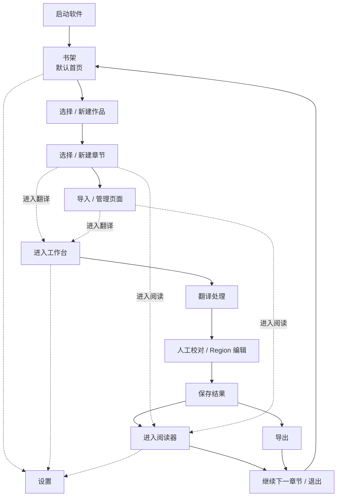

---

## 3. 启动流程


用户感知层面：

1. 启动软件。
2. 系统完成数据库与必要恢复检查。
3. 默认显示书架。
4. 书架显示作品、标签、收藏、归档、最近打开等信息。
5. 不自动跳回上次的工作台或阅读器。

---

## 4. 书架主流程

### 4.1 书架首页

用户可进行：

```text
查看全部作品
搜索作品
按标签筛选
查看收藏
查看归档
查看最近打开
新建作品
导入作品
管理标签
打开回收站
```

### 4.2 作品选择流程

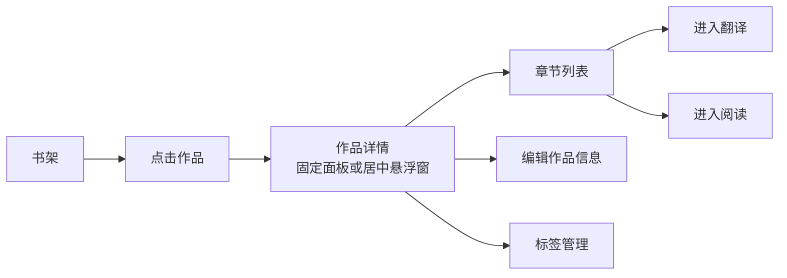

作品详情至少应显示：

- 中文作品名
- 原始标题
- 作者
- 出版社
- 系列
- 源语言 / 目标语言
- 标签
- 收藏 / 归档状态
- 章节列表
- 最近阅读章节
- 阅读进度
- 最后阅读时间
- 累计阅读时长

---

## 5. 新建作品流程

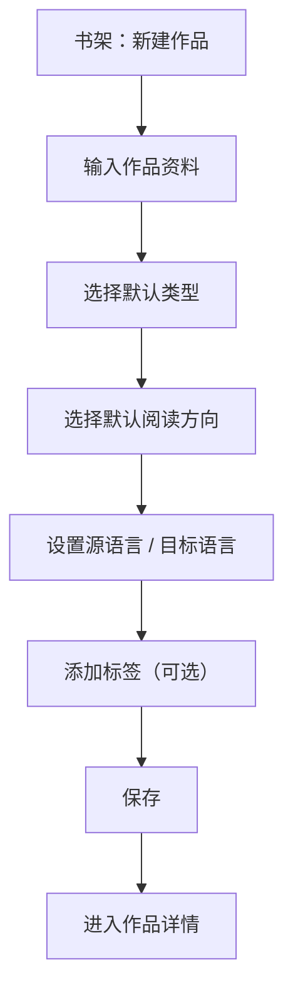

默认类型：

```text
分页漫画
Webtoon 条漫
```

默认阅读方向：

```text
分页漫画：RTL / LTR
Webtoon：Vertical
```

作品默认值只作为 Chapter 初始值；后续每个 Chapter 可独立覆盖。

---

## 6. 标签管理流程

标签为用户自由标签。

支持：

```text
新增标签
重命名标签
删除标签
给作品添加标签
从作品移除标签
```

收藏、归档、最近打开不是普通 Tag。

删除 Tag：

```text
只删除标签或关联
不删除作品
```

标签管理优先使用：

```text
固定管理区
或
居中悬浮窗
```

不跳转独立页面。

---

## 7. 章节管理流程

### 7.1 新建章节

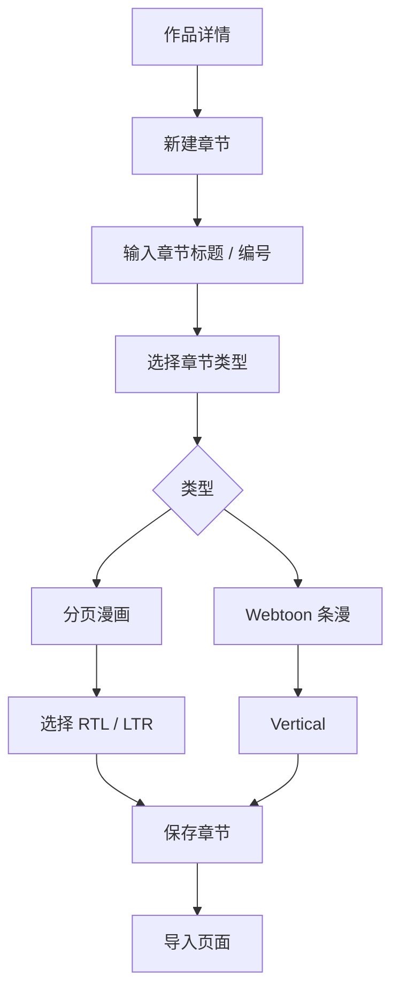

章节可使用：

```text
第 1 话
第 10.5 话
第 1 卷
番外
特别篇
```

不建立独立 Volume 层。

### 7.2 章节类型

```text
paged
webtoon
```

同一本作品可同时包含不同类型 Chapter。

---

## 8. 页面导入流程

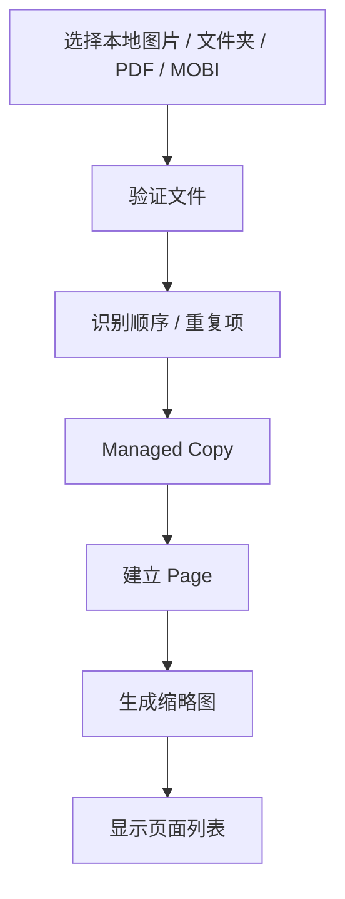

导入后保存：

- 原始文件名
- 原始导入顺序
- 当前显示顺序
- 文件 Hash
- 图片宽高
- Managed Copy 引用

用户原始文件不被修改。

---

## 9. Webtoon 导入与阅读规则

### 9.1 数据规则

一张超长 Webtoon 原图：

```text
= 一张逻辑 Page
```

处理时可以：

```text
临时切片
```

但临时切片：

- 不成为 Page；
- 不出现在页面列表；
- 不影响阅读顺序；
- 只属于 Cache；
- 可随时重新生成。

### 9.2 阅读缩放

```text
以条漫宽度为基准
→ 自动适配阅读区域宽度
→ 高度自然延伸
→ 纵向滚动
```

退出后保存：

```text
last_page_id
scroll_offset_y
```

---

## 10. 页面列表流程

页面列表支持：

```text
单选
Ctrl 多选
Shift 连续多选
拖拽排序
右键菜单
```

页面多选仅限当前 Chapter。

### 10.1 右键操作范围

```text
章节级入口 / 页面列表空白处
→ “全部” = 当前章节全部 Page

单选 Page
→ 单页命令

多选 Page
→ 选择页命令
```

---

## 11. 页面批处理命令

### 11.1 翻译

```text
全部翻译
全部翻译（跳过已翻译）
选择页翻译
单页翻译
```

### 11.2 重新渲染

```text
全部重新渲染
选择页重新渲染
单页重新渲染
```

### 11.3 重新修复

```text
全部重新修复
选择页重新修复
单页重新修复
```

### 11.4 重新 OCR

```text
全部重新 OCR
选择页重新 OCR
单页重新 OCR
单 Region 重全翻译
```

---

## 12. “全部翻译”流程定义

“全部翻译”不默认重新 OCR。


规则：

- 沿用现有 OCR。
- 重新执行翻译及需要的后续步骤。
- 不覆盖 Translation Lock。
- 不覆盖 Region Lock。
- 不处理 Page Lock。
- 人工修改内容必须保护。

需要重新 OCR 时使用专门的“重新 OCR”。

---

## 13. “全部翻译（跳过已翻译）”流程

处理：

```text
未翻译
翻译失败
缺失译文
```

跳过：

```text
已完成
已锁定
人工保护
```

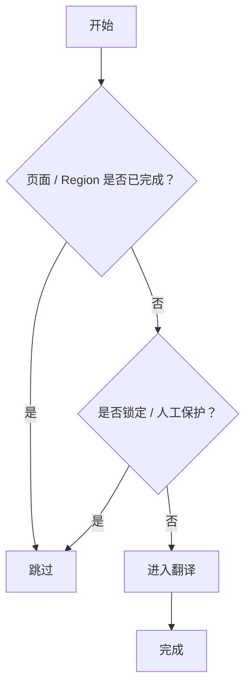

---

## 14. 重新 OCR 流程

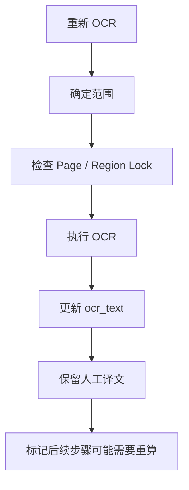

重新 OCR 不得自动覆盖：

- 人工编辑译文
- Translation Lock
- 人工确认 final_translation

如果新的 OCR 使译文可能失配：

> UI 应明确提示“原文已变化，现有译文可能需要重译”。

---

## 15. 工作台进入流程

### 15.1 从书架进入

```text
章节详情
→ 进入翻译
→ 关闭详情悬浮窗
→ 切换工作台
→ 携带 book_id + chapter_id
→ 加载章节页面与状态
```

### 15.2 直接点击一级导航“工作台”

若存在有效最近工作上下文：

```text
恢复最近 Book + Chapter
```

若不存在：

```text
工作台空状态
→ 固定选择区或悬浮窗选择作品 / 章节
```

不得跳转到新的选择页面。

---

## 16. 完整翻译主流程


实际执行时，Pipeline 可以根据已有状态跳过已经完成且不需要重算的步骤。

---

## 17. OCR 流程

### 17.1 OCR Provider 选择

系统按：

```text
当前任务覆盖
>
章节 Provider
>
作品 Provider
>
全局默认 Provider
```

解析。

目标能力包括：

- manga-ocr
- 48px / RapidOCR
- PaddleOCR Korean
- OpenAI-compatible Vision OCR
- 其他注册 OCR Provider

### 17.2 韩漫

当 Chapter 为 Webtoon / 韩文场景时，可优先使用：

```text
PaddleOCR Korean
```

复杂艺术字可回退：

```text
OpenAI-compatible Vision OCR
```

---

## 18. Region 生成与人工调整流程

文字检测建立 Region 初始数据。

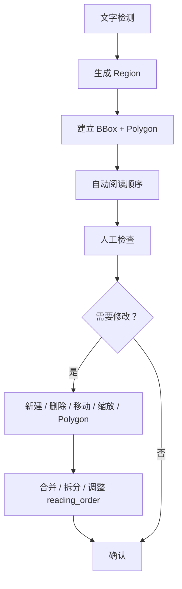

一个 Region 是一个可独立处理单位。

Region 类型：

```text
对白
旁白
拟声词
标题
注释
其他
```

---

## 19. 拟声词 SFX 流程

默认：

```text
skip
```

用户可切换：

```text
skip      默认跳过
translate 正常翻译
manual    仅人工处理
```

继承：

```text
作品
↓
章节
↓
Region
```

越具体的设置优先。

---

## 20. 翻译约束流程

### 20.1 作用范围

```text
章节级
>
作品级
>
全局
```

### 20.2 自动术语识别

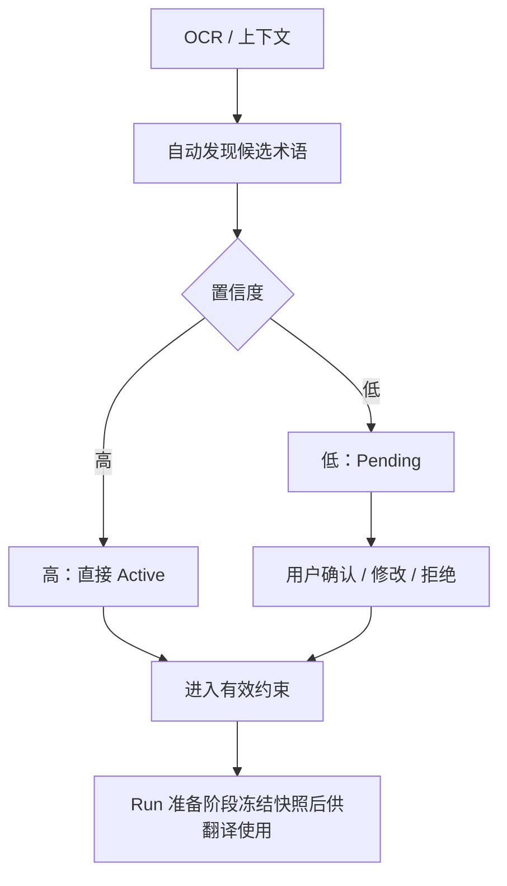

用户拒绝的候选词保留 `rejected` 状态，避免重复推荐。

人工锁定术语不得被自动识别结果覆盖。

---

## 21. Translation Memory 流程

### 21.1 翻译时

```text
当前作品 Exact Match
→ 当前作品 Fuzzy Match
→ 全局 TM Match
→ 作为翻译参考
```

### 21.2 写入时

只有：

```text
人工确认 final_translation
或
已校对内容
```

才允许写入 Translation Memory。

未经确认的机器译文不写入正式 TM。

---

## 22. 多页上下文翻译流程

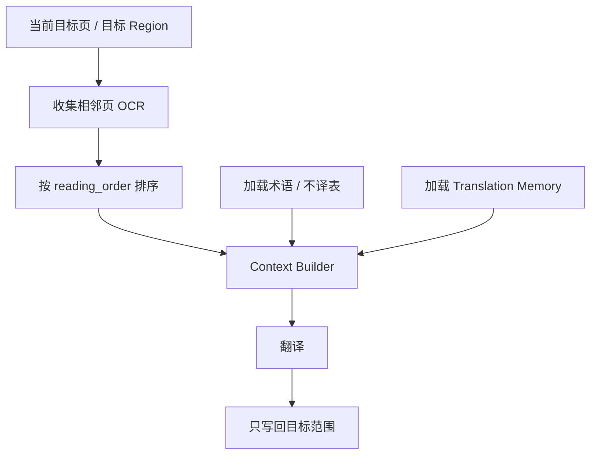

核心规则：

> Context Window 与写回范围严格分离。

例如：

```text
看 5 页上下文
≠
修改 5 页
```

单页翻译可读取上下页，但只修改当前页目标内容。

---


## 22.1 单 Region 重全翻译流程

“单 Region 重全翻译”不是普通“重译”。

普通“单 Region 重译”主要重新执行翻译并按需要重渲染；  
**单 Region 重全翻译**则从当前 Region 的 OCR 开始，完整重跑至重新渲染：


规则：

- 只处理当前 Region，不影响同页其他 Region。
- 重新生成 OCR、翻译、Mask、修复和渲染相关结果。
- 每个重要结果按 Revision / ArtifactRevision 保存，不直接销毁旧版本。
- Page Lock / Region Lock 默认阻止执行。
- Translation Lock / Inpaint Lock 默认保护人工结果；用户明确执行“单 Region 重全翻译”时，可对**本次任务**进行临时覆盖确认，但不得永久静默解除锁。
- 人工修改保护仍生效；如将覆盖当前 Region 的人工确认内容，应在执行前明确提示。

---

## 23. 图片文字消除 / 修复流程

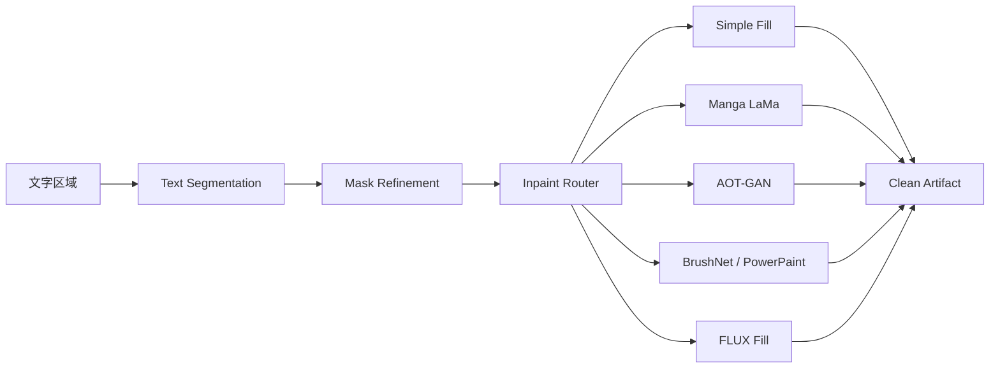

典型路由：

```text
纯色 / 白色气泡
→ Simple Fill

普通漫画
→ Manga LaMa

网点 / 结构
→ AOT-GAN / Manga LaMa

彩色 Webtoon / 复杂背景
→ BrushNet / PowerPaint

关键结构仍失败
→ FLUX Fill
```

---

## 24. 重新修复流程

```text
全部重新修复
选择页重新修复
单页重新修复
单 Region 重新修复
```

执行前：

```text
检查 Page Lock
→ 检查 Region Lock
→ 检查 Inpaint Lock
```

重修：

```text
现有 Region + Mask
或
重新分割 / 精修 Mask
→ Inpaint Router
→ 新 ArtifactRevision
```

不得直接覆盖旧 Revision。

---

## 25. 排版渲染流程

### 25.1 自动字号

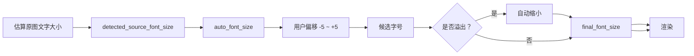

规则：

- 自动字号默认开启。
- 原图字号优先。
- 翻译后放不下时自动缩小。
- 不因译文较短而自动放大超过原图估算字号。
- Region 可以单独关闭自动字号。
- 用户可进行 `-5 ~ +5` 偏移。
- 用户手动明确设置时可突破自动限制。

### 25.2 默认样式

初始默认参考：

```text
Source Han Sans K Bold / 思源黑体粗体
自动字号：开启
fallback 字号：26
文字：黑色
描边：开启
描边：白色
描边宽度：3
行距：1.0
排版方向：auto
```

---

## 26. 重新渲染流程

重新渲染仅：

```text
final_translation
+
当前 clean artifact
+
当前 TextStyle
→ Rendering
→ 新 translated / render ArtifactRevision
```

不执行：

```text
OCR
Translation
Inpaint
```

因此适合：

- 改字体
- 改字号
- 改描边
- 改对齐
- 改文本方向
- 调整 Region
- 调整文字内容后快速出图

---

## 27. Region 文本编辑流程

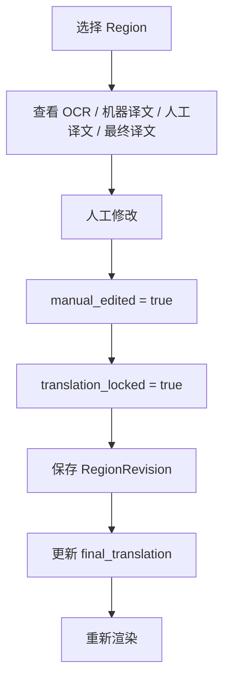

人工修改后默认自动 Translation Lock，防止批量翻译覆盖。

---

## 28. Lock 用户流程

### 28.1 Page Lock

用户锁定 Page：

```text
整页自动处理跳过
```

### 28.2 Region Lock

用户锁定 Region：

```text
该 Region 全部自动处理跳过
```

### 28.3 Translation Lock

```text
禁止自动重译覆盖
允许重新渲染
```

### 28.4 Inpaint Lock

```text
禁止自动重新修复
允许用现有 Clean 重新渲染
```

优先级：

```text
Page Lock
>
Region Lock
>
Translation / Inpaint Lock
```

---

## 29. Revision 用户流程

会产生重要 Revision 的操作：

- 保存人工译文
- 接受重译结果
- 修改 Region 几何并保存
- 修改文字样式并保存
- 修改术语正式值
- 重新图片修复
- 重新渲染产生新 Artifact
- 批处理开始前保护人工内容

不采用：

```text
每输入一个字符就建立 Revision
```

用户应能：

```text
查看历史
切换历史
恢复历史
固定（Pin）重要版本
清理旧版本
```

---

## 30. 任务 / 队列用户流程

任何长耗时操作创建：

```text
PipelineRun
→ PipelineTask
→ StepRun
```

UI 用户操作：

```text
提交
查看进度
暂停
继续
停止
失败重试
查看错误
查看步骤
```

其中“停止”只终止剩余任务，不删除已经完成的页面成果。

### 30.1 状态

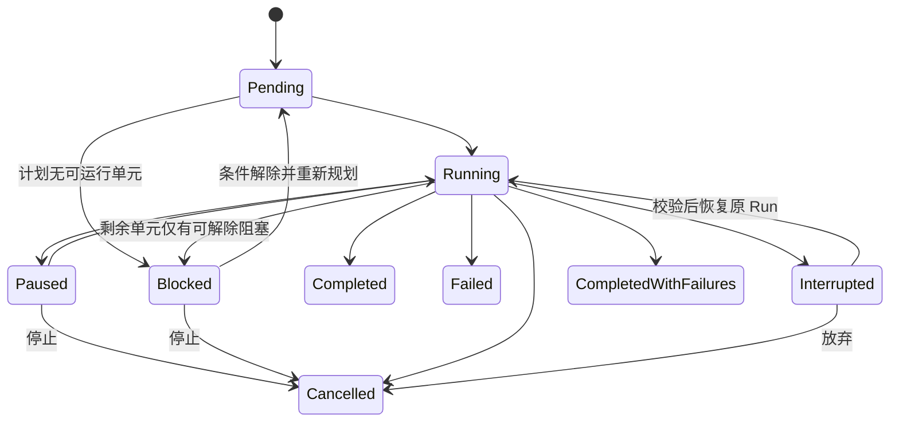

“重试失败页”新建 PipelineRun，仅包含失败目标，通过 `source_run_id + retry_reason` 保留来源，原 Run 历史不改写；Step 自动重试在原 Run 内按相同输入与设置执行。Interrupted 的 Continue / Restart / Abandon 语义及竞态优先级按 [TASK-002 契约 §6](contracts/TASK-002_MINIMUM_DATA_EXECUTION_CONTRACT.md) 执行。

### 30.2 异常退出

如果应用退出时任务仍是 Running：

```text
下次启动
→ 识别为 Interrupted
→ 不误判 Completed
→ 用户选择继续（Resume 原 Run）/ 重新开始（Restart 新 Run）/ 放弃（Abandon）
```

---


### 30.3 工作台固定任务进度面板

工作台必须提供固定的**任务进度面板**。推荐默认位于工作台底部，可折叠成紧凑进度条；不使用独立页面，也不要求弹出 Modal。

展开示意：

```text
┌────────────────────────────────────────────────────┐
│ 当前任务：第 12 话 · 全部翻译（跳过已翻译）       │
│ ███████████████░░░░░░  68%                        │
│                                                    │
│ 流程：检测 ✓ → OCR ✓ → 翻译 ● → 修复 → 渲染      │
│ 当前页：23 / 40   023.jpg   [缩略图]              │
│ 已完成：27   失败：2   跳过：4   等待：7           │
│                                                    │
│ [暂停]          [停止]          [继续]             │
└────────────────────────────────────────────────────┘
```

面板显示三层进度：

```text
Run 总体进度
    ↓
Page 当前处理进度
    ↓
Step 当前流程进度
```

至少显示：

- 当前 PipelineRun 名称和处理范围。
- 总体进度条 / 百分比。
- 完整流程节点以及当前 Step 高亮。
- 当前 Page 页序、文件名；建议附小缩略图。
- 已完成 Page 数。
- 失败 Page 数。
- 跳过 Page 数。
- 等待 Page 数。
- 暂停、停止、继续按钮。

### 暂停

```text
点击“暂停”
→ 不再开始新的 Page / Step
→ 当前不可安全中断的 Step 允许完成
→ 进入 Paused
```

暂停不删除结果，也不把已完成 Page 重新设为未处理。

### 继续

```text
Paused
→ 点击“继续”
→ 从持久化断点恢复
→ 已成功且仍有效的 Step 不重复执行
```

### 停止

```text
点击“停止”
→ 停止当前 PipelineRun 的剩余工作
→ 后续 Pending Task 取消
→ 已完成 Page / Region / ArtifactRevision 全部保留
→ 不回滚已经生成的成果
```

停止不是“删除任务”。

### 页面统计交互

- 点击“已完成” → 页面列表筛选 / 定位已完成页面。
- 点击“失败” → 页面列表筛选失败页，可进一步进入失败原因与重试。
- 点击“跳过” → 显示因已翻译、Lock、规则排除等原因跳过的页面。
- 点击“当前页” → 页面列表自动滚动并选中当前处理 Page。

页面列表同步显示：

```text
○ 等待
● 处理中
✓ 已完成
! 失败
↷ 跳过
🔒 已锁定
```

### 批量任务结束状态

如果 40 页中：

```text
38 页完成
2 页失败
```

PipelineRun 显示：

```text
已完成（有失败）
```

而不是把整个 38 页成功成果标记为失败。

折叠状态至少保留：

```text
任务名称
总体百分比
当前页
当前 Step
暂停 / 停止 / 继续（按状态启用）
```

---

## 31. 任务详情流程

任务详情不是独立页面。

进入方式：

```text
任务队列
→ 点击任务
→ 固定详情区或悬浮窗
```

显示：

- 命令类型
- Book / Chapter
- 页面范围
- 当前进度
- 当前 Step
- Provider
- Model
- Device
- 错误
- 重试次数
- 运行时间

---

## 32. 人工校对流程

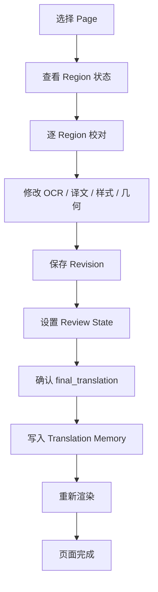

人工确认后的 final_translation 可进入 Translation Memory。

---

## 33. 阅读器进入流程

### 33.1 从书架进入

```text
作品详情 / 章节详情
→ 进入阅读
→ 关闭当前详情窗
→ 切换阅读器
→ 加载 Book + Chapter
```

### 33.2 从工作台进入

翻译保存完成后可：

```text
查看结果
→ 阅读器
```

---

## 34. 分页漫画阅读流程

### RTL

```text
右 → 左
```

### LTR

```text
左 → 右
```

支持：

- Original
- Translated

两个模式分别保存阅读进度。

---

## 35. Webtoon 阅读流程

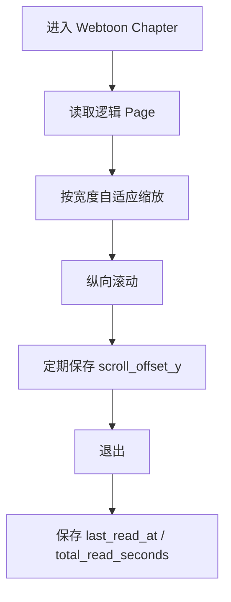

条漫高度不固定，因此不得按固定页面高度缩放。

---

## 36. 阅读进度流程

分别保存：

```text
Original
Translated
```

书籍详情显示：

```text
最近阅读章节
当前阅读进度
最后阅读时间
累计阅读时长
```

进入阅读器时可选择：

```text
从上次位置继续
从章节开头开始
```

---

## 37. 导出流程

```mermaid
flowchart TB

    A["选择导出"]
    B["选择范围"]
    C["选择格式"]
    D["选择目标位置"]
    E["确认设置"]
    F["创建导出任务"]
    G["生成文件"]
    H["保存 ExportHistory"]
    I["打开所在文件夹 / 完成"]

    A --> B --> C --> D --> E --> F --> G --> H --> I
```

格式：

```text
单图
ZIP
CBZ
PDF
文本
```

最近导出历史支持：

- 打开所在文件夹
- 查看状态
- 使用相同设置再次导出

---

## 38. 设置主流程

设置是一级页面。

主要分区：

```text
Provider
网络 / 代理
OCR
翻译
图片修复
排版样式
模型 / GPU
任务 / 并发
缓存 / Revision
回收站
备份 / 恢复
Plugin / Hooks
```

---

## 39. Provider Profile 流程

```mermaid
flowchart TB

    A["设置 → Provider"]
    B["新建 / 编辑 Profile"]
    C["选择能力"]
    D["填写 endpoint / model"]
    E["保存 Credential Reference"]
    F["选择网络 Profile"]
    G["连接测试"]
    H{"成功？"}
    I["启用"]
    J["显示错误"]

    A --> B --> C --> D --> E --> F --> G --> H
    H -->|"是"| I
    H -->|"否"| J
```

同一个 Provider 可建立多个 Profile。

例如：

```text
OpenAI-翻译
OpenAI-VisionOCR
OpenAI-备用
```

---

## 40. Provider 默认选择流程

解析优先级：

```text
当前任务临时指定
>
章节 Provider
>
作品 Provider
>
全局默认 Provider
```

可按 Capability 分别设置：

- OCR
- Translation
- Inpaint
- Detection
- Rendering（如需 Provider 化）

---

## 41. 网络代理流程

### 41.1 Network Profile

可配置多个：

```text
系统代理
Clash 本地代理
公司代理
海外 API 专用代理
```

### 41.2 模式

```text
Direct
System
HTTP
HTTPS
SOCKS5
```

### 41.3 Provider 使用顺序

```text
Provider 专用 Network Profile
>
全局软件代理
>
Windows 系统代理
>
Direct
```

### 41.4 连接测试

```mermaid
flowchart TB

    A["选择 Network Profile"]
    B["测试代理"]
    C["DNS"]
    D["TCP"]
    E["TLS"]
    F["HTTP"]
    G{"成功？"}
    H["显示可用"]
    I["显示具体失败阶段"]

    A --> B --> C --> D --> E --> F --> G
    G -->|"是"| H
    G -->|"否"| I
```

代理失败默认不静默直连。

---

## 42. 设置覆盖流程

优先级：

```text
全局设置
↓
作品设置
↓
章节设置
↓
当前任务临时覆盖
```

适用于：

- OCR Provider
- Translation Provider
- Inpaint Provider
- 阅读方向
- SFX
- 上下文策略
- Text Style
- 自动字号
- 翻译参数
- 修复质量

当前任务临时覆盖只对本次 PipelineRun 生效。

---

## 43. 回收站流程

### 43.1 删除

```mermaid
flowchart LR

    A["删除 Book / Chapter / Page"]
    B["确认"]
    C["软删除"]
    D["进入软件回收站"]
    E["保留 Managed Copy"]
    F["可恢复 / 永久删除"]

    A --> B --> C --> D --> E --> F
```

### 43.2 恢复

恢复父对象时，只恢复同一次删除 Batch 中一起删除的数据。

### 43.3 永久删除

必须明确确认。

永久删除：

- 数据库项目数据
- Managed Copy
- 生成资产
- Cache

不删除：

```text
用户原始源文件
```

### 43.4 自动清理

可选：

```text
7 天
30 天
90 天
永不自动清理
```

默认：

```text
永不自动清理
```

---

## 44. 错误处理用户流程

### 44.1 Provider 错误

系统区分：

- Provider 鉴权失败
- Rate Limit
- Provider 不可用
- 网络超时
- Proxy 连接失败
- Proxy 认证失败
- DNS
- TLS

用户可：

```text
查看原因
修改 Provider
修改代理
连接测试
重试
```

### 44.2 Pipeline 单步失败

```text
StepRun Failed
→ 当前 Task Failed
→ 保留已成功的上游结果
→ 不删除已有 ArtifactRevision
→ 用户重试失败步骤或任务
```

---

## 45. 无保存修改关闭流程

```mermaid
flowchart TB

    A["Esc / 关闭"]
    B{"是否有未保存修改？"}
    C["直接关闭"]
    D["保存 / 放弃 / 取消"]
    E["保存后关闭"]
    F["放弃后关闭"]
    G["保持窗口"]

    A --> B
    B -->|"否"| C
    B -->|"是"| D
    D -->|"保存"| E
    D -->|"放弃"| F
    D -->|"取消"| G
```

---

## 46. 双屏 / 独立悬浮窗流程

允许支持的悬浮窗：

```text
主窗口内打开
→ 用户拖出主窗口
→ 移到第二显示器
→ 调整大小 / 最大化
→ 关闭后保存 WindowLayoutState（可选）
```

辅助 Non-modal 窗口可在用户处理工作台时持续显示。

---

## 47. 典型完整使用场景：日漫章节

```mermaid
flowchart TB

    A["书架"]
    B["打开作品"]
    C["新建 / 选择 Chapter"]
    D["类型：Paged"]
    E["方向：RTL"]
    F["导入图片"]
    G["页面排序"]
    H["进入工作台"]
    I["全部翻译（跳过已翻译）"]
    J["检测 / OCR"]
    K["术语 + TM"]
    L["翻译"]
    M["Mask / Inpaint"]
    N["自动字号 / 渲染"]
    O["人工校对"]
    P["保存 / Lock"]
    Q["阅读器"]
    R["导出"]

    A --> B --> C --> D --> E --> F --> G --> H --> I --> J --> K --> L --> M --> N --> O --> P
    P --> Q
    P --> R
```

---

## 48. 典型完整使用场景：韩国 Webtoon

```mermaid
flowchart TB

    A["书架"]
    B["选择作品 / Chapter"]
    C["类型：Webtoon"]
    D["阅读：Vertical"]
    E["导入超长图"]
    F["一张长图 = 一张 Page"]
    G["工作台"]
    H["临时切片 Cache"]
    I["Korean OCR"]
    J["复杂艺术字 → Vision OCR fallback"]
    K["多页 / 区域上下文翻译"]
    L["彩色背景修复 Router"]
    M["BrushNet / PowerPaint / 必要时 FLUX"]
    N["自动字号 / 渲染"]
    O["校对"]
    P["阅读器按宽自适应"]
    Q["保存纵向滚动进度"]

    A --> B --> C --> D --> E --> F --> G --> H --> I --> J --> K --> L --> M --> N --> O --> P --> Q
```

---

## 49. 典型场景：人工修正一个气泡

```text
工作台
→ 点击 Region
→ 修改 OCR（如需要）
→ 修改译文
→ 自动 manual_edited=true
→ 自动 Translation Lock
→ 保存 RegionRevision
→ 调整字号 / 样式
→ 重新渲染当前 Region / Page
→ 确认校对
→ final_translation
→ 可写入 Translation Memory
```

---

## 50. 典型场景：批量选择 5 页重新渲染

```text
页面列表
→ Ctrl/Shift 选择 5 页
→ 右键
→ 选择页重新渲染
→ 创建 PipelineRun
→ PipelineRunTarget 保存 5 个 page_id
→ 各页使用现有 final_translation + clean artifact
→ Rendering
→ 新 ArtifactRevision
→ 页面状态更新
```

---

## 51. 典型场景：继续中断任务

```text
程序异常退出
→ 原 Running 任务标记 Interrupted
→ 下次启动进入书架
→ 任务状态提示
→ 用户打开任务详情
→ 选择继续 / 重新开始 / 放弃
→ 选择继续时，Pipeline 从可恢复 Step 继续
```

---

## 52. 用户可见状态建议

Page 列表主要显示综合状态：

```text
未处理
处理中
部分完成
已完成
需校对
失败
已锁定
```

详细状态进入任务详情或 Region / Page Inspector 查看。

不要把所有 StepRun 状态直接堆在页面卡片上。

---

## 53. 用户流与数据对象映射

| 用户动作 | 核心对象 |
|---|---|
| 新建作品 | Book |
| 新建章节 | Chapter |
| 导入页面 | Page + MediaArtifact |
| 调整页序 | Page.sort_order |
| 打标签 | Tag + BookTag |
| 进入工作台 | Book + Chapter Context |
| OCR | Region + StepRun |
| 修改 Region | Region + RegionRevision |
| 翻译 | Region + TranslationConstraint + TranslationMemory |
| 图片修复 | MediaArtifact + ArtifactRevision |
| 修改字号 | RegionTextStyle + RegionRevision |
| 一键翻译 | PipelineRun + Targets + Tasks + StepRuns |
| 暂停 / 重试 | PipelineTask |
| 阅读 | ReadingProgress |
| 导出 | ExportHistory |
| 删除 | RecycleBinEntry |
| 配置 Provider | ProviderProfile |
| 配置代理 | NetworkProfile |

---

## 54. 本文件明确不引入的用户流程

当前不建立：

```text
用户注册 / 登录
团队协作
权限管理
角色工坊
Manga Insight / RAG
Volume 独立管理页面
Webtoon 切片页面
```

---

## 55. 与 01 / 02 / 03 的一致性

本文件保持：

- 四个一级页面；
- 默认启动书架；
- 书架章节可以正式跳转到工作台 / 阅读器；
- 其他业务内容使用固定面板 / 悬浮窗；
- Book → Chapter → Page → Region；
- Webtoon 单长图仍为单逻辑 Page；
- 三层翻译约束；
- Translation Memory；
- 四类 Lock；
- Region / Artifact Revision；
- PipelineRun / Task / StepRun；
- 多 Provider / 多 Network Profile；
- 自动字号 + `-5~+5` 微调；
- Managed Copy 与原始文件保护；
- 软件回收站；
- 原文 / 译文独立阅读进度。

---

## 56. 后续文档接口

`05_UI_MAPPING.md` 应基于本文件进一步回答：

```text
这个流程在哪个页面发生？
用固定面板还是悬浮窗？
按钮在哪里？
右键菜单是什么？
状态显示在哪里？
哪些窗口支持双屏？
```

`06_TRANSLATION_PIPELINE.md` 应进一步回答：

```text
每个 Step 输入什么？
输出什么？
什么情况下跳过？
什么情况下失效？
重跑从哪一步开始？
Lock 如何判断？
ArtifactRevision 如何生成？
Context 如何构建？
Provider fallback 如何执行？
```
