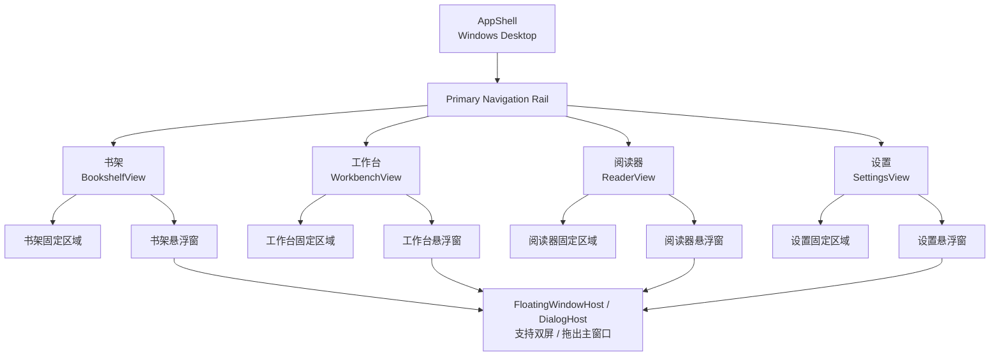
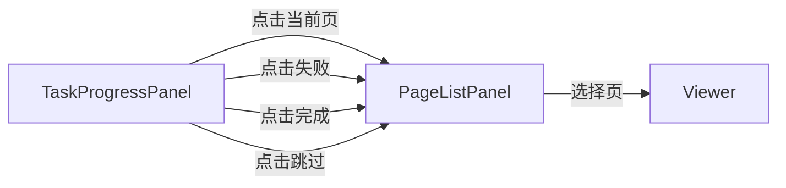
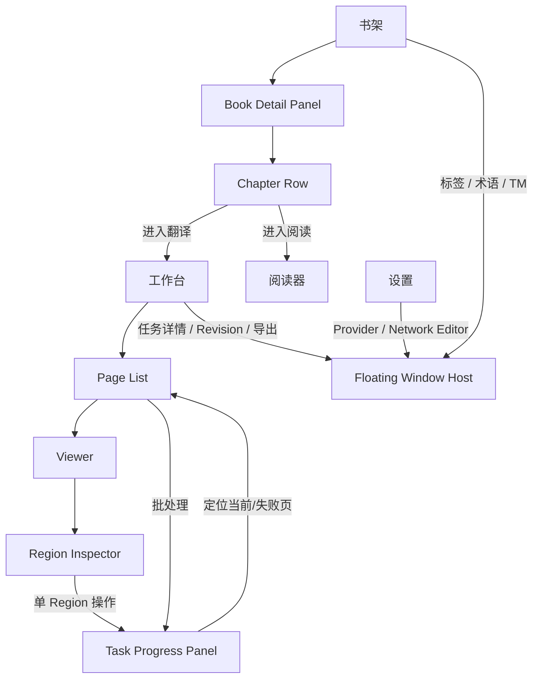

# 05 UI 映射与界面结构（Target UI Mapping）

> 本文件定义新漫画翻译软件的目标 UI 映射（To-Be），用于把 `01 功能架构`、`02 技术架构`、`03 数据模型`、`04 用户流程` 落到具体界面结构、固定面板、悬浮窗、按钮、右键菜单、状态显示和 ViewModel / Use Case 边界。
>
> 本文件基于：
>
> - `01_FUNCTIONAL_ARCHITECTURE_To-Be_同步03_任务进度版.md`
> - `02_TECHNICAL_ARCHITECTURE_To-Be_同步03_任务进度版.md`
> - `03_DATA_MODEL_任务进度同步版.md`
> - `04_USER_FLOW_任务进度同步版.md`
>
> 核心约束：
>
> 1. 软件启动默认进入**书架**。
> 2. 一级独立页面只有：**书架、工作台、阅读器、设置**。
> 3. 除四个一级页面之间的切换外，不创建新的一级 Route / Page。
> 4. 有明确固定位置的功能优先使用固定 Panel；否则使用居中悬浮窗 / Floating Window。
> 5. 悬浮窗背景不强制变暗；编辑类不可点击外部直接关闭；查看类可以；危险操作必须明确确认。
> 6. 悬浮窗必须内容自适应，避免溢出，并支持调整大小、最大化、双屏、拖出主窗口。
> 7. 工作台必须有固定任务进度面板，显示总体进度、当前流程、当前页、已完成页、失败页、跳过页、等待页，并提供暂停 / 停止 / 继续。
> 8. QML/UI 只绑定 ViewModel 状态，不直接访问 SQLite、Managed File Storage 或具体 AI Provider。
> 9. 人工修改、Lock、Revision、Translation Memory、ArtifactRevision 等数据保护规则必须在 UI 中可见、可理解、可操作。

---

# 1. UI 总体信息架构



---

# 2. Screen Map

## 2.1 一级 Screen

| Screen ID | 中文名称 | 是否一级页面 | 默认入口 | 主要职责 |
|---|---|---:|---:|---|
| `bookshelf` | 书架 | 是 | **是** | 作品、章节、页面、标签、阅读进度、翻译知识入口 |
| `workbench` | 工作台 | 是 | 否 | 翻译、OCR、Region 编辑、修复、渲染、任务进度 |
| `reader` | 阅读器 | 是 | 否 | Original / Translated 阅读、RTL/LTR/Webtoon |
| `settings` | 设置 | 是 | 否 | Provider、网络、模型、文字样式、缓存、备份等 |

## 2.2 非一级内容

以下内容**不是页面**：

```text
作品详情
作品编辑
章节详情
章节编辑
标签管理
翻译约束
Translation Memory
页面导入
页面批处理设置
任务详情
失败页列表
Region Revision
Artifact Revision
导出
Provider Profile 编辑
Network Profile 编辑
连接测试
回收站
备份 / 恢复
危险操作确认
```

这些内容必须映射为：

```text
固定 Panel
或
Floating Window / Dialog
```

---

# 3. App Shell

## 3.1 推荐整体布局

```text
┌──────────────────────────────────────────────────────────────┐
│ Window Title / Windows Native Frame                         │
├────────┬─────────────────────────────────────────────────────┤
│        │                                                     │
│ 一级   │                                                     │
│ 导航   │                  当前一级页面                       │
│ Rail   │                                                     │
│        │                                                     │
│ 书架   │                                                     │
│ 工作台 │                                                     │
│ 阅读器 │                                                     │
│ 设置   │                                                     │
│        │                                                     │
└────────┴─────────────────────────────────────────────────────┘
```

### 左侧一级导航 Rail

固定入口：

```text
书架
工作台
阅读器
设置
```

规则：

- 软件启动时选中“书架”。
- 四个入口始终可见。
- 切换一级页面不销毁当前 Book / Chapter 上下文。
- 如果工作台有运行中任务，离开工作台不停止任务。
- 工作台导航项可显示任务状态小徽标，例如：
  - 运行中
  - 暂停
  - 有失败

---

# 4. Window / Panel 分类规范

## 4.1 四类 UI 容器

### A. Primary Page

仅：

```text
BookshelfView
WorkbenchView
ReaderView
SettingsView
```

### B. Fixed Panel

适合长期观察、频繁交互、与当前主内容强关联的功能。

例如：

```text
书架右侧作品详情
工作台页面列表
工作台 Viewer
工作台 Region Inspector
工作台任务进度面板
阅读器导航面板
设置分类导航
```

### C. Floating Tool Window

适合：

- 信息较多；
- 需要长时间停留；
- 可边看主页面边操作；
- 需要拖到第二屏。

例如：

```text
术语管理
Translation Memory
任务详情
Revision History
Provider Profile 详情
Network Profile 详情
高级日志 / 诊断
```

可为 Non-modal。

### D. Modal / Confirmation Dialog

适合必须先完成或明确确认的操作：

```text
新建作品
新建章节
导入设置
永久删除
覆盖人工修改
单 Region 重全翻译覆盖确认
恢复 Revision
危险代理 / TLS 设置确认
```

背景不强制变暗。

---

# 5. 悬浮窗统一行为

## 5.1 尺寸

- 根据内容计算推荐初始尺寸。
- 最小尺寸不得导致关键按钮或字段溢出。
- 超出可视区域时：
  - 内容区滚动；
  - Footer 操作区固定；
  - 不允许按钮被裁切。
- 大型窗口允许最大化。
- 默认最大尺寸建议不超过当前屏幕可用区域的约 90%。

## 5.2 关闭

```text
无未保存修改
→ Esc 关闭

有未保存修改
→ 保存 / 放弃 / 取消
```

### 点击外部

| 类型 | 点击外部关闭 |
|---|---:|
| 查看类 | 可以 |
| 编辑类 | 不可以 |
| 危险操作 | 不可以 |
| Non-modal 工具窗 | 不适用 |

## 5.3 双屏

Floating Window 必须允许：

```text
主窗口内部打开
→ 拖出主窗口
→ 移动到第二显示器
→ 调整大小
→ 最大化
```

可保存：

```text
WindowLayoutState
```

用于恢复：

- 上次屏幕；
- 大小；
- 位置；
- 最大化状态。

---

# 6. 书架 BookshelfView

## 6.1 页面职责

书架负责：

- Book 浏览；
- 搜索；
- 标签；
- 收藏；
- 归档；
- 最近打开；
- Book / Chapter 管理；
- 阅读进度；
- 进入工作台；
- 进入阅读器；
- 回收站入口；
- 翻译约束 / Translation Memory 管理入口。

---

# 7. 书架推荐布局

```text
┌────────┬──────────────────────────────────────────────────────┐
│ 一级   │ 顶部工具栏                                           │
│ 导航   │ [新建作品] [导入] [搜索________] [筛选] [排序]       │
│        ├──────────────────────────────┬───────────────────────┤
│ 书架 ● │                              │                       │
│ 工作台 │       作品 Grid / List        │    Book Detail Panel  │
│ 阅读器 │                              │                       │
│ 设置   │                              │  封面 / 基本资料       │
│        │                              │  标签                  │
│        │                              │  阅读进度              │
│        │                              │  Chapter List          │
│        │                              │                       │
│        │                              │ [进入翻译] [进入阅读]   │
└────────┴──────────────────────────────┴───────────────────────┘
```

## 7.1 固定区域

### BookshelfToolbar

包含：

- 新建作品
- 导入
- 搜索
- 标签筛选
- 收藏筛选
- 归档筛选
- 最近打开
- 排序
- Grid / List 切换

### BookGrid / BookList

每个 Book Card 推荐显示：

- 封面
- 中文标题
- 原始标题（可选）
- 标签摘要
- 当前阅读进度
- 最近打开时间
- 收藏状态
- 归档状态

### BookDetailPanel

推荐固定在右侧。

显示：

- 封面
- 作品资料
- 标签
- 收藏 / 归档
- 最近阅读
- 阅读百分比
- 最后阅读时间
- 累计阅读时长
- Chapter 列表
- 进入翻译
- 进入阅读
- 编辑
- 更多菜单

---

# 8. Book 操作映射

| 用户动作 | UI 位置 | UI 类型 | 结果 |
|---|---|---|---|
| 新建作品 | BookshelfToolbar | Modal | 创建 Book |
| 点击作品 | BookGrid/List | 固定 | 更新 BookDetailPanel |
| 编辑作品 | BookDetailPanel | Modal / Floating | 编辑 Book |
| 收藏 | Card / Detail | Inline Action | `is_favorite` |
| 归档 | More Menu | Confirm + Action | `is_archived` |
| 管理标签 | Toolbar / Detail | Floating Window | Tag / BookTag |
| 删除作品 | More Menu | Dangerous Confirm | 进入回收站 |
| 进入翻译 | Chapter Row | 一级页面切换 | Workbench |
| 进入阅读 | Chapter Row | 一级页面切换 | Reader |

---

# 9. Chapter List

Chapter Row 至少显示：

```text
章节编号
章节标题
类型：分页 / Webtoon
阅读方向：RTL / LTR / Vertical
Page 数量
翻译状态摘要
阅读进度
```

Chapter Row 操作：

```text
进入翻译
进入阅读
编辑
页面管理
翻译设置
删除
```

章节详情不建立新页面。

---

# 10. 新建 / 编辑 Chapter Window

字段：

```text
章节标题
副标题
章节编号
Chapter Type：
  分页漫画
  Webtoon

Reading Direction：
  RTL
  LTR
  Vertical

排序
备注
```

行为：

- Webtoon 默认 Vertical。
- Paged 默认继承 Book RTL/LTR。
- 用户可覆盖。

---

# 11. 页面管理 Window / Panel

从 Chapter Row 打开。

建议大型悬浮窗，可拖到第二屏。

包含：

```text
页面缩略图列表
原始顺序
当前顺序
拖拽排序
导入更多页面
删除页面
Page Lock
状态
多选
右键菜单
```

Webtoon 长图：

- 仍显示为一个 Page。
- 不显示内部临时 Tile。

---

# 12. 页面列表右键菜单

## 12.1 单选 Page

```text
单页翻译
单页重新 OCR
单页重新修复
单页重新渲染
锁定 / 解锁 Page
进入当前页
查看 Revision
删除
```

## 12.2 多选 Page

```text
选择页翻译
选择页重新 OCR
选择页重新修复
选择页重新渲染
批量锁定 / 解锁
删除所选
```

## 12.3 Chapter 级

```text
全部翻译
全部翻译（跳过已翻译）
全部重新 OCR
全部重新修复
全部重新渲染
```

---

# 13. 翻译知识管理

## 13.1 TranslationConstraint Window

建议：

```text
Floating Tool Window
可拖出主窗口
可双屏
```

顶部：

```text
作用域：[全局] [当前作品] [当前章节]
类型：[术语] [不译]
状态：[Active] [Pending] [Rejected] [Disabled]
搜索
```

表格字段：

```text
原词
目标词
分类
来源
置信度
状态
锁定
备注
```

操作：

```text
新增
编辑
删除
确认候选
拒绝候选
锁定
禁用
恢复历史 Revision
```

---

# 14. Translation Memory Window

建议 Floating Tool Window。

显示：

```text
来源范围
原文
译文
Exact / Fuzzy
作品来源
使用次数
最后使用时间
```

筛选：

```text
当前作品
全局
语言对
搜索
```

操作：

```text
查看
编辑
禁用 / 删除
提升为全局
查看来源 Region
```

未经人工确认的机器译文不得进入正式 TM。

---

# 15. 工作台 WorkbenchView

## 15.1 页面职责

工作台是生产操作核心页面：

- Page 导航；
- 原图 / 修复图 / 译图查看；
- Region 编辑；
- OCR；
- 翻译；
- 修复；
- 排版；
- 校对；
- 单 Region 重全翻译；
- Page 批处理；
- Task / Queue；
- 进度监控。

---

# 16. 工作台总体布局

```text
┌────────┬────────────────────────────────────────────────────────────┐
│ 一级   │ Workbench Toolbar                                          │
│ 导航   │ Book / Chapter  当前页  模式  主要批处理操作               │
│        ├──────────────┬─────────────────────────────┬───────────────┤
│ 书架   │              │                             │               │
│ 工作台●│ Page List    │       Viewer / Canvas       │ Region        │
│ 阅读器 │              │                             │ Inspector     │
│ 设置   │ 缩略图       │ Original / Clean /          │               │
│        │ 状态         │ Translated / Compare        │ OCR / 译文    │
│        │ 多选         │                             │ 样式 / Lock   │
│        │ 右键菜单     │ Region Overlay              │ Revision      │
│        │              │                             │               │
│        ├──────────────┴─────────────────────────────┴───────────────┤
│        │ Task Progress Panel                                        │
│        │ 68% │ OCR✓ 翻译● 修复○ │ 当前23/40 │ 完成27 失败2 跳过4 │
│        │ [暂停] [停止] [继续]                                      │
└────────┴────────────────────────────────────────────────────────────┘
```

---

# 17. Workbench Toolbar

推荐放置：

```text
当前 Book
当前 Chapter
上一页 / 下一页
Original / Clean / Translated / Compare
缩放
适合窗口
Region Overlay 开关
全部翻译
全部翻译（跳过已翻译）
更多批处理
```

不建议把所有高级参数塞进 Toolbar。

高级参数进入：

```text
右侧固定 Inspector
或
Translation Settings Floating Window
```

---

# 18. PageListPanel

## 18.1 固定位置

工作台左侧固定。

支持折叠 / 调整宽度。

## 18.2 Page Tile

至少显示：

```text
缩略图
页序
文件名
综合状态
Lock
Review State
```

状态：

```text
○ 等待
● 处理中
✓ 已完成
! 失败
↷ 跳过
🔒 已锁定
```

## 18.3 当前 Page

当前正在 Viewer 打开的 Page：

- 高亮边框；
- 当前 Page 标记。

当前 Pipeline 正在处理的 Page：

- 额外显示“运行中”指示；
- 与 Viewer 当前打开页可以不同。

---

# 19. PageListPanel 与 TaskProgressPanel 联动



规则：

- 点击“失败 2” → PageList 进入失败筛选。
- 点击“已完成 27” → 已完成筛选。
- 点击“跳过 4” → 跳过筛选。
- 点击“当前页” → 自动滚动并定位 Pipeline 当前 Page。
- 清除筛选后恢复 Chapter 全部 Page。

---

# 20. Viewer / Canvas

## 20.1 模式

至少支持：

```text
Original
Clean
Translated
Compare
```

Compare 可支持：

```text
单图切换
左右双图
```

## 20.2 Canvas 能力

```text
Zoom
Pan
Fit
100%
Region Overlay
Region Selection
Polygon Edit
BBox Edit
Mask Preview
Text Preview
```

## 20.3 Webtoon

Webtoon 工作台 Viewer：

- 按宽度适配；
- 可纵向滚动；
- 长图处理 Tile 不暴露为 Page；
- Region 坐标仍基于逻辑原图。

---

# 21. Region 选中交互

```text
点击 Region
→ Viewer 高亮 Region
→ Inspector 加载该 Region
→ PageList 保持当前 Page
```

多 Region 选择可作为后续扩展；P0 以单 Region Inspector 为主。

---

# 22. Region Inspector

推荐工作台右侧固定。

分组建议：

```text
基本
OCR
翻译
样式
修复
Lock
Revision
```

折叠 Section，避免信息密度过高。

---

# 23. Region Inspector：基本

显示：

```text
Region Type
Reading Order
BBox
Polygon 状态
Review State
```

操作：

```text
新建
删除
移动
缩放
Polygon 编辑
合并
拆分
调整 reading_order
```

---

# 24. Region Inspector：OCR

显示：

```text
ocr_text
OCR Provider
置信度
最近 OCR 时间
```

操作：

```text
单 Region OCR
```

---

# 25. Region Inspector：翻译

显示：

```text
machine_translation
edited_translation
final_translation
Translation Lock
TM Match
当前翻译约束摘要
```

操作：

```text
单 Region 重译
单 Region 重全翻译
编辑译文
确认 final_translation
写入 Translation Memory
```

---

# 26. 单 Region 重全翻译按钮

位置：

```text
Region Inspector → 翻译 Section
```

建议使用明确名称：

> **重全翻译**

悬浮说明：

```text
从 OCR 开始完整重跑当前 Region：
OCR → 配色 → 术语 → 翻译 → Mask → 修复 → 渲染 → 保存
```

如果存在：

```text
Translation Lock
Inpaint Lock
人工确认内容
```

点击后弹危险/覆盖确认：

```text
本次重全翻译可能覆盖当前 Region 的人工确认结果。
锁不会被永久解除，只对本次任务临时覆盖。

[继续执行]
[取消]
```

Page Lock / Region Lock 默认阻止执行，应要求先明确解锁。

---

# 27. Region Inspector：样式

显示：

```text
自动字号 开/关
原图字号估算
自动基准字号
字号偏移
最终字号
字体
文字颜色
描边
描边颜色
描边宽度
行距
对齐
文字方向
```

## 27.1 字号偏移 UI

推荐：

```text
[-5] [-4] [-3] [-2] [-1] [0] [+1] [+2] [+3] [+4] [+5]
```

或：

```text
[ - ]  Offset: +2  [ + ]
```

但必须限制到：

```text
-5 ... +5
```

显示：

```text
原图估算：28
偏移：+2
最终字号：30
```

若 shrink-to-fit 后变为 27：

```text
自动适配后：27
```

---

# 28. Region Inspector：修复

显示：

```text
当前 Mask
当前 Clean Artifact
Inpaint Provider
Router Reason
Inpaint Lock
```

操作：

```text
预览 Mask
编辑 / 修正 Mask
单 Region 重新修复
查看 Artifact Revision
```

---

# 29. Region Inspector：Lock

明确四种 Lock：

```text
Page Lock
Region Lock
Translation Lock
Inpaint Lock
```

说明：

- Page Lock：整页自动处理跳过。
- Region Lock：该 Region 自动流程跳过。
- Translation Lock：禁止自动覆盖译文，但允许重渲染。
- Inpaint Lock：禁止自动重新修复，但允许使用现有 Clean 重渲染。

不得只显示一个模糊“锁定”。

---

# 30. Region Inspector：Revision

入口：

```text
查看历史
```

打开：

```text
RegionRevisionWindow
```

显示：

- 时间
- OCR
- 机器译文
- 人工译文
- final
- 几何
- 样式
- Lock
- 变更原因

操作：

```text
预览
对比
恢复
Pin
```

恢复是危险操作，需要确认。

---

# 31. TaskProgressPanel

## 31.1 固定位置

工作台底部固定区域。

可：

```text
展开
折叠为紧凑进度条
调整高度
```

不做独立页面。

## 31.2 展开布局

```text
┌────────────────────────────────────────────────────────────┐
│ 当前任务：第 12 话 · 全部翻译（跳过已翻译）               │
│ ███████████████░░░░░  68%                                 │
│                                                            │
│ 检测 ✓ → OCR ✓ → 配色 ✓ → 术语 ✓ → 翻译 ● → 修复 ○ → 渲染 ○│
│ 当前页：23 / 40   023.jpg   [缩略图]                       │
│ 完成 27 │ 失败 2 │ 跳过 4 │ 等待 7                        │
│                                                            │
│ [暂停]              [停止]              [继续]             │
└────────────────────────────────────────────────────────────┘
```

---

# 32. TaskProgressPanel 状态控制

## Running

按钮：

```text
暂停：Enabled
停止：Enabled
继续：Disabled
```

## Paused

```text
暂停：Disabled
停止：Enabled
继续：Enabled
```

## Completed / CompletedWithFailures

```text
暂停：Disabled
停止：Disabled
继续：Disabled
```

如有失败：

```text
[查看失败] [重试失败页]
```

## Interrupted

```text
[继续] [重新开始] [放弃]
```

---

# 33. TaskProgressPanel 折叠状态

至少显示：

```text
任务名
百分比
当前 Page
当前 Step
状态
暂停 / 停止 / 继续
```

例如：

```text
第12话  68%  │ 23/40 │ 翻译中 │ [暂停] [停止]
```

---

# 34. Task Detail Window

点击任务标题 / “详情”：

```text
Task Detail Floating Window
```

推荐 Non-modal，可拖第二屏。

显示：

```text
PipelineRun
目标范围
开始时间
运行时长
Provider Snapshot
Settings Snapshot
Task List
StepRun List
当前并发
错误
重试
```

失败项可以展开：

```text
Page 08
→ OCR
→ ProviderAuthenticationError
→ [重试]
```

---

# 35. 失败页 Window

可以作为 Task Detail 的固定 Tab，也可从“失败 2”打开轻量 Floating Window。

显示：

```text
缩略图
页序
文件名
失败 Step
错误摘要
重试次数
```

操作：

```text
定位 Page
单页重试
选择失败页重试
查看详细错误
```

---

# 36. 翻译设置 Window

工作台“翻译设置”打开 Floating Window。

Section：

```text
OCR
Translation
Context
Translation Constraint
Translation Memory
SFX
Inpaint
Rendering
Provider Override
```

当前任务临时覆盖必须明确显示：

> 仅本次任务

不得误写成全局设置。

---

# 37. 阅读器 ReaderView

## 37.1 推荐布局

```text
┌────────┬─────────────────────────────────────────────────────┐
│ 一级   │ Reader Toolbar                                       │
│ 导航   │ Chapter │ Original/Translated │ RTL/LTR/Vertical    │
│        ├─────────────┬───────────────────────────────────────┤
│ 书架   │ Reader Nav  │                                       │
│ 工作台 │             │              Viewer                   │
│ 阅读器●│ Chapter     │                                       │
│ 设置   │ Page        │                                       │
│        │             │                                       │
└────────┴─────────────┴───────────────────────────────────────┘
```

Reader Nav 可折叠。

---

# 38. Reader Toolbar

至少包含：

```text
作品
章节
Original / Translated
上一页 / 下一页
阅读方向
缩放
适合宽度
继续上次位置
```

---

# 39. Paged 阅读

RTL：

```text
右 → 左
```

LTR：

```text
左 → 右
```

可以显示：

```text
单页
双页（后续可选）
```

阅读进度分别维护：

```text
Original
Translated
```

---

# 40. Webtoon 阅读

目标：

```text
以图片宽度适配 Reader Viewport
高度自然延伸
纵向滚动
```

禁止：

```text
按固定高度强制缩放整个超长图
```

保存：

```text
last_page_id
scroll_offset_y
```

---

# 41. 阅读器进度显示

可放 Toolbar / Reader Nav：

```text
当前章节
当前 Page
XX%
最后阅读
```

书架 BookDetailPanel 同步展示：

```text
最近阅读
原文进度
译文进度
最后阅读时间
累计阅读时长
```

---

# 42. 阅读器悬浮窗

可包括：

```text
章节选择
阅读设置
图片信息
快捷帮助
```

不建立新的页面。

---

# 43. 设置 SettingsView

## 43.1 页面结构

设置本身是一级页面。

内部使用固定二级分类列表，不建立独立 Route：

```text
设置
├─ Provider
├─ 网络 / 代理
├─ OCR
├─ 翻译
├─ 图片修复
├─ 排版样式
├─ 模型 / GPU
├─ 任务 / 并发
├─ 缓存 / Revision
├─ 回收站
├─ 备份 / 恢复
└─ Plugin / Hooks
```

左侧分类固定，右侧内容切换。

---

# 44. Provider Settings

列表区固定显示：

```text
Profile 名称
Provider Type
Capability
Model
网络 Profile
Enabled
连接状态
```

操作：

```text
新建
编辑
复制
启用 / 禁用
设为默认
连接测试
删除
```

编辑使用 Floating Window / Modal。

同一 Provider 允许多 Profile。

---

# 45. Provider Profile Editor

字段：

```text
Profile 名称
Provider Type
Capabilities
Base URL
Model
Credential
Network Profile
Proxy Policy
高级参数
```

API Key：

- 输入框默认密码模式；
- 不显示数据库明文；
- 保存 Credential Reference。

---

# 46. Network Settings

列表：

```text
Profile 名称
模式
Proxy 地址摘要
Bypass
TLS
状态
```

模式：

```text
Direct
System
HTTP
HTTPS
SOCKS5
```

操作：

```text
新建
编辑
复制
测试
删除
设为全局默认
```

---

# 47. Network Connection Test Window

显示阶段：

```text
DNS
TCP
TLS
HTTP
Provider Auth
```

失败必须区分：

```text
ProxyConnectionError
ProxyAuthenticationError
DNSResolutionError
TLSHandshakeError
ConnectTimeout
ReadTimeout
ProviderAuthenticationError
ProviderRateLimitError
ProviderUnavailableError
```

不得只显示“连接失败”。

---

# 48. Text Style Defaults Settings

全局默认样式：

```text
自动字号：开启
Fallback 字号：26
字体：Source Han Sans K Bold / 思源黑体粗体
文字颜色：黑色
描边：开启
描边颜色：白色
描边宽度：3
行距：1.0
方向：auto
对齐：start
```

UI 显示：

```text
字体选择
自动字号
Fallback 字号
颜色
描边
行距
排版方向
实时预览
恢复默认
```

---

# 49. Settings Override 显示

任何可继承配置应明确显示来源：

```text
全局
作品覆盖
章节覆盖
任务临时覆盖
Region 覆盖
```

例如：

```text
OCR Provider：
PaddleOCR Korean
来源：章节设置
```

不要只显示最终值而隐藏来源。

---

# 50. 回收站 Window

入口：

```text
书架
或
设置 → 回收站
```

推荐大型 Floating Window。

显示：

```text
类型
名称
删除时间
原位置
预计自动清理时间
```

操作：

```text
恢复
永久删除
清空回收站
```

永久删除必须二次确认。

---

# 51. Export Window

工作台 / 阅读器进入。

字段：

```text
范围
格式
输出位置
渲染设置
文件命名
覆盖策略
```

格式：

```text
单图
ZIP
CBZ
PDF
文本
```

按钮：

```text
导出
取消
```

导出后：

```text
打开所在文件夹
再次导出
```

---

# 52. Import Window

字段：

```text
来源
目标 Book
目标 Chapter
Chapter Type
Reading Direction
重复文件策略
排序预览
```

支持：

```text
图片
文件夹
PDF
MOBI
```

导入前显示预览和文件数量。

---

# 53. Revision History Window

统一外观，可根据对象切换内容：

```text
Region Revision
Artifact Revision
Constraint Revision
```

布局：

```text
左：Revision Timeline
中：当前 Revision 内容
右：对比 / Metadata
```

支持双屏。

操作：

```text
预览
对比
恢复
Pin
删除可清理历史
```

---

# 54. Overlay / Toast / Notification

## Toast

用于轻量反馈：

```text
已保存
已加入任务
已复制
连接成功
```

## Banner

用于持续但非阻塞状态：

```text
网络不可用
GPU 不可用，已回退 CPU
任务已暂停
数据库处于只读恢复模式
```

## Dangerous Alert

必须明确按钮，不自动消失：

```text
永久删除
关闭 TLS 验证
覆盖人工确认结果
```

---

# 55. Dirty State

编辑窗统一：

```text
dirty = false
→ Esc / X 直接关闭

dirty = true
→ 保存 / 放弃 / 取消
```

主页面固定 Inspector：

- 修改文字后可自动进入 dirty。
- 切换 Region / Page 前必须：
  - 自动保存（仅允许已明确设置为 autosave 的字段）
  - 或弹保存确认。

建议正文 / Region 译文编辑采用明确保存或可靠的 debounce autosave + Revision checkpoint，具体由后续实现确定。

---

# 56. Screen-Action Map

| Screen | Action | UI 位置 | 目标 |
|---|---|---|---|
| 书架 | 新建作品 | Toolbar | Book |
| 书架 | 搜索 | Toolbar | Book Filter |
| 书架 | 标签筛选 | Toolbar | Tag |
| 书架 | 点击作品 | Grid/List | BookDetailPanel |
| 书架 | 新建章节 | BookDetailPanel | Chapter |
| 书架 | 进入翻译 | Chapter Row | Workbench |
| 书架 | 进入阅读 | Chapter Row | Reader |
| 书架 | 管理术语 | Book/Chapter Menu | Constraint Window |
| 工作台 | 选择 Page | PageList | Viewer |
| 工作台 | 多选 Page | PageList | Batch Selection |
| 工作台 | 单 Region OCR | Inspector | OCR Use Case |
| 工作台 | 单 Region 重译 | Inspector | Translation Use Case |
| 工作台 | 单 Region 重全翻译 | Inspector | PipelineRun |
| 工作台 | 单 Region 重修 | Inspector | Inpaint Use Case |
| 工作台 | 单 Region 重渲染 | Inspector | Rendering Use Case |
| 工作台 | 暂停 | TaskProgressPanel | Task Manager |
| 工作台 | 停止 | TaskProgressPanel | Task Manager |
| 工作台 | 继续 | TaskProgressPanel | Task Manager |
| 阅读器 | Original/Translated | Toolbar | Reader State |
| 阅读器 | 继续阅读 | Toolbar | ReadingProgress |
| 设置 | 新建 Provider | Provider Section | ProviderProfile |
| 设置 | 测试网络 | Network Section | Connectivity Test |
| 设置 | 默认排版 | Text Style Section | SettingsOverride |

---

# 57. Feature-UI Matrix

| 功能 | 书架 | 工作台 | 阅读器 | 设置 | Floating Window |
|---|---:|---:|---:|---:|---:|
| Book 管理 | ✓ |  |  |  | 编辑 |
| Chapter 管理 | ✓ |  |  |  | 编辑 |
| Page 管理 | ✓ | ✓ |  |  | 大型管理窗 |
| 标签 | ✓ |  |  |  | ✓ |
| 阅读进度 | ✓ |  | ✓ |  |  |
| OCR |  | ✓ |  | ✓配置 |  |
| Translation |  | ✓ |  | ✓配置 |  |
| Translation Constraint | 入口 | ✓摘要 |  |  | ✓ |
| Translation Memory | 入口 | ✓匹配 |  |  | ✓ |
| Region 编辑 |  | ✓ |  |  | Revision |
| Inpaint |  | ✓ |  | ✓配置 | Revision |
| Rendering |  | ✓ |  | ✓配置 |  |
| 自动字号 |  | ✓Region |  | ✓默认 |  |
| Task Progress |  | ✓固定 |  |  | Task Detail |
| Reader | 入口 | 查看结果入口 | ✓ |  |  |
| Export |  | ✓ | ✓ |  | ✓ |
| Provider |  | 临时覆盖 |  | ✓ | 编辑 |
| Network Proxy |  | 状态 |  | ✓ | 编辑/测试 |
| Recycle Bin | 入口 |  |  | 入口 | ✓ |
| Revision |  | 入口 |  | 清理策略 | ✓ |

---

# 58. UI Interaction Map



---

# 59. UI-to-Service Mapping

| UI Component | ViewModel | Application / Use Case |
|---|---|---|
| `AppShell` | `NavigationViewModel` | Navigation Service |
| `BookshelfView` | `BookshelfViewModel` | Library Use Cases |
| `BookDetailPanel` | `BookDetailViewModel` | Book / Chapter Use Cases |
| `PageManagementWindow` | `PageManagementViewModel` | Import / Page Use Cases |
| `WorkbenchView` | `WorkbenchViewModel` | Translation Application Service |
| `PageListPanel` | `PageListViewModel` | Page Query / Task Projection |
| `ViewerCanvas` | `ViewerViewModel` | Page / Artifact Query |
| `RegionInspector` | `RegionInspectorViewModel` | Edit / Review Use Cases |
| `TaskProgressPanel` | `TaskProgressViewModel` | Task / Queue Manager |
| `TaskDetailWindow` | `TaskDetailViewModel` | PipelineRun / Task Query |
| `ConstraintWindow` | `ConstraintViewModel` | TranslationConstraint Use Cases |
| `TranslationMemoryWindow` | `TranslationMemoryViewModel` | TM Use Cases |
| `ReaderView` | `ReaderViewModel` | Reader Use Cases |
| `SettingsView` | `SettingsViewModel` | Settings Service |
| `ProviderEditor` | `ProviderProfileViewModel` | Provider Config Service |
| `NetworkEditor` | `NetworkProfileViewModel` | Network Config Service |
| `ExportWindow` | `ExportViewModel` | Export Service |
| `RecycleBinWindow` | `RecycleBinViewModel` | Recycle Bin Use Cases |
| `RevisionWindow` | `RevisionViewModel` | Revision / Artifact Use Cases |

---

# 60. QML 推荐组件边界

```text
src/ui/qml/
├─ shell/
│  ├─ AppShell.qml
│  └─ PrimaryNavigationRail.qml
│
├─ bookshelf/
│  ├─ BookshelfView.qml
│  ├─ BookshelfToolbar.qml
│  ├─ BookGrid.qml
│  ├─ BookCard.qml
│  ├─ BookDetailPanel.qml
│  └─ ChapterList.qml
│
├─ workbench/
│  ├─ WorkbenchView.qml
│  ├─ WorkbenchToolbar.qml
│  ├─ PageListPanel.qml
│  ├─ PageTile.qml
│  ├─ ViewerCanvas.qml
│  ├─ RegionOverlay.qml
│  ├─ RegionInspector.qml
│  └─ TaskProgressPanel.qml
│
├─ reader/
│  ├─ ReaderView.qml
│  ├─ ReaderToolbar.qml
│  └─ ReaderNavigator.qml
│
├─ settings/
│  ├─ SettingsView.qml
│  └─ SettingsSectionList.qml
│
├─ windows/
│  ├─ FloatingWindowHost.qml
│  ├─ BookEditorWindow.qml
│  ├─ ChapterEditorWindow.qml
│  ├─ ConstraintWindow.qml
│  ├─ TranslationMemoryWindow.qml
│  ├─ TaskDetailWindow.qml
│  ├─ RevisionHistoryWindow.qml
│  ├─ ProviderEditorWindow.qml
│  ├─ NetworkEditorWindow.qml
│  ├─ ImportWindow.qml
│  ├─ ExportWindow.qml
│  └─ RecycleBinWindow.qml
│
└─ common/
   ├─ ConfirmDialog.qml
   ├─ DirtyCloseDialog.qml
   ├─ StatusBadge.qml
   ├─ ProgressBadge.qml
   ├─ EmptyState.qml
   └─ ToastHost.qml
```

这些只是目标边界，实际文件拆分可以按实现调整，但不得把业务逻辑重新塞回 QML。

---

# 61. 状态 Badge 规范

## Page

```text
等待
处理中
已完成
已完成（有警告）
失败
跳过
需校对
已锁定
```

## PipelineRun

```text
等待
运行中
暂停
已完成
已完成（有失败）
失败
已停止
中断
```

## Region

```text
未识别
已 OCR
已翻译
已修复
已渲染
需校对
已确认
已锁定
```

同一个对象可以同时具有：

```text
Process Status
+
Review State
+
Lock State
```

UI 不应试图用一个 Badge 表示所有语义。

---

# 62. 空状态

## 书架无作品

```text
还没有作品
[新建作品]
[导入作品]
```

## 工作台无上下文

```text
尚未选择作品 / 章节
[选择作品和章节]
```

选择动作使用悬浮窗，不跳回新页面。

## Reader 无章节

```text
尚未选择阅读章节
[选择章节]
```

## Task 无运行任务

TaskProgressPanel 可：

```text
折叠隐藏
或
显示“当前无运行任务”
```

---

# 63. 错误状态

错误不能只 Toast 后消失。

对于影响任务的错误：

```text
Page Badge
TaskProgressPanel
TaskDetailWindow
```

三处应能互相定位。

例如：

```text
失败 2
→ 点击
→ PageList 筛选
→ 点击 Page
→ Viewer / Inspector
→ 查看对应 StepRun 错误
```

---

# 64. 多屏使用建议

典型双屏：

```text
屏幕 1：
Workbench
├─ PageList
├─ Viewer
├─ Inspector
└─ TaskProgress

屏幕 2：
Constraint Window
Task Detail
Revision History
Translation Memory
```

或：

```text
屏幕 1：Viewer / Editing
屏幕 2：Revision / Translation / Task Diagnostics
```

Fixed Panel 本身不直接脱离主窗口；需要脱离的内容应由对应 Floating Tool Window 承载。

---

# 65. UI 性能约束

为后续实现预留以下要求：

- PageList 大量缩略图必须虚拟化。
- BookGrid 大量作品卡片必须虚拟化。
- Webtoon Viewer 不应一次将超长图全分辨率解码到 UI 内存。
- Viewer Region Overlay 必须支持大量 Region 时的增量刷新。
- TaskProgressPanel 的频繁进度更新应节流，避免阻塞 UI Thread。
- QML 不直接轮询 SQLite；通过 ViewModel / Observable Model 更新。
- Thumbnail 与大图分离加载。
- Floating Window 跨屏时不得复制业务真值。

---

# 66. 关键危险操作 UI

必须明确确认：

```text
永久删除 Book / Chapter / Page
清空回收站
恢复旧 Revision 覆盖当前状态
单 Region 重全翻译覆盖人工确认结果
解除关键 Lock 后执行自动覆盖
关闭 TLS 验证
代理失败自动直连
批量删除
```

确认 Dialog 必须说明：

```text
将影响什么
是否可恢复
是否保留 Revision
是否影响用户原始文件
```

---

# 67. 关键 UI 验收条件

### 导航

- 启动进入书架。
- 只有 4 个一级页面。
- 作品详情等不出现新一级页面。
- 书架进入翻译后正确携带 Book + Chapter。
- 书架进入阅读后正确携带 Book + Chapter + ReadingProgress。

### Workbench

- PageList、Viewer、Inspector、TaskProgress 四区可以同时工作。
- Page 多选与右键菜单范围明确。
- 当前 Pipeline Page 与 Viewer 当前 Page 可以区分。
- 进度面板可以暂停 / 停止 / 继续。
- 点击失败页统计可以定位失败 Page。
- 单 Region 重全翻译可从 Inspector 进入。
- Lock 状态清晰显示。

### Floating Window

- 内容不溢出。
- 支持调整大小。
- 支持最大化。
- 可拖第二屏。
- 编辑 dirty 时 Esc 出现保存 / 放弃 / 取消。
- 查看类外部点击可关闭。
- 危险操作不能外部点击关闭。

### Reader

- RTL / LTR 正确。
- Webtoon 按宽缩放。
- Original / Translated 进度独立。
- Webtoon scroll_offset_y 可恢复。

### Settings

- 多 Provider Profile。
- 多 Network Profile。
- Credential 不明文展示。
- 设置覆盖来源可见。

---

# 68. 与 01 / 02 / 03 / 04 的一致性

本文件不新增新的业务主线，而是将前四份文档映射为 UI：

```text
01 功能架构
→ 哪些能力需要界面

02 技术架构
→ UI / ViewModel / Application 边界

03 数据模型
→ UI 读取 / 修改哪些 Domain 数据

04 用户流程
→ 用户如何在 UI 中完成操作

05 UI Mapping
→ 功能具体落在哪个 Page / Panel / Window / Action
```

已经保持：

- 默认书架。
- 四个一级页面。
- 固定面板优先。
- 其他内容悬浮窗。
- 双屏 Floating Window。
- Book → Chapter → Page → Region。
- Paged / Webtoon。
- RTL / LTR / Vertical。
- Region 统一模型。
- 单 Region 重全翻译。
- Translation Constraint。
- Translation Memory。
- 四类 Lock。
- Revision。
- 自动字号与 `-5..+5`。
- PipelineRun / Task / StepRun。
- 工作台固定 TaskProgressPanel。
- 暂停 / 停止 / 继续。
- 已完成 / 失败 / 跳过 / 当前 Page 联动。
- Provider / Network 多 Profile。
- 软件回收站。
- Original / Translated 阅读进度。

---

# 69. 下一步：06_TRANSLATION_PIPELINE

`06_TRANSLATION_PIPELINE.md` 应进一步定义：

```text
每个 Pipeline 命令的 Step DAG
Step 输入 / 输出
Step Skip / Invalidate 规则
单页 / 多页上下文
单 Region 重译 vs 重全翻译
Page / Region Lock 判定
Translation / Inpaint Lock 临时覆盖
暂停安全边界
停止语义
断点恢复
Provider fallback
ArtifactRevision 创建
RegionRevision 创建
任务进度统计算法
失败页重试策略
```

05 完成后，不应再靠 UI 猜 Pipeline 行为；06 应成为 Workbench 和 TaskProgressPanel 的执行协议来源。
