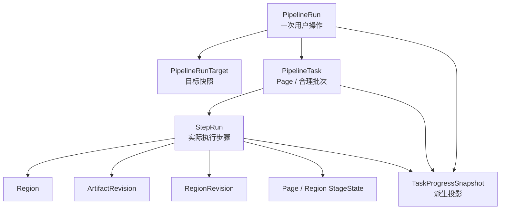
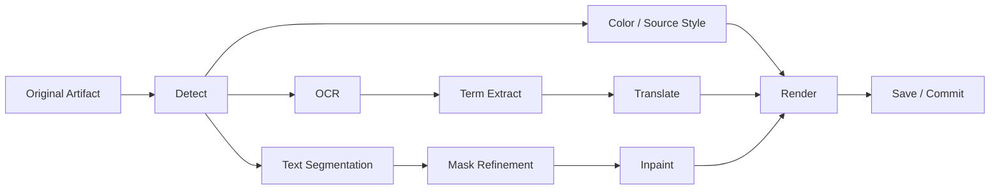
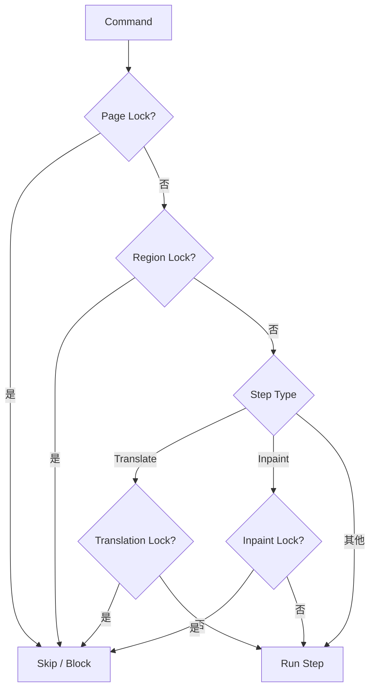
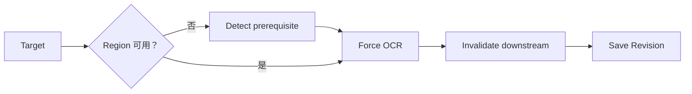
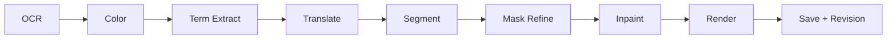

# 06 翻译 Pipeline 执行协议（Target Translation Pipeline）

> 本文件定义新漫画翻译软件的目标 Pipeline 执行协议（To-Be），用于把 `01 功能架构`、`02 技术架构`、`03 数据模型`、`04 用户流程`、`05 UI Mapping` 统一成可实现、可恢复、可测试的后台执行规则。
>
> 本文件直接承接：
>
> - `01_FUNCTIONAL_ARCHITECTURE_To-Be_同步03_任务进度版.md`
> - `02_TECHNICAL_ARCHITECTURE_To-Be_同步03_任务进度版.md`
> - `03_DATA_MODEL_任务进度同步版.md`
> - `04_USER_FLOW_任务进度同步版.md`
> - `05_UI_MAPPING.md`
>
> 已确认业务语义保持不变，包括：
>
> - `PipelineRun → PipelineRunTarget → PipelineTask → StepRun`
> - Page / Region / Translation / Inpaint 四类 Lock
> - 单 Region 重全翻译从 OCR 开始直到重新渲染并保存
> - Translation Constraint：章节级 > 作品级 > 全局
> - Translation Memory：作品优先 > 全局
> - Context Window 与实际写回范围严格分离
> - Webtoon 一张超长原图仍是一张逻辑 Page
> - 自动字号 + `-5..+5` 偏移 + `shrink_to_fit`
> - 工作台固定 `TaskProgressPanel`
> - 暂停 / 停止 / 继续
> - 已完成 / 失败 / 跳过 / 等待 / 当前 Page 联动
> - 已完成 Artifact / Revision 不因停止、失败或重试被静默删除
>
> **说明：** 前五份文档对部分 Step 失效规则、执行 DAG、重试边界和 Provider fallback 只给出了业务要求，没有定义完整执行协议。本文件将这些要求形式化为目标规则。凡需要反向补充 03 数据模型枚举 / command type 的内容，将在文末“同步建议”单独列出，不把新增点伪装成既有定义。

---

# 1. Pipeline 的职责边界

Pipeline 负责：

```text
确定目标范围
→ 解析设置 / Provider / Lock
→ 构建 Step DAG
→ 判断 Run / Skip / Block
→ 调度 CPU / GPU / Network
→ 执行 Step
→ 保存 Revision / ArtifactRevision
→ 更新状态
→ 聚合进度
→ 失败重试 / 暂停 / 继续 / 停止 / 恢复
```

Pipeline 不负责：

```text
直接绘制 QML
直接控制 UI Widget
直接弹窗
把业务真值保存在 ViewModel
删除用户源文件
静默解除 Lock
静默切换代理为 Direct
静默覆盖人工确认结果
```

---

# 2. Pipeline 核心对象



原则：

- `PipelineRun` 表示一次用户意图。
- `PipelineRunTarget` 冻结当时的目标集合。
- `PipelineTask` 表示可独立调度的工作单元。
- `StepRun` 是最小可记录执行步骤。
- UI 进度来自上述对象的投影，不建立第二套任务真值。

---

# 3. 用户可见流程与内部执行 DAG 分离

04 / 05 中用户可见的完整流程是：

```text
检测
→ OCR
→ 配色
→ 术语
→ 翻译
→ Mask
→ 修复
→ 渲染
→ 保存
```

为了正确表达数据依赖，06 将内部执行关系定义为 DAG，而不是要求所有步骤机械串行。

## 3.1 完整执行 DAG



### 3.2 解释

这不会改变用户看到的阶段顺序。

它只明确：

- OCR 与 Mask 分支都依赖 Region / Detection。
- Translation 不需要等待 Inpaint 才能开始。
- Inpaint 不需要等待 Translation 才能开始。
- Render 必须同时拿到：
  - 当前可用 `final_translation`
  - 当前可用 Clean Artifact
  - 当前 TextStyle / Color 信息

因此允许调度器在资源许可时并行执行：

```text
OCR / Translation 分支
与
Segmentation / Mask / Inpaint 分支
```

---

# 4. Step 类型

正式 Step：

```text
detect
ocr
color
term_extract
translate
segment
mask_refine
inpaint
render
save
export
```

其中：

- `save` 是提交/持久化边界，不是 AI Provider。
- `export` 不属于普通页面翻译必经链，只在 Export Pipeline 中执行。

---

# 5. Step 输入 / 输出总表

| Step | 主要输入 | 主要输出 | 典型 Revision / 状态 |
|---|---|---|---|
| `detect` | Original Artifact、Detection 设置 | Region 初始几何、检测 metadata | Region / RegionStageState |
| `ocr` | Original、Region 几何、OCR Provider | `ocr_text`、置信度、OCR provenance | RegionRevision |
| `color` | Original、Region | 文字/描边/背景颜色、原图字号估算等 | RegionTextStyle / Revision |
| `term_extract` | OCR、上下文、已有约束 | 自动术语候选 / 更新 | ConstraintRevision |
| `translate` | OCR、Constraint、TM、Context、Provider | `machine_translation` / 可用 final | RegionRevision |
| `segment` | Original、Region 几何 | 原始文字 Mask | MediaArtifact / ArtifactRevision |
| `mask_refine` | 原始 Mask、图像、Region | 精修 Mask | ArtifactRevision |
| `inpaint` | Original / 上游 Clean、最终 Mask、Router | Clean Artifact | ArtifactRevision |
| `render` | Clean、final_translation、TextStyle | Translated / Preview Artifact | ArtifactRevision |
| `save` | 当前 Step 输出 | current revision 指针、StageState | SQLite transaction |
| `export` | Translated Artifact / Text | ZIP/CBZ/PDF/Text/单图 | ExportHistory |

---

# 6. Detect Step

## 6.1 输入

```text
Original ArtifactRevision
Detection Provider
Detection Settings
Chapter Type
Page dimensions
```

## 6.2 输出

```text
Region 集合
BBox
Polygon（Provider 可提供或后处理生成）
初始 reading_order
Detection metadata
```

## 6.3 人工 Region 与 Detect

重新 Detect 不得无条件删除人工 Region。

目标策略：

```text
自动 Region
→ 可以由重新检测重建 / 匹配

人工新建 / 人工确认 Region
→ 必须保护
→ 不能静默删除
```

若重新 Detect 与人工 Region 冲突：

```text
保留人工 Region
+
将新检测结果作为候选 / 比较结果
```

---

# 7. OCR Step

## 7.1 Provider 解析

优先级：

```text
当前任务临时覆盖
>
章节 ProviderBinding
>
作品 ProviderBinding
>
全局默认 ProviderBinding
```

目标 OCR Provider 包括：

```text
manga-ocr
48px / RapidOCR
PaddleOCR Korean
OpenAI-compatible Vision OCR
其他注册 OCR Provider
```

## 7.2 韩国 Webtoon

默认路由目标：

```text
韩文常规文本
→ PaddleOCR Korean

复杂艺术字 / 常规 OCR 低质量
→ 已配置的 Vision OCR fallback
```

fallback 必须显式配置或由已确认的 OCR 路由策略允许，不得任意调用未授权远程 Provider。

## 7.3 输出

```text
ocr_text
confidence
provider provenance
model
options
timestamp
```

---

# 8. Color / Source Style Step

目标：

```text
提取原图文字颜色
描边 / 背景相关颜色
估算原图字体大小
辅助判断横排 / 竖排
```

输出用于：

```text
RegionTextStyle
Rendering
```

至少应支持：

```text
detected_source_font_size
source_font_size_confidence
text_color
stroke / fill 参考信息
```

若无法可靠估算字号：

```text
使用全局 / 作品 / 章节 TextStyle fallback
```

默认 fallback 字号：

```text
26
```

---

# 9. Term Extract Step

## 9.1 输入

```text
OCR
当前 Context
已有 TranslationConstraint
```

## 9.2 状态

```text
高置信度
→ Active

低置信度
→ Pending

用户拒绝
→ Rejected
```

## 9.3 人工优先

```text
人工锁定
>
人工未锁定
>
自动高置信度
>
自动待确认
```

自动 Term Extract 不得覆盖人工锁定项。

---

# 10. 批量翻译的 Constraint Freeze

Translation Pipeline 必须可复现。

批量 Run 推荐分成两个逻辑阶段：

```text
准备阶段
→ 冻结本次有效约束
→ 翻译阶段
```

## 10.1 准备阶段

针对本次目标范围：

```text
读取 / 补齐必要 OCR
→ 自动术语识别
→ 合并有效章节 / 作品 / 全局约束
→ 生成 effective constraint snapshot
```

## 10.2 翻译阶段

所有 Translation Step 使用本次 Run 的 effective snapshot。

如果用户在 Run 运行中修改术语：

```text
当前已启动 Run
→ 默认继续使用已冻结 snapshot

下一次 Run
→ 使用新的约束
```

这样避免同一批任务前半章和后半章因为用户中途改术语而产生不可追踪差异。

---

# 11. Translation Constraint 合并顺序

同一 source term 冲突时：

```text
章节级
>
作品级
>
全局
```

同层级内：

```text
人工锁定
>
人工值
>
自动 Active
```

`Pending / Rejected / Disabled` 不作为正式翻译约束。

---

# 12. Translation Memory 查询

翻译前：

```text
当前作品 Exact Match
→ 当前作品 Fuzzy Match
→ 全局 Exact / Fuzzy Match
```

TM 只作为 Translation Context。

不得：

```text
TM 匹配
→ 直接静默覆盖人工 final_translation
```

写入 TM 仍遵守：

```text
人工确认 final_translation
或
已校对内容
```

未经确认机器翻译不进入正式 TM。

---

# 13. Context Builder

Context Builder 负责：

```text
确定目标写回范围
收集上下文
按 reading_order 排序
加载 Constraint
加载 TM
控制 Token Budget
构造 Provider Request
记录实际上下文 provenance
```

UI 不自行拼 Prompt。

---

# 14. Context 与 Write Scope

核心不变量：

```text
Context Scope
≠
Write Scope
```

例如：

```text
上下文读取 Page 10~14
目标 Write Scope = Page 12
```

则：

```text
允许读取 Page 10~14 OCR
只允许写回 Page 12 的目标 Region
```

---

# 15. 单页上下文模式

单页翻译可：

```text
仅当前页
当前页 + 上一页
当前页 + 下一页
当前页 + 上下页
```

Context Builder 按：

```text
Page order
+
Region reading_order
```

组织文本。

---

# 16. 尽可能多页上下文模式

目标：

> 在 Provider Context Window / Token Budget 允许范围内，尽可能加入连续上下文。

算法目标：

```text
目标页
→ 优先加入目标页全部 Region
→ 向前 / 向后扩展连续 Page
→ 达到 Token Budget 前停止
```

必须保留：

```text
Page Boundary
Region ID
reading_order
```

以便正确映射输出。

---

# 17. Webtoon Context

Webtoon 一张超长图仍是一张逻辑 Page，因此不能只按“上下 Page”构建上下文。

Webtoon 使用：

```text
Region reading_order
→ 连续 Region Window
→ 按 Token Budget 分 Chunk
```

允许：

```text
前一 Chunk 的 OCR
+
当前 Chunk
+
后一小段 Context
```

但每个 Region 的写回范围必须明确。

Webtoon 临时 Tile：

```text
只用于图像处理
不得成为 Translation Context 的逻辑 Page
```

---

# 18. Translate Step

## 18.1 输入

```text
ocr_text
effective TranslationConstraint
Translation Memory matches
Context Bundle
Provider Profile snapshot
Translation options
```

## 18.2 输出

```text
machine_translation
Provider provenance
model
request options
context provenance
```

## 18.3 final_translation

如果没有人工编辑保护：

```text
machine_translation
→ 可成为当前 final_translation
```

如果存在人工确认 / edited_translation：

```text
自动结果不得静默覆盖
```

---

# 19. Text Segmentation

输入：

```text
Original
Region geometry
```

输出：

```text
raw text mask
```

目标：

- 提取真实文字像素；
- 减少检测框内背景误伤；
- 为 Mask Refinement 提供输入。

---

# 20. Mask Refinement

至少执行：

```text
去噪
膨胀
边界保护
气泡边框保护
人物 / 建筑 / 速度线等结构保护
```

保存：

```text
原始 Mask（如存在）
最终 Refined Mask
参数
来源
```

Mask 不能只留在内存中。

---

# 21. Inpaint Router

输入至少包括：

```text
mask_area_ratio
background_complexity
is_speech_bubble
is_solid_background
is_lineart
has_screentone
is_color_webtoon
structure_crossing_mask
preferred_quality
device_capability
provider_availability
```

目标路由：

```text
Simple Fill
Anime / Manga LaMa
AOT-GAN
BrushNet / PowerPaint
FLUX Fill
```

典型策略：

```text
白色 / 纯色小区域
→ Simple Fill

普通黑白漫画
→ Manga LaMa

网点 / 结构连续
→ AOT-GAN / Manga LaMa

彩色 Webtoon / 复杂背景
→ BrushNet / PowerPaint

关键细节仍失败
→ FLUX Fill
```

---

# 22. Inpaint Step

## 22.1 输入

```text
Original / 当前上游图像
Refined Mask
Region
Router Result
Provider Profile
```

## 22.2 输出

```text
Clean ArtifactRevision
provider
model
options
router_reason
fallback_chain
```

每次重新修复创建新的 ArtifactRevision。

不得覆盖旧版本。

---

# 23. Rendering Step

输入：

```text
Current Clean ArtifactRevision
final_translation
Region geometry
RegionTextStyle
```

目标字号：

```text
detected_source_font_size
→ auto_font_size
→ font_size_offset (-5..+5)
→ overflow detection
→ shrink_to_fit
→ final_font_size
```

规则：

- 原图字号优先。
- 译文过长可自动缩小。
- 不因译文较短而自动放大超过原图估算字号。
- 用户可关闭 Region 自动字号。
- 用户手动设置可以显式突破自动限制。

输出：

```text
Translated / Render Preview ArtifactRevision
```

---

# 24. Save / Commit Step

`save` 不只是“写一个文件”。

它负责把一次成功 Step 的结果安全提交为新的当前版本。

推荐提交协议：

```text
生成临时输出
→ 验证文件可读
→ 计算 Hash / metadata
→ 写入 Managed Storage 正式路径
→ SQLite Transaction
   ├─ 新建 ArtifactRevision / RegionRevision
   ├─ 更新 current revision
   └─ 更新 StageState
→ Commit
```

若任一步骤失败：

```text
旧 current revision 保持不变
半成品不成为 current
```

这样避免：

```text
数据库指向不存在文件
或
文件已覆盖但数据库仍是旧状态
```

---

# 25. Step Validity

Pipeline 在决定是否重跑 Step 前，需要判断现有结果是否仍然有效。

一个 Step 只有在以下条件同时成立时才能 Skip：

```text
已有成功结果
+
所有上游输入仍相同
+
影响该 Step 的设置没有变化
+
目标未要求 Force Rerun
+
Lock / Policy 允许复用
```

---

# 26. Step Decision

每个目标 Step 在执行前产生一个决定：

```text
RUN
SKIP_VALID
SKIP_POLICY
BLOCKED
```

### RUN

需要实际执行。

### SKIP_VALID

已有结果仍有效。

### SKIP_POLICY

根据命令语义跳过，例如：

```text
translate_untranslated 遇到已完成 Page
SFX policy = skip
```

### BLOCKED

无法执行，例如：

```text
Page Lock
Region Lock
必要输入缺失且无法自动补齐
Provider 不可用
```

---

# 27. Skip Reason

建议统一 reason code：

```text
already_valid
already_translated
page_locked
region_locked
translation_locked
inpaint_locked
sfx_skip
sfx_manual_only
out_of_scope
manual_protected
missing_required_input
provider_unavailable
```

TaskProgressPanel 的“跳过”详情应显示真实原因。

---

# 28. Step 失效 / Invalidation

06 将“已有结果存在但上游已经变化”定义为：

```text
STALE
```

STALE 不等于删除。

原则：

```text
旧 Revision 仍保留
current 结果可继续查看
但自动调度不能把它当成最新有效结果
```

---

# 29. Invalidation 依赖矩阵

| 发生变化 | 失效内容 |
|---|---|
| Original Artifact 改变 | Detect 及全部下游 |
| Region 几何改变 | OCR、Color、Segment、Mask、Inpaint、Render；Translation 视 OCR 是否改变而判断 |
| `ocr_text` 改变 | Term Extract、Translation；现有人工 final 保留但标记源文可能失配 |
| Translation Constraint 改变 | 后续新 Translation 使用新约束；已有译文不自动覆盖 |
| Translation Memory 改变 | 不强制失效已有译文，只影响后续 Translation |
| `final_translation` 改变 | Render |
| RegionTextStyle 改变 | Render |
| Mask 改变 | Inpaint、Render |
| Clean Artifact 改变 | Render |
| Inpaint Provider / 参数改变 | 只有明确重修时 Inpaint + Render |
| Rendering 参数改变 | Render |
| Provider 默认项改变 | 不自动废弃既有成功结果，下一次重跑使用新 Provider |

---

# 30. OCR 改变后的保护

重新 OCR：

```text
更新 ocr_text
→ 不自动删除 machine / edited / final
→ 标记 Translation 结果可能 STALE
```

如果存在：

```text
Translation Lock
manual_edited
人工确认 final_translation
```

则：

```text
保留译文
UI 提示：
“原文已变化，现有译文可能需要重译”
```

---

# 31. Lock Gate

所有自动 Step 在进入调度器前经过统一 Lock Gate。



---

# 32. 四类 Lock 精确语义

## Page Lock

```text
阻止该 Page 的自动 / 批量处理。
```

## Region Lock

```text
阻止该 Region 的自动处理。
```

## Translation Lock

```text
阻止 Translation Step 自动覆盖。
不阻止 Render。
```

## Inpaint Lock

```text
阻止 Inpaint Step 自动重跑。
不阻止使用现有 Clean Render。
```

---

# 33. 显式操作与 Lock

### 普通批处理

不得自动临时覆盖 Lock。

### 单 Region 重全翻译

已确认：

```text
Page Lock / Region Lock
→ 默认阻止
→ 用户必须先明确解锁

Translation Lock / Inpaint Lock
→ 用户明确执行“重全翻译”时
→ 弹覆盖确认
→ 仅本次 Run 临时覆盖
→ 数据中的锁本身保持不变
```

---

# 34. Pipeline Command Catalog

当前正式命令：

```text
translate_all
translate_untranslated
translate_selected
translate_single

rerender_all
rerender_selected
rerender_single

reinpaint_all
reinpaint_selected
reinpaint_single

reocr_all
reocr_selected
reocr_single

retranslate_region_full
```

Region Inspector 同时已有：

```text
单 Region OCR
单 Region 重译
单 Region 重新修复
单 Region 重渲染
```

文末将给出对应 command type 同步建议。

---

# 35. translate_all

作用域：

```text
当前 Chapter 全部目标 Page / Region
```

语义：

```text
已有有效 OCR
→ 复用，不强制重新 OCR

OCR 缺失 / 必要上游缺失
→ 自动补齐必要 prerequisite

Translation
→ 对符合条件且未被保护的目标重新执行

后续
→ 按有效性判断 Mask / Inpaint
→ Render
→ Save
```

不得：

- 覆盖 Page / Region Lock；
- 覆盖 Translation Lock；
- 静默覆盖人工 final。

---

# 36. translate_untranslated

目标：

```text
未翻译
翻译失败
缺失译文
```

跳过：

```text
已完成
已锁定
人工保护
```

对未处理原始 Page：

```text
允许自动补齐 Detect / OCR 等必要 prerequisite
```

但：

```text
存在有效 OCR
→ 不重新 OCR
```

---

# 37. translate_selected

目标：

```text
PipelineRunTarget 中选中的 Page
```

06 安全默认：

```text
未完成 / 失败 / 缺失内容
→ 执行

已经完成且有效
→ 默认 SKIP_VALID
```

如果后续需要“选择页强制重译”，建议增加独立明确命令，而不是让普通“选择页翻译”隐式覆盖已有人工成果。

---

# 38. translate_single

作用域：

```text
单 Page
```

安全默认与 `translate_selected` 相同：

```text
有效完成内容默认复用
缺失 / 失败 / stale 内容执行
```

Region 层需要强制重译时使用 Region 重译命令。

---

# 39. reocr_all / selected / single

DAG：



语义：

```text
Force OCR
不自动 Translation
不自动 Inpaint
不自动 Render
```

完成后：

```text
Term / Translation 可能 STALE
UI 显示“原文已变化，可能需要重译”
```

---

# 40. reinpaint_all / selected / single

默认 DAG：

```text
Target Region
→ 检查现有 Mask
→ Mask 有效：复用
→ Mask 缺失 / stale：Segment → Mask Refine
→ Force Inpaint
→ 新 Clean ArtifactRevision
→ Mark Render STALE
```

本命令默认不自动重译。

本命令默认不隐式删除旧 Translated Artifact。

用户可随后执行：

```text
重新渲染
```

---

# 41. rerender_all / selected / single

严格只执行：

```text
current final_translation
+
current valid Clean Artifact
+
current TextStyle
→ Render
→ Save
```

不执行：

```text
OCR
Translation
Segmentation
Mask Refine
Inpaint
```

若没有可用 Clean Artifact：

```text
BLOCKED: missing_clean_artifact
```

UI 应提供：

```text
[先执行重新修复]
```

---

# 42. 单 Region OCR

作用域：

```text
一个 Region
```

执行：

```text
OCR
→ RegionRevision
→ 下游 Translation 标记 STALE
```

不修改同 Page 其他 Region。

---

# 43. 单 Region 重译

与“重全翻译”严格区分。

普通重译：

```text
当前 ocr_text
+ 当前有效 Constraint
+ TM
+ Context
→ Force Translate
→ 更新 machine_translation
→ 按人工保护规则更新 final
→ 若 Clean 有效，则 Render
```

不执行：

```text
OCR
Segmentation
Mask Refine
Inpaint
```

---

# 44. 单 Region 重全翻译

已确认定义：



执行范围：

```text
只允许写当前 Region
```

内部调度可并行：

```text
OCR → Term → Translate
与
Segment → Mask → Inpaint
```

最终在 Render 汇合。

---

# 45. 单 Region 重全翻译：保护规则

执行前必须检查：

```text
Page Lock
Region Lock
Translation Lock
Inpaint Lock
manual_edited
人工确认 final
```

Page / Region Lock：

```text
要求先明确解锁
```

Translation / Inpaint Lock：

```text
允许本次临时覆盖确认
锁值本身不永久改变
```

人工确认内容：

```text
必须提示覆盖影响
旧 RegionRevision 保留
```

---

# 46. 单 Region 重新修复

```text
当前 Region
→ Mask 有效则复用
→ 否则 Segment / Mask Refine
→ Force Inpaint
→ 新 Clean Revision
→ Render 标记 STALE
```

不影响其他 Region。

---

# 47. 单 Region 重渲染

```text
当前 Region final_translation
+
当前 Region / Page Clean
+
TextStyle
→ Force Render
```

允许在：

```text
Translation Lock = true
Inpaint Lock = true
```

时执行。

---

# 48. Pipeline Plan 构建

创建 PipelineRun 后，不立即盲目执行。

先构建计划：

```text
Resolve Targets
→ Resolve Settings
→ Resolve Provider Bindings
→ Resolve Locks
→ Build Required DAG
→ Check Existing Step Validity
→ Mark RUN / SKIP / BLOCKED
→ Create Tasks
→ Start Scheduler
```

---

# 49. 设置快照

PipelineRun 创建时冻结：

```text
settings_snapshot_json
provider_binding_snapshot_json
context_policy_json
```

目的：

- 运行中用户修改全局设置不影响已经开始的 Run。
- 可复现“当时用的是什么配置”。

---

# 50. Provider Snapshot

Run 开始后：

```text
Provider Profile 配置变化
→ 不静默切换当前已运行 Run
```

如果恢复任务时原 Provider 不存在 / 被禁用：

```text
Run 保持 Interrupted / Blocked
→ UI 要求重新绑定
→ 用户确认后继续
```

不得静默用另一个 Provider 继续，除非原 Run 的 fallback policy 明确允许。

---

# 51. Provider Fallback 总原则

只允许：

```text
显式配置的 fallback
或
架构中已定义的 Router fallback
```

禁止：

```text
Provider 失败
→ 随便选另一个可用 Provider
```

---

# 52. OCR Fallback

示例：

```text
PaddleOCR Korean
→ 低质量 / 特定失败
→ 已配置 Vision OCR
```

记录：

```text
first_provider
failure_reason
fallback_provider
final_provider
```

---

# 53. Inpaint Fallback

Inpaint Router 可根据场景直接选层级，也可以失败后按配置 fallback。

例如：

```text
Manga LaMa
→ structure insufficient
→ AOT-GAN
→ complex color
→ BrushNet / PowerPaint
→ final fallback
→ FLUX Fill
```

每次尝试都必须可诊断。

---

# 54. Translation Provider Fallback

默认：

```text
不自动跨 Provider fallback
```

只有用户明确配置：

```text
Primary
→ Secondary
```

时才能执行。

原因：

不同翻译模型可能产生明显风格差异。

---

# 55. 网络代理失败

遵守已有 NetworkProfile 规则：

```text
Proxy Failure
≠
自动 Direct
```

只有用户启用：

```text
allow_proxy_failure_direct_fallback
```

才允许 Direct。

发生 Direct fallback 时：

```text
UI 必须可见
Audit / provenance 必须记录
```

---

# 56. Step Retry

分两类。

## 56.1 同 Provider 自动 Retry

适用于明确可重试错误，例如：

```text
ReadTimeout
ProviderRateLimitError
ProviderUnavailableError
```

根据设置执行有限次数重试。

## 56.2 不自动 Retry

例如：

```text
ProviderAuthenticationError
ProxyAuthenticationError
InvalidInput
MissingCredential
LockBlocked
```

应立即失败并让用户修复。

---

# 57. Retry 不得改变输入

同一个 Step 自动 Retry：

```text
相同目标
相同输入 Revision
相同设置 snapshot
相同 Provider（除非显式 fallback）
```

这样 retry 才是同一个执行意图。

---

# 58. 用户“重试失败页”

UI：

```text
TaskProgressPanel
→ 查看失败
→ 重试失败页
```

目标规则：

```text
收集失败 Page
→ 创建新的 PipelineRunTarget
→ 从第一个仍需执行的失败 / stale Step 开始
→ 复用有效上游结果
```

原失败 Run 保留历史。

新 Run 在 provenance / summary 中引用来源 Run。

---

# 59. 暂停 Pause

Run 级：

```text
pause_requested = true
```

Scheduler：

```text
停止启动新的 Page
停止启动新的 Step
```

当前正在执行 Step：

```text
Provider 支持安全 cooperative pause / cancel
→ 可安全停止

不支持
→ 允许该 Step 完成
→ 在 Step 边界进入 paused
```

---

# 60. Pause Safe Boundary

第一版最可靠的安全边界：

```text
两个 StepRun 之间
```

不得为了“立刻暂停”而留下：

```text
半个数据库事务
半个正式 Artifact
损坏的 current revision
```

---

# 61. 继续 Continue

```text
paused
→ pause_requested = false
→ 验证已有 Step 状态
→ 从第一个未完成 / stale Step 继续
```

已经成功且仍有效的 Step：

```text
SKIP_VALID
```

不重复执行。

---

# 62. 停止 Stop

用户点击停止：

```text
cancel_requested = true
```

行为：

```text
不启动新 Step
不启动新 Page
Pending Task → cancelled
```

当前 Step：

```text
可安全 cooperative cancel
→ cancel

不可安全 cancel
→ 完成当前 Step
→ 不进入下一 Step
```

保留：

```text
已完成 Page
RegionRevision
ArtifactRevision
Translation
Clean
Render
```

不得回滚。

---

# 63. Stop 与 Delete 区分

```text
停止任务
≠
删除任务
≠
回滚任务
≠
删除已经生成的结果
```

停止只是：

```text
停止剩余执行
```

---

# 64. 应用异常退出

启动恢复时：

```text
running
→ interrupted
```

然后：

```text
读取 PipelineRun
→ 读取 Task / StepRun
→ 校验 Artifact / Revision
→ 确定最后安全提交点
```

UI：

```text
[继续]
[重新开始]
[放弃]
```

---

# 65. Crash Resume

选择“继续”：

```text
已 completed 且输入仍有效
→ SKIP_VALID

running 但没有成功 commit
→ 重新执行该 Step

failed
→ 从失败 Step 根据 retry policy 继续

pending
→ 正常调度
```

---

# 66. 半成品清理

所有 AI / Render 文件输出应先进入：

```text
temporary path
```

只有 Save / Commit 成功后才进入正式 current revision。

应用恢复时：

```text
未登记的 temp artifact
→ 可清理
```

不得把临时文件误认为正式输出。

---

# 67. Webtoon 图像切片 Pipeline

Webtoon：

```text
一个超长 Original
= 一个逻辑 Page
```

处理器可：

```text
按宽 / 高 / 模型输入限制
→ 生成临时 Tile
→ 各 Tile 检测 / OCR / Mask
→ 映射回逻辑原图坐标
```

临时 Tile：

```text
不生成永久 Page
不进入阅读 Page List
不进入正式 ArtifactRevision
```

---

# 68. Webtoon Region 坐标

所有 Region 最终坐标必须使用：

```text
逻辑 Original Page 坐标
```

即使 Provider 输入是 Tile：

```text
Tile local coordinate
→ 转换为 Original global coordinate
```

否则：

- Viewer overlay
- Mask
- Reading
- Revision
- Render

会失去统一坐标基准。

---

# 69. Webtoon Inpaint

对于彩色 Webtoon：

```text
is_color_webtoon = true
```

复杂背景优先：

```text
BrushNet / PowerPaint
```

FLUX Fill：

```text
高质量回退
非默认批处理
```

---

# 70. Rendering 与 Webtoon

Render 必须在逻辑原图坐标系中完成。

允许内部：

```text
Tile Render
→ 拼回逻辑长图
```

但输出：

```text
Translated Artifact
```

仍属于同一个 Page。

---

# 71. Page / Region StageState

PageStageState / RegionStageState 用于细粒度 UI 与 Pipeline 判断。

现有状态：

```text
not_started
pending
running
completed
failed
skipped
interrupted
cancelled
```

06 建议增加：

```text
stale
```

用于：

> 曾经成功，但上游变化后结果不再是当前有效结果。

---

# 72. Page 综合状态

从 StageState 派生。

示例：

```text
所有需要 Step completed / valid
→ 已完成

任一正在执行
→ 处理中

一部分完成，一部分未完成
→ 部分完成

存在失败且仍未重试成功
→ 失败 / 部分失败

存在 review requirement
→ 需校对

Page Lock
→ 已锁定
```

---

# 73. PipelineRun 聚合状态

```text
pending
running
paused
completed
completed_with_failures
failed
cancelled
interrupted
```

判定：

### completed

```text
全部目标进入 terminal state
且没有失败 Task
```

### completed_with_failures

```text
全部目标已经停止继续调度
且至少一个 Page / Task failed
但 Run 本身没有致命调度错误
```

### failed

```text
Run 级致命错误
导致整个 Run 无法形成正常终态
```

---

# 74. TaskProgress 页数统计

对 `PipelineRunTarget` 中 Page 目标聚合。

```text
total_page_count
completed_page_count
failed_page_count
skipped_page_count
waiting_page_count
processing_page_count
```

同一 Page 只进入一个主分类。

建议优先级：

```text
failed
>
processing
>
completed
>
skipped
>
waiting
```

---

# 75. TaskProgress 百分比

不能只用：

```text
已完成页 / 总页
```

因为当前 Page 可能已经执行大部分步骤。

第一版推荐按“计划 Step Unit”计算：

```text
task_progress
=
terminal_step_units / planned_step_units
```

Run：

```text
overall_progress
=
所有 Task 已终结 Step Unit
/
所有 Task 计划 Step Unit
```

其中 terminal 包括：

```text
completed
skipped
failed
cancelled
```

失败 / 跳过仍是“已经得到终态”，但 UI 必须通过独立计数显示它不是成功。

---

# 76. Step Weight

第一版：

```text
每个 planned Step = 1 unit
```

避免凭经验猜测耗时权重。

后续如果采集到稳定历史运行时间，可再引入动态权重。

---

# 77. 当前 Page

若只运行一个 Task：

```text
current_page_id = Running Task Page
```

若存在并发：

```text
TaskProgressPanel
→ 显示一个 Primary Focus Page
→ Task Detail 显示全部并发 Task
```

第一版 Primary Focus 可定义为：

```text
target_order 最小的 Running Task
```

这样行为稳定、可预测。

---

# 78. 当前 Step

```text
current_step_type
=
Primary Focus Task 当前 Running StepRun
```

如果 Task 在等待资源：

```text
显示“等待 GPU”
“等待网络”
“等待模型”
```

不要错误显示为某个尚未开始的 Step。

---

# 79. PageList 与 TaskProgress 同源

必须：

```text
PipelineRun / Task / StepRun
        ↓
同一 Task Projection
        ↓
PageList 状态
+
TaskProgressPanel
```

禁止：

```text
PageList 自己算一套
TaskProgressPanel 再算一套
```

否则容易出现：

```text
进度面板：已完成
PageList：处理中
```

---

# 80. 资源调度

资源池至少区分：

```text
CPU
GPU
Network
Disk / IO
```

Provider 声明需要的资源。

---

# 81. GPU

GPU 模型：

```text
统一 DeviceManager / ModelManager
```

Scheduler 不能让多个页面各自无控制抢显存。

至少需要：

```text
GPU capacity / mutex
model load state
device fallback policy
```

---

# 82. CPU fallback

GPU 不可用时：

```text
只有 Provider 声明支持 CPU
→ 才可 fallback CPU
```

发生 fallback：

```text
记录 device provenance
UI 可提示
```

不得假装仍在 GPU 执行。

---

# 83. Network Concurrency

云端 OCR / Translation：

```text
按 Provider rate limit
+
软件并发设置
```

控制。

Provider RateLimit：

```text
进入 Retry Policy
```

不能让大量 Page 同时无界请求。

---

# 84. 多页 Context 与并发

“尽可能多页上下文”与 Page 独立并发存在冲突。

因此 Translation Scheduler 必须先构建：

```text
Context Group
```

再执行。

Paged：

```text
连续 Page
→ 按 Token Budget 分组
```

Webtoon：

```text
连续 Region
→ 按 Token Budget 分组
```

不同 Context Group 之间可根据设置并发。

同一 Group 内输出必须能映射回：

```text
Page ID
Region ID
```

---

# 85. SFX Policy Gate

Region：

```text
region_type = sfx
```

策略：

### skip

```text
Translation Step → SKIP_POLICY
```

### manual

```text
自动 Translation → SKIP_POLICY
用户可以人工输入
```

### translate

```text
进入正常 Translation
```

---

# 86. 自动字号失效规则

如果变化：

```text
ocr / source style estimate
Region geometry
final_translation
font_size_offset
font
stroke
line_spacing
text direction
```

则：

```text
Render → STALE
```

不自动使：

```text
OCR
Translation
Inpaint
```

失效。

---

# 87. Revision 创建规则

## RegionRevision

在以下重要事件创建：

```text
OCR 保存
重译结果接受
人工译文保存
final 确认
Geometry 保存
TextStyle 保存
Lock 关键变化
批处理覆盖人工内容前保护点
```

## ArtifactRevision

```text
Mask
Clean
Translated
Preview
Export（如建 Artifact）
```

生成新版本。

---

# 88. Revision 与 current

原则：

```text
Revision History
≠
Current Revision
```

重跑成功：

```text
新增 Revision
→ 更新 current pointer
```

重跑失败：

```text
不改变 current pointer
```

因此失败不会破坏上一个可用结果。

---

# 89. 人工修改保护

任何自动 Step 在写 Region 前都要再次进行“写入时保护检查”。

即使任务开始时没有 Lock：

```text
任务运行中
→ 用户手工编辑并自动 Translation Lock
→ 后台 Translation 请求稍后返回
```

此时后台结果：

```text
可保存为候选 / provenance
但不得覆盖当前人工 final
```

不能只在任务开始前检查一次 Lock。

---

# 90. Optimistic Write Guard

建议写入时比较：

```text
目标 Region revision
```

如果：

```text
Step 开始时 revision = 10
返回时 current revision = 12
```

说明用户或其他任务已经修改。

自动 Step：

```text
不得直接覆盖 revision 12
```

应：

```text
生成冲突结果 / candidate
或
标记 Step needs_review
```

这是保护人工编辑的重要最后防线。

---

# 91. 同一 Page 多任务冲突

默认不允许两个写任务同时修改同一个 Region 的同一能力。

例如：

```text
Run A Translate Region X
Run B Translate Region X
```

Scheduler 应：

```text
序列化
或
第二个任务等待
```

不同能力可在 DAG 安全时并行：

```text
Translate Region X
与
Inpaint Region X
```

因为最终在 Render 汇合。

---

# 92. Error 分类

## Input / Domain

```text
MissingOriginalArtifact
MissingRegion
MissingOCRText
MissingCleanArtifact
InvalidGeometry
LockBlocked
ManualProtectionConflict
```

## Provider

```text
ProviderAuthenticationError
ProviderRateLimitError
ProviderUnavailableError
ProviderInvalidResponseError
```

## Network

```text
ProxyConnectionError
ProxyAuthenticationError
DNSResolutionError
TLSHandshakeError
ConnectTimeout
ReadTimeout
```

## Device / Model

```text
ModelLoadError
OutOfMemoryError
DeviceUnavailableError
```

## Storage

```text
FileReadError
FileWriteError
ArtifactCommitError
DatabaseTransactionError
```

## Pipeline

```text
OutputMappingError
ContextBuildError
InterruptedError
CancelledError
```

---

# 93. Error 与 UI

错误不能只 Toast。

必须可从：

```text
Page Badge
TaskProgressPanel
TaskDetailWindow
```

定位。

任务详情至少显示：

```text
Page
Region（如适用）
Step
Provider
Model
Error Code
Error Summary
Retry Count
```

---

# 94. 失败后保留

一个 Page：

```text
OCR success
Translate success
Inpaint failed
```

则：

```text
OCR Revision 保留
Translation Revision 保留
旧 Clean current 保留
新的 Inpaint Step failed
```

用户重试：

```text
从 Inpaint 继续
```

不重跑 OCR / Translation。

---

# 95. Retry Failed Pages

批量 Run：

```text
40 Page
38 completed
2 failed
```

状态：

```text
completed_with_failures
```

UI：

```text
[查看失败]
[重试失败页]
```

重试只构建失败目标的新 Run。

---

# 96. Export Pipeline

Export 独立于 Translation Pipeline。


格式：

```text
single_image
zip
cbz
pdf
text
```

---

# 97. Export 与 stale

默认导出应检查：

```text
Translated Artifact 是否 current / valid
```

如果存在 stale 页面：

```text
UI 提示
“部分页面不是最新渲染结果”
```

用户可以：

```text
先重新渲染
或
明确继续导出现有版本
```

不应静默假装所有输出最新。

---

# 98. Pipeline 日志保留

长期保留：

```text
PipelineRun summary
失败摘要
人工干预关键记录
```

可清理：

```text
成功 Step 的低价值详细日志
Debug Artifact
临时 Tile
临时 Provider payload（如不需要审计）
```

敏感数据必须脱敏。

---

# 99. Credential / Prompt 安全

日志不得记录：

```text
API Key
Proxy Password
完整敏感 Credential
```

如果 Translation Request 需要调试：

```text
优先保存结构化 metadata
```

是否保存完整 Prompt / Response 应由高级诊断选项控制，并明确提示其中可能包含漫画文本。

---

# 100. Pipeline 测试矩阵

至少覆盖：

| 测试 | 必须验证 |
|---|---|
| Full Translation | 从缺失 prerequisite 到 Render 正常完成 |
| Reuse OCR | `translate_all` 不重复有效 OCR |
| Skip Translated | `translate_untranslated` 跳过完成内容 |
| Page Lock | 批量任务不处理锁定 Page |
| Region Lock | 不处理锁定 Region |
| Translation Lock | 不覆盖人工译文 |
| Inpaint Lock | 不自动重修 |
| Re-render | 不触发 OCR / Translation / Inpaint |
| Re-OCR | 不覆盖人工 final，正确标记下游 stale |
| Region Retranslate | 不重新 OCR / Inpaint |
| Region Full Retranslate | 从 OCR 到 Render，只影响目标 Region |
| Pause | 在安全边界暂停 |
| Continue | 从断点继续 |
| Stop | 保留已完成成果 |
| Crash Resume | Running → Interrupted → Resume |
| Retry | 从失败 Step 继续 |
| Provider Fallback | 只使用显式 fallback |
| Proxy Failure | 默认不静默 Direct |
| Revision | 失败不改变 current revision |
| Optimistic Guard | 后台结果不能覆盖任务期间人工修改 |
| Webtoon | Tile 不变成 Page，坐标正确回映 |
| Context Scope | 读取上下文但只写目标 |
| TM | 未确认机器译文不写 TM |
| Constraint Priority | Chapter > Book > Global |
| Progress | PageList 与 TaskProgressPanel 同源 |
| CompletedWithFailures | 部分失败仍保留成功成果 |

---

# 101. 关键 Pipeline 验收场景

## 场景 A：首次处理未翻译章节

```text
选择全部翻译（跳过已翻译）
→ Page 无 Region
→ Detect
→ OCR / Color / Segment
→ Term Extract
→ Constraint Freeze
→ Translate
→ Mask Refine / Inpaint
→ Render
→ Save
→ completed
```

## 场景 B：已有 OCR，重新全部翻译

```text
translate_all
→ OCR valid
→ SKIP_VALID OCR
→ Force Translation
→ valid Clean 可复用
→ Render
→ Save
```

## 场景 C：手工改过一个 Region

```text
manual_edited = true
translation_locked = true
→ translate_all
→ 该 Region Translation SKIP_POLICY
→ 其他 Region 正常处理
```

## 场景 D：单 Region 重全翻译

```text
点击重全翻译
→ Translation / Inpaint Lock 存在
→ 用户确认本次覆盖
→ OCR
→ Color
→ Term
→ Translate
→ Segment / Mask / Inpaint
→ Render
→ 新 Revision
→ 原锁保持 true
```

## 场景 E：暂停

```text
Page 23 正在 Inpaint
→ Pause
→ 当前 Provider 不支持安全暂停
→ Page 23 Inpaint 完成
→ 不开始 Render
→ run = paused
```

## 场景 F：停止

```text
40 Page
已完成 27
当前 Page 28
→ Stop
→ 当前安全结束
→ 剩余 Pending cancelled
→ 已完成 27 Page 不回滚
```

## 场景 G：失败后继续

```text
Page 8 OCR 成功
Translate Provider timeout
→ Retry
→ OCR 不重跑
→ Translate 重试
```

---

# 102. 与 TaskProgressPanel 的执行契约

`TaskProgressPanel` 需要的字段都必须由 Pipeline 提供：

```text
run_title
run_status
overall_progress

total_page_count
completed_page_count
failed_page_count
skipped_page_count
waiting_page_count

current_page_id
current_page_name
current_thumbnail
current_step_type
step_flow

can_pause
can_continue
can_stop
```

UI 只消费。

UI 不自己推断 Step 是否成功。

---

# 103. 按钮可用状态

## Running

```text
can_pause = true
can_stop = true
can_continue = false
```

## Paused

```text
can_pause = false
can_stop = true
can_continue = true
```

## Completed / CompletedWithFailures

```text
false / false / false
```

失败页另提供：

```text
Retry Failed
```

## Interrupted

```text
Continue
Restart
Abandon
```

---

# 104. Pipeline 不变量

必须始终成立：

1. 用户源文件不被修改。
2. 已人工确认结果不被后台静默覆盖。
3. Lock 在 Step 开始与写入时都要检查。
4. Context 读取范围不得扩大写回范围。
5. 重跑成功创建新 Revision，不直接销毁旧 Revision。
6. 重跑失败不改变上一个 current revision。
7. 停止不回滚成功成果。
8. 暂停只在安全边界生效。
9. 崩溃恢复不得把 Running 误判为成功。
10. Provider / Proxy fallback 必须符合显式策略。
11. PageList 与 TaskProgressPanel 必须使用同一任务投影。
12. Webtoon Tile 永远不是逻辑 Page。
13. `retranslate_region_full` 永远只能写目标 Region。
14. 重新渲染不得偷偷执行 OCR / Translation / Inpaint。
15. Translation Memory 不接受未经确认的机器翻译。

---

# 105. 06 对 03 的同步建议

为了让数据模型完全表达本执行协议，下一次同步 03 时建议补充以下内容。

## 105.1 StageState 增加 `stale`

现有：

```text
not_started
pending
running
completed
failed
skipped
interrupted
cancelled
```

建议增加：

```text
stale
```

原因：

> “从未执行”与“执行过但因上游改变而失效”必须区分。

## 105.2 补齐 Region command type

03 已有 Region UI 能力，但 command type 列表只正式列出了：

```text
retranslate_region_full
```

建议补充：

```text
ocr_region
retranslate_region
reinpaint_region
rerender_region
```

这样 Region Inspector 的四类独立动作也能进入统一 PipelineRun / Task / StepRun 审计。

## 105.3 Retry 来源

用户点击“重试失败页”创建新 PipelineRun 时，建议在 Run provenance / summary 中记录：

```text
source_run_id
retry_reason
```

不一定必须单独加列，也可进入现有 `summary_json / provenance`。

## 105.4 Optimistic Write Guard

建议在 Step provenance 中记录：

```text
input_region_revision_id
```

写入时对比 current RegionRevision，防止后台结果覆盖任务运行期间的人工编辑。

---

# 106. 与 01~05 的一致性

本文件没有改变前五份文档的核心用户设计：

```text
01
→ 功能能力

02
→ 技术层 / Provider / Task 边界

03
→ PipelineRun / Task / StepRun / Revision 数据真值

04
→ 用户从哪里发起操作

05
→ 按钮 / Panel / Window 在哪里

06
→ 点击以后后台到底如何执行
```

保持：

- 四个一级页面。
- 默认进入书架。
- Workbench 为翻译生产核心。
- TaskProgressPanel 固定底部。
- 单页 / 多选 / 全部批处理。
- 单 Region OCR / 重译 / 重全翻译 / 重修 / 重渲染。
- Translation Constraint。
- Translation Memory。
- Page / Region / Translation / Inpaint Lock。
- Revision / ArtifactRevision。
- Provider / Network Profile。
- Webtoon 单逻辑 Page。
- 自动字号。
- 暂停 / 停止 / 继续。
- completed_with_failures。

---

# 107. 下一步：07_NON_FUNCTIONAL_REQUIREMENTS

07 应在本 Pipeline 协议基础上定义：

```text
性能目标
大章节 / 大 Webtoon 容量
内存上限
GPU / CPU 资源
并发默认值
UI 响应时间
TaskProgress 刷新频率
SQLite 并发 / 事务
文件完整性
备份 / 恢复
日志保留
缓存大小
模型缓存
安全 / Credential
网络超时 / Retry 上限
崩溃恢复
打包
Windows 路径 / 长路径
测试资产规模
```

06 之后，07 不再定义业务执行语义，只定义“这些行为要达到什么质量、性能和可靠性标准”。
