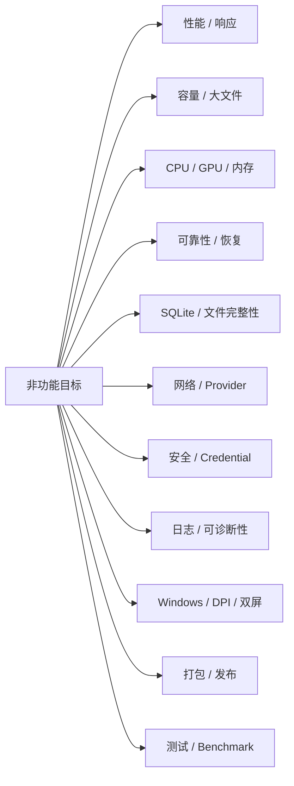

# 07 非功能需求（Target Non-Functional Requirements）

> 本文件定义新漫画翻译软件的目标非功能需求（To-Be），用于约束性能、稳定性、容量、资源占用、数据安全、备份恢复、网络、日志、可诊断性、Windows 兼容性、打包和测试质量。
>
> 本文件基于：
>
> - `01_FUNCTIONAL_ARCHITECTURE_To-Be_同步03_任务进度版.md`
> - `02_TECHNICAL_ARCHITECTURE_To-Be_同步03_任务进度版.md`
> - `03_DATA_MODEL_任务进度同步版.md`
> - `04_USER_FLOW_任务进度同步版.md`
> - `05_UI_MAPPING.md`
> - `06_TRANSLATION_PIPELINE.md`
>
> **边界：**
>
> `07` 不重新定义业务流程。  
> “执行什么、从哪一步开始、什么时候 Skip / Lock / Retry”由 `06_TRANSLATION_PIPELINE.md` 定义。  
> 本文件只定义这些行为要达到的**速度、容量、可靠性、安全性和可维护性标准**。
>
> 本文件中的数值分为：
>
> - **MUST**：第一版必须满足。
> - **SHOULD**：推荐目标，若达不到必须记录原因。
> - **TUNABLE**：默认值，可在设置中调整。
>
> 尚未经过真实硬件基准测试的数值均属于**目标基线**，后续必须通过 Benchmark 校准，不应把预测值当成已经达到的性能。

---

# 1. 非功能目标总览



---

# 2. 目标平台

## 2.1 主平台

**MUST**

```text
Windows x64 Desktop
```

目标运行形态：

```text
PySide6
Qt Quick / QML
Python
SQLite
Managed File Storage
```

不把浏览器 / Web SPA 作为主运行形态。

## 2.2 Windows 版本策略

第一版推荐：

```text
Primary Support：
Windows 11 x64

Compatibility / Best Effort：
仍能满足依赖要求的 Windows 10 x64 环境
```

正式 Release 前必须明确最终支持矩阵。

## 2.3 权限

**MUST**

普通使用不得要求：

```text
Administrator
```

以下操作除外：

- 用户主动选择系统级安装目录；
- 驱动 / CUDA 等第三方组件本身要求管理员权限；
- 用户主动执行需要管理员权限的系统操作。

---

# 3. 启动性能

## 3.1 冷启动

推荐硬件上：

**SHOULD**

```text
点击程序
→ 书架主界面可交互
P95 ≤ 3 秒
```

其中不包括：

```text
首次模型下载
首次大型数据库迁移
用户主动恢复大型备份
```

## 3.2 启动原则

**MUST**

启动时不得自动加载：

```text
全部 OCR 模型
全部 Inpaint 模型
全部 Translation Provider
全部 Webtoon 大图
```

必须：

```text
Core / UI 先启动
→ 模型 Lazy Load
```

## 3.3 首次模型加载

模型首次加载耗时不计入普通 UI 冷启动指标。

UI 必须显示：

```text
正在加载模型
模型名称
设备
进度 / 状态
```

不得表现为界面“卡死”。

---

# 4. UI 响应时间

除明确的异步耗时任务外：

## 4.1 即时交互

**SHOULD**

```text
按钮按下 → 视觉反馈
≤ 100 ms
```

## 4.2 一级页面切换

已有数据可用且不触发重型 IO 时：

**SHOULD**

```text
书架 / 工作台 / 阅读器 / 设置
P95 ≤ 300 ms
```

## 4.3 Fixed Panel

例如：

```text
点击 Book → BookDetailPanel
点击 Page → Viewer
点击 Region → Inspector
```

已有数据在内存 / 本地索引可用时：

**SHOULD**

```text
P95 ≤ 200 ms
```

## 4.4 禁止主线程阻塞

**MUST**

以下操作不得在 QML / UI Thread 长时间同步执行：

```text
OCR
Detection
Translation
Inpaint
大型图片解码
文件 Hash
PDF / MOBI 解析
模型加载
大量数据库扫描
网络请求
备份
导出
```

---

# 5. UI 卡顿红线

**MUST**

正常交互过程中不得出现持续：

```text
> 500 ms
```

的无反馈冻结。

若某操作预计超过：

```text
300 ms
```

推荐：

```text
异步执行
+
Loading / Progress / Busy State
```

---

# 6. TaskProgressPanel 刷新频率

任务进度更新过快会拖慢 QML。

默认：

```text
TUNABLE：
4 Hz
```

即最多约：

```text
每 250 ms 一次 UI Progress Projection 刷新
```

允许重要事件立即推送：

```text
Task Failed
Run Paused
Run Completed
Current Page Changed
Current Step Changed
```

但普通百分比变化应节流。

---

# 7. Viewer 流畅度

## 7.1 普通漫画

推荐硬件、常规页面尺寸下：

**SHOULD**

```text
Zoom / Pan / Page Switch
无明显卡顿
```

目标：

```text
交互滚动 / 平移尽量维持 60 FPS
最低可接受持续帧率不应长期低于 30 FPS
```

该指标只针对 Viewer 交互，不要求 AI 推理达到实时帧率。

## 7.2 Region Overlay

**MUST**

Region Overlay 更新不得因为单个 Region 属性变化而重建整章所有 Region。

应支持：

```text
当前 Page 局部刷新
单 Region 增量刷新
```

---

# 8. DPI 与显示缩放

**MUST**

验证 Windows：

```text
100%
125%
150%
175%
200%
```

显示缩放。

不得出现：

- 文本裁切；
- Footer 按钮不可见；
- Floating Window 超出屏幕；
- Inspector 内容无法滚动；
- TaskProgressPanel 控件重叠。

---

# 9. 双屏 / 多显示器

**MUST**

至少验证：

```text
主窗口在屏幕 A
Floating Window 拖到屏幕 B
```

并覆盖：

```text
不同 DPI
不同分辨率
不同缩放比例
```

窗口恢复时，如果原显示器不存在：

```text
自动回到当前可用主屏
```

不得恢复到不可见屏幕区域。

---

# 10. Floating Window 自适应

**MUST**

悬浮窗：

```text
内容不能溢出屏幕
关键 Footer 不能被裁切
可调整大小
可最大化
```

内容过多：

```text
内容区 Scroll
Footer 固定
```

建议最大初始尺寸：

```text
≤ 当前屏幕可用工作区的约 90%
```

---

# 11. 书架容量

第一版测试基线：

**SHOULD**

```text
2,000 Book
20,000 Chapter
100,000 Page metadata
```

书架仍应可正常：

```text
启动
搜索
筛选
排序
虚拟滚动
```

不要求一次把全部封面原图加载进内存。

---

# 12. Chapter 容量

单 Chapter 测试基线：

```text
普通分页：
1,000 Page

常规实际使用：
几十到几百 Page
```

PageList 必须虚拟化。

不得：

```text
Chapter 1000 Page
→ 同时创建 1000 个全尺寸图片对象
```

---

# 13. Region 容量

测试基线：

```text
普通 Page：
0 ~ 100 Region

压力 Page：
200 Region
```

要求：

- Viewer 仍可选择 Region；
- Inspector 响应正常；
- reading_order 可管理；
- 状态更新不扫描整库。

---

# 14. Webtoon 大图容量

系统不应设置过小的固定高度上限。

测试基线建议：

```text
Width：800 ~ 2,000 px
Height：至少覆盖 200,000 px
```

**MUST**

实现时采用：

```text
分块解码 / Tile / Region Window
```

避免：

```text
整个超长图全分辨率长期驻留 UI 内存
```

---

# 15. Webtoon Tile 内存规则

临时 Tile：

```text
只保留当前处理窗口和少量预取
```

不得把完整长图拆成数百 Tile 后全部同时解码驻留内存。

Tile Cache：

```text
可丢弃
可重建
不属于业务真值
```

---

# 16. 图片尺寸策略

对于高分辨率原图：

Viewer：

```text
优先显示适合屏幕的 Preview / Tile
```

Pipeline：

```text
使用 Provider 所需分辨率
```

原图：

```text
Managed Original 始终保留
```

不得为了 UI 性能直接覆盖或永久缩小 Original。

---

# 17. 内存目标

由于 OCR / Inpaint 模型差异很大，区分 Core 与 AI Model。

## 17.1 Core / UI Idle

不加载重型 AI 模型时：

**SHOULD**

```text
RSS ≤ 600 MB
```

这是目标基线，不包含：

- PyTorch 大型模型；
- FLUX；
- BrushNet；
- 其他重型推理模型。

## 17.2 常规 Viewer

普通漫画 Page + Thumbnail Cache：

**SHOULD**

避免单页切换后内存持续单调增长。

连续浏览：

```text
500 Page
```

后应能观察到 Cache 淘汰，不出现明显 Memory Leak。

## 17.3 Webtoon

Webtoon Viewer 内存预算：

```text
TUNABLE
默认不超过：
min(2 GB, 可用物理内存的 30%)
```

超过预算应淘汰远离视口的 Tile。

---

# 18. 内存泄漏判定

压力测试：

```text
重复打开 / 关闭 100 次大型 Floating Window
连续切换 500 Page
连续选择 5,000 次 Region
```

结束并完成 GC / Qt 对象释放后：

**SHOULD**

内存回落到稳定平台，不应持续线性增长。

---

# 19. GPU 资源原则

**MUST**

所有 GPU 推理由统一：

```text
DeviceManager
ModelManager
Scheduler
```

管理。

禁止：

```text
各 Page / ViewModel 自己初始化 CUDA Model
```

---

# 20. GPU 并发默认值

第一版安全默认：

```text
重型 GPU Inference：
1

轻量 GPU Task：
由 Provider 声明是否允许 >1
```

例如：

```text
FLUX / BrushNet / PowerPaint
→ 默认串行

轻量 OCR
→ 可按显存实测调整
```

---

# 21. GPU OOM

遇到：

```text
OutOfMemoryError
```

不得导致整个应用崩溃。

处理：

```text
捕获
→ 标记 Step Failed
→ 尝试释放无用 Model / Cache
→ 显示诊断
```

只有 Provider 声明 CPU fallback 时才允许：

```text
GPU → CPU
```

并记录实际 Device。

---

# 22. 模型 Lazy Load

**MUST**

模型：

```text
按需加载
```

支持：

```text
Load
Reuse
Unload
```

不得在 App 启动时全部加载。

---

# 23. 模型卸载

默认可采用：

```text
TUNABLE：
重型模型空闲 10 分钟后允许卸载
```

或者：

```text
显存压力出现时优先卸载非活动模型
```

具体时间后续可根据 Benchmark 调整。

---

# 24. CPU 并发

第一版默认：

```text
TUNABLE：
CPU Heavy Worker = min(2, 合理 CPU 核数)
```

普通 IO / Metadata Worker 可独立。

不得因为 CPU 任务把 UI Thread 占满。

---

# 25. Network 并发

默认每个远程 Provider：

```text
TUNABLE：
2 个并发请求
```

允许 Provider Profile 单独配置。

必须同时遵守：

```text
Provider rate limit
软件全局并发
用户设置
```

---

# 26. Disk IO 并发

大型图片：

```text
Hash
Copy
Export
Thumbnail
```

需要后台 IO Queue。

避免：

```text
多线程同时无界读取数十张超大图
```

第一版推荐：

```text
2~4 IO Worker
```

根据机械硬盘 / SSD Benchmark 再调整。

---

# 27. Scheduler 公平性

如果同时存在：

```text
交互型单 Region 操作
+
整章批处理
```

推荐优先：

```text
用户刚发起的前台交互型任务
>
后台批处理
```

但不得直接取消已运行的非可抢占 Step。

可在下一个安全边界调度前台任务。

---

# 28. SQLite 模式

推荐：

```text
PRAGMA foreign_keys = ON
PRAGMA journal_mode = WAL
busy_timeout >= 5000 ms
```

具体 `synchronous` 模式应通过真实可靠性 / 性能测试确定。

默认建议：

```text
NORMAL
```

涉及 Migration / Backup / 关键元数据操作时可使用更严格策略。

---

# 29. SQLite 写入模型

**MUST**

避免多个后台线程直接竞争写 SQLite。

推荐：

```text
Repository
→ 统一事务边界
→ 单写者 / 序列化写入
```

允许多个读事务。

---

# 30. SQLite 事务长度

**MUST**

不得在数据库事务中执行：

```text
网络请求
OCR 推理
模型加载
Inpaint
大型文件 Copy
```

正确顺序：

```text
耗时处理在事务外完成
→ 输出验证
→ 短事务 Commit metadata
```

---

# 31. Artifact 原子提交

正式 Artifact 必须：

```text
临时文件写入
→ flush / close
→ 验证
→ Hash
→ 原子移动 / 替换到 Managed Path
→ SQLite Transaction 更新 current revision
```

失败：

```text
旧 current 保持
```

---

# 32. 文件完整性

ArtifactRevision 至少保存：

```text
managed_path
file_hash
size_bytes
mime_type
width
height
```

在：

```text
恢复
备份校验
诊断
```

时可进行完整性检查。

---

# 33. Managed File Storage 路径

**MUST**

项目内部路径不得直接使用不受控的用户标题作为核心目录名。

推荐：

```text
{book_id}
{chapter_id}
{artifact_id}
```

作为稳定路径。

用户标题只用于显示。

---

# 34. Windows 非法文件名

导出文件名必须处理：

```text
< > : " / \ | ? *
```

以及 Windows 保留名：

```text
CON
PRN
AUX
NUL
COM1...
LPT1...
```

并处理：

```text
末尾空格
末尾句点
```

---

# 35. Unicode 路径

**MUST**

覆盖：

```text
中文
日文
韩文
Emoji
空格
括号
```

路径测试。

例如：

```text
D:\漫画\【作品名】\第１２話\한글\
```

不得假设 ASCII。

---

# 36. Windows 长路径

Managed Storage 通过短 ID 目录降低路径长度。

同时：

**SHOULD**

代码不使用硬编码：

```text
MAX_PATH = 260
```

应优先使用 Python / Qt 支持的 Unicode 路径 API。

---

# 37. 原始文件保护

**MUST**

用户源文件：

```text
默认只读语义
永不因项目处理被覆盖
```

删除 Book / Chapter / Page：

```text
不删除用户源文件
```

永久删除只影响：

```text
Managed Copy
生成 Artifact
数据库记录
Cache
```

---

# 38. Import 完整性

Managed Copy 完成后才允许正式建立可处理 Page。

推荐：

```text
Copy
→ Hash
→ Image Decode Validation
→ Metadata
→ Commit Page
```

如果 Copy 中断：

```text
不创建“看似正常但原图不存在”的 Page
```

---

# 39. Duplicate Detection

使用：

```text
source_hash
```

进行重复检测。

对超大文件可先：

```text
size + quick fingerprint
```

再计算完整 Hash。

最终正式去重依据应可追踪。

---

# 40. Cache 分类

至少分：

```text
Thumbnail Cache
Webtoon Tile Cache
Model Temp Cache
Render Temp Cache
Debug Artifact
```

业务真值不得只存在 Cache。

---

# 41. Cache 默认配额

建议默认：

```text
TUNABLE：
普通运行 Cache 总量 10 GB
```

也允许：

```text
按磁盘剩余空间比例
```

做动态限制。

达到配额：

```text
优先淘汰最旧可重建 Cache
```

不得删除：

- Current Artifact；
- Pinned Revision；
- 用户原图；
- Translation Memory；
- 当前数据库。

---

# 42. 磁盘剩余空间保护

开始大型操作前：

```text
导入
重修
Render
Export
Backup
```

检查可用空间。

推荐红线：

```text
剩余 < 5 GB
或
预计输出 > 可用空间安全预算
```

则：

```text
警告 / 阻止高风险任务
```

5 GB 为默认建议值，可配置。

---

# 43. Revision 保留

沿用 03：

```text
Current：保留
最近 3~5 个历史 Revision：默认保留
Pinned：永不自动清理
更老 Revision：可清理
```

清理必须：

```text
先检查 current / pinned / foreign reference
```

---

# 44. Recycle Bin

默认：

```text
永不自动清空
```

用户可选：

```text
7 天
30 天
90 天
```

**MUST**

自动清理不能删除用户源文件。

---

# 45. 数据库备份

至少支持：

```text
自动 SQLite Backup
手动项目备份
Migration 前 Backup
```

---

# 46. 自动备份默认策略

建议第一版：

```text
TUNABLE：
数据库发生变化且距离上次自动备份 ≥ 24 小时
→ 创建一次自动备份
```

同时：

```text
每次 Schema Migration 前
→ 强制 Pre-Migration Backup
```

---

# 47. 备份保留

建议：

```text
最近 7 份自动日备份
+
所有尚未明确清理的 Migration 前备份
```

用户可手动删除旧备份。

正式默认值应在实际项目体积测试后校准。

---

# 48. Backup 原子性

SQLite Backup 必须使用：

```text
SQLite Backup API
或
确认数据库一致性的受支持方式
```

不得在数据库正在写入时简单复制一个不一致的 `.db` 文件。

---

# 49. Restore

恢复前：

```text
当前数据库再备份一次
```

恢复后：

```text
Integrity Check
Schema Version Check
Managed File Reference Check
```

Restore 不覆盖用户源文件。

---

# 50. Migration

**MUST**

每个 Migration：

```text
有版本号
有名称
有 checksum
可检测已执行
```

执行：

```text
Pre-Migration Backup
→ Migration
→ Integrity Check
→ Commit Schema Version
```

失败：

```text
回滚 / 恢复
不得继续使用半迁移数据库
```

---

# 51. Startup Integrity Check

启动至少检查：

```text
SQLite 可打开
Schema Version 合法
关键表存在
```

更深完整性检查可以：

```text
按周期
故障后
用户手动触发
```

避免每次启动扫描全部大型 Artifact。

---

# 52. Crash Recovery

程序异常退出后：

```text
running PipelineRun
→ interrupted
```

启动恢复：

```text
读取 Run / Task / Step
→ 检查 last safe commit
→ 检查临时输出
→ 提供继续 / 重启 / 放弃
```

不得把 Running 自动改成 Completed。

---

# 53. Crash Recovery 时间

不进行大型完整 Hash 扫描时：

**SHOULD**

```text
任务恢复状态判断
≤ 5 秒
```

超大型项目需要更久时：

```text
UI 必须先可交互
后台继续验证
```

---

# 54. Pause / Stop 响应

## Pause

点击后：

**SHOULD**

```text
≤ 200 ms 显示“正在暂停”
```

真正进入 `paused`：

```text
取决于当前 Step 安全边界
```

## Stop

点击后：

**SHOULD**

```text
≤ 200 ms 显示“正在停止”
```

不得为了立即停止而破坏当前 Artifact / DB Transaction。

---

# 55. Task 状态持久化

**MUST**

以下变化应及时持久化：

```text
Run Started
Task Started
Step Started
Step Completed / Failed
Pause
Stop
Run Completed
```

不允许仅存在于 ViewModel 内存。

---

# 56. Progress Projection

TaskProgressPanel：

```text
不是业务真值
```

崩溃后重建：

```text
PipelineRun
+ Task
+ StepRun
+ PageStageState
→ 重新计算
```

不得依赖 UI 临时状态恢复进度。

---

# 57. 日志等级

至少：

```text
DEBUG
INFO
WARNING
ERROR
CRITICAL
```

Release 默认：

```text
INFO
```

高级诊断模式可启用 DEBUG。

---

# 58. 日志轮转

建议：

```text
TUNABLE：
单文件 10 MB
保留 10 个文件
```

约：

```text
100 MB 普通应用日志上限
```

Pipeline 结构化摘要可由 SQLite 独立长期保留。

---

# 59. 敏感信息脱敏

**MUST**

日志不得输出：

```text
API Key
Proxy Password
Credential Secret
完整 Authorization Header
Cookie / Session Secret
```

显示：

```text
sk-****abcd
```

仅作为 UI Masked Hint 时使用，不进入普通日志。

---

# 60. Prompt / Response 日志

默认：

```text
不保存完整远程 Prompt / Response
```

高级诊断模式如果允许保存：

- 必须明确开启；
- UI 提示可能包含漫画文本；
- 必须受日志清理策略管理；
- 仍必须清除 Credential。

---

# 61. 错误可诊断性

每个失败 Step 至少能定位：

```text
PipelineRun
Task
Page
Region（如适用）
Step
Provider
Model
Device
NetworkProfile
Error Code
Retry Count
Timestamp
```

---

# 62. Diagnostic Bundle

建议提供：

```text
导出诊断包
```

默认包括：

```text
应用版本
OS / CPU / RAM
GPU / Driver
Provider 配置摘要（无 Secret）
Network 模式摘要（无密码）
最近日志
失败 Run 摘要
Schema Version
模型清单
```

默认不包括：

```text
用户原始漫画图片
API Key
完整 Prompt
```

除非用户明确选择加入。

---

# 63. 网络超时

建议默认：

```text
Connect Timeout：10 秒
```

Capability 总超时建议：

```text
普通 Translation：180 秒
Vision OCR：180 秒
远程 Inpaint：300 秒
连接测试：30 秒
```

模型下载使用独立长超时策略，不复用 API Request 超时。

以上均为 `TUNABLE` 目标默认值。

---

# 64. 网络 Retry

自动 Retry 默认：

```text
TUNABLE：
最多 2 次额外重试
```

即：

```text
首次 + 2 Retry
```

推荐指数退避：

```text
1s
2s
```

如果 Provider 返回：

```text
Retry-After
```

应优先遵守。

---

# 65. 不可自动 Retry

默认不自动重试：

```text
ProviderAuthenticationError
ProxyAuthenticationError
InvalidInput
MissingCredential
LockBlocked
ManualProtectionConflict
```

避免无意义重复请求。

---

# 66. 网络取消

Provider 支持取消时：

```text
Stop
→ cooperative cancel
```

不支持取消时：

```text
等待当前请求结束 / 超时
→ 不启动下一 Step
```

---

# 67. Proxy 安全

**MUST**

代理失败默认：

```text
不自动 Direct
```

只有显式：

```text
allow_proxy_failure_direct_fallback = true
```

才允许。

发生 fallback：

```text
UI 可见
日志 / Audit 可追踪
```

---

# 68. TLS

默认：

```text
verify_tls = true
```

关闭 TLS 验证属于危险设置：

```text
必须明确确认
不能默认关闭
```

---

# 69. Credential Storage

**MUST**

Secret：

```text
Windows Credential Manager
或等价受保护凭据存储
```

SQLite 只保存：

```text
credential_ref
```

不得把 Secret 明文放入：

```text
app.db
settings.json
普通日志
Crash Report
```

---

# 70. Credential UI

输入框：

```text
默认 password mode
```

允许：

```text
短暂显示
复制（如用户主动）
更新
删除
```

界面不得长期完整展示已有 Secret。

---

# 71. 文件安全边界

插件 / Provider / 外部工具默认不得：

```text
任意扫描用户磁盘
修改项目外文件
删除源目录
```

需要项目外文件时必须来自：

```text
用户明确选择
或
明确授权路径
```

---

# 72. Plugin / Hook 稳定性

插件崩溃：

```text
不得让 Core Domain / SQLite 损坏
```

插件错误应隔离：

```text
Plugin Error
→ 当前扩展失败
→ 应用仍可运行
```

高风险插件能力应有权限声明。

---

# 73. Translation Memory 性能

第一版 Exact / Fuzzy。

Exact：

**SHOULD**

```text
常规本地 TM 查询 P95 ≤ 50 ms
```

Fuzzy：

**SHOULD**

```text
常规候选查询 P95 ≤ 200 ms
```

前提是：

```text
合理索引
不全表逐条 Python 计算
```

大规模 TM 具体阈值通过 Benchmark 校准。

---

# 74. Search 性能

书架搜索：

```text
2,000 Book
```

目标：

**SHOULD**

```text
P95 ≤ 150 ms
```

页面 / Region 搜索或筛选不得每次从磁盘重新解析图片。

---

# 75. Thumbnail

生成：

```text
后台异步
```

列表：

```text
优先加载 Thumbnail
禁止加载 Original 代替缩略图
```

Thumbnail 失败：

```text
显示占位图
不影响 Page 数据
```

---

# 76. Thumbnail Cache

建议：

```text
磁盘缓存
+
有限内存缓存
```

内存缓存使用：

```text
LRU / 等价策略
```

不得无限增长。

---

# 77. Autosave

对于：

```text
Region Text Edit
Style Edit
```

如果采用 Autosave：

```text
debounce
+
Revision checkpoint
```

不得每输入一个字符：

```text
创建一个 Revision
```

建议 debounce：

```text
TUNABLE：
500~1000 ms
```

关键操作切换 Page / Region 前必须 flush。

---

# 78. Dirty Close

已有规则：

```text
dirty=false
→ Esc 关闭

dirty=true
→ 保存 / 放弃 / 取消
```

**MUST**

关闭主窗口时，如果存在：

```text
未保存编辑
运行中任务
```

必须分别处理，不得把“停止任务”和“放弃编辑”混成一个确认。

---

# 79. 关闭应用与运行任务

关闭主程序时：

```text
存在 running PipelineRun
```

必须提示：

```text
等待安全停止并退出
取消退出
```

如支持“保留任务状态后退出”：

```text
必须将 Running → Interrupted / 可恢复状态安全持久化
```

不得直接 kill 后假装任务完成。

---

# 80. 版本兼容

每个 Release：

```text
App Version
Schema Version
Plugin API Version（若启用）
```

应可诊断。

旧数据库：

```text
通过 Migration 升级
```

新数据库被旧 App 打开：

```text
必须拒绝或只读
```

不得盲目写入。

---

# 81. PyInstaller 发布

第一版继续以：

```text
PyInstaller onedir
```

为优先发布形态。

原因：

```text
更易诊断
更易验证 Qt DLL
更易处理 optional model dependencies
```

---

# 82. 打包要求

发布包必须在**干净 Windows 环境**验证：

```text
启动
书架
工作台
阅读器
设置
SQLite 创建
图片导入
至少一个本地轻量 OCR / Mock Provider
导出
```

不得只在开发机通过。

---

# 83. 可选依赖

Core 安装 / 启动不得强制要求：

```text
所有 PyTorch Model
所有 Inpaint Model
所有 OCR Runtime
```

Provider 缺依赖：

```text
只禁用该 Provider
显示安装 / 可用状态
```

不能让整个应用无法启动。

---

# 84. Model Download

模型下载必须：

```text
可显示进度
可取消
可校验
失败可重试
```

下载未完成：

```text
不得注册为 Ready
```

如果有 Hash：

```text
必须校验
```

---

# 85. Model Cache

模型缓存与普通图片 Cache 分开。

不得因为用户执行：

```text
清理临时图片 Cache
```

而意外删除大型模型。

模型清理由独立设置明确执行。

---

# 86. 可观察性 Metrics

本机应用不要求上传遥测。

但内部可记录：

```text
Step duration
Provider latency
Retry count
CPU / GPU device
Peak memory（测试模式）
Peak VRAM（测试模式）
Artifact size
Page count
Region count
```

用于 Benchmark 和调优。

默认不向外部服务器上传。

---

# 87. 隐私

第一版默认：

```text
本地数据留在本地
```

只有用户配置并使用远程 Provider 时：

```text
相应 OCR / 文本 / 图片按 Provider 请求发送
```

UI 应能明确区分：

```text
Local Provider
Remote Provider
```

---

# 88. 远程 Provider 数据提示

对于远程：

```text
Vision OCR
Translation
Remote Inpaint
```

设置页应显示：

```text
该 Provider 会向远程服务发送什么类型的数据
```

但不需要每次任务重复弹窗。

---

# 89. 网络离线能力

没有网络时：

```text
书架
本地阅读
本地编辑
本地 OCR（已安装）
本地 Inpaint（已安装）
本地 Rendering
```

仍应可使用。

远程能力：

```text
清晰显示不可用
```

不得导致整个应用启动失败。

---

# 90. 数据保留可配置

用户至少能管理：

```text
Cache
Revision
Debug Artifact
成功详细日志
回收站
Backup
Model Cache
```

每一类清理必须说明：

```text
可否重建
会不会影响当前结果
```

---

# 91. 清理操作安全

清理器运行前构建保护集合：

```text
Current Revision
Pinned Revision
Active Pipeline inputs
Active Pipeline outputs
Backup 当前引用
用户源文件
```

这些对象不得被清理。

---

# 92. 正在运行时清理

默认禁止清理：

```text
Active Pipeline 正在使用的 Artifact / Cache
```

可以：

```text
跳过并提示
```

不得让任务因为清理器删除正在使用的输入而失败。

---

# 93. 数据库索引

至少为高频关系建立索引：

```text
Chapter.book_id
Page.chapter_id
Page.sort_order
Region.page_id
Region.reading_order
StageState target + stage
PipelineTask.pipeline_run_id
StepRun.task_id
Artifact page_id / region_id
TranslationConstraint scope
TranslationMemory source_hash / scope
BookTag
ReadingProgress
```

具体 SQL 在实现阶段确定。

---

# 94. 查询 N+1 控制

书架 / PageList / TaskProgress 不允许典型：

```text
1 个列表
→ 每行再单独查几十次数据库
```

应使用：

```text
批量 Query
Projection
预聚合
```

---

# 95. UI 数据分页 / 虚拟化

必须虚拟化：

```text
BookGrid
PageList
长 Task List
Revision Timeline
```

大型列表不能一次创建全部 QML Delegate。

---

# 96. Background Query

长查询：

```text
不要阻塞 UI Thread
```

返回：

```text
Observable Model
```

必要时分页。

---

# 97. 测试层级

至少：

```text
Unit
Repository
Provider Contract
Pipeline Integration
UI / ViewModel
File Safety
Crash Recovery
Performance Benchmark
Packaging Smoke Test
```

---

# 98. 最小真实测试资产集

测试仓库 / 外部测试数据至少覆盖：

```text
日漫横 / 竖排对白
黑白网点
复杂拟声词
韩国彩色 Webtoon
超长 Webtoon
透明 PNG
JPEG
Unicode 文件名
重复图片
损坏图片
大量小图
大分辨率单图
```

如测试素材受版权限制：

```text
不得把未授权漫画原图提交到公开仓库
```

使用自制 / 授权 Fixture。

---

# 99. 性能 Benchmark 数据集

建议建立固定基准：

### Dataset A：普通日漫

```text
50 Page
每页约 10 Region
```

### Dataset B：大 Chapter

```text
500 Page
缩略图 + metadata
```

### Dataset C：Region 压力

```text
1 Page
200 Region
```

### Dataset D：Webtoon

```text
1 Page
约 1,600 x 200,000 px
```

### Dataset E：Library

```text
2,000 Book
20,000 Chapter
100,000 Page metadata
```

---

# 100. Benchmark 输出

每次主要 Release 建议记录：

```text
Cold Start
Book Search
PageList Load
Page Switch
Viewer Memory
Webtoon Scroll Memory
TaskProgress Update Cost
SQLite Query P95
OCR Step Time
Translation Step Time
Inpaint Step Time
Render Step Time
Peak RAM
Peak VRAM
Packaging Size
```

AI 推理时间按：

```text
Provider / Model / Device
```

分别记录，不能混成一个总平均值。

---

# 101. CI 性能策略

普通 CI：

```text
不强制跑完整 GPU Benchmark
```

但至少运行：

```text
轻量性能回归测试
大型 metadata fixture
Pipeline Mock Benchmark
```

GPU / 大模型 Benchmark 可在：

```text
Release Candidate
本地专用 Benchmark 机器
```

执行。

---

# 102. 测试超时

不得通过：

```text
随意把 Timeout 调成巨大值
```

掩盖死锁。

每类测试应有合理超时，并在超时后输出：

```text
当前 Run
当前 Task
当前 Step
线程 / Worker
Provider 状态
```

---

# 103. 可靠性验收

第一版至少验证：

1. OCR 中程序崩溃后可恢复。
2. Translation 中断后不丢已完成 Page。
3. Inpaint 失败不破坏旧 Clean。
4. Render 失败不破坏旧 Translated。
5. Stop 不回滚已完成成果。
6. Pause 后 Continue 不重复有效 Step。
7. Migration 失败可恢复旧 DB。
8. Cache 清理不删除 current revision。
9. 回收站清理不删除用户源文件。
10. 后台结果不覆盖任务期间人工修改。

---

# 104. 性能验收

第一版至少验证：

```text
启动时间
四一级页面切换
2,000 Book 搜索
1,000 Page List
500 Page 连续滚动
200 Region Overlay
200k px Webtoon
TaskProgress 4 Hz 更新
SQLite 高频 Task 状态更新
```

---

# 105. 安全验收

至少验证：

```text
SQLite 中无 API Key 明文
日志中无 API Key 明文
Proxy Password 不进入日志
TLS 默认开启
Proxy Failure 不静默 Direct
删除 Book 不删除源文件
永久删除有明确确认
```

---

# 106. 打包验收

干净 Windows 环境：

```text
解压 / 安装
→ 启动
→ 默认书架
→ 创建 Book
→ 创建 Chapter
→ 导入 Page
→ 工作台
→ Mock / Local Pipeline
→ 阅读
→ 导出
→ 关闭
→ 再启动恢复
```

全部通过才能作为可用 Release。

---

# 107. 推荐硬件档位

这些不是硬性最低要求，而是测试和说明书建议档位。

## 基础档

```text
CPU：4 核以上
RAM：8 GB
GPU：无要求
Disk：SSD 推荐
```

可运行：

```text
书架
阅读
基础编辑
轻量 CPU OCR
远程 Provider
Rendering
```

重型本地 Inpaint 可能不可用或很慢。

## 推荐档

```text
CPU：6~8 核以上
RAM：16 GB
GPU：NVIDIA 8 GB VRAM 级别或更高（如需要本地 AI）
SSD
```

## 高质量本地 AI 档

```text
RAM：32 GB+
VRAM：12 GB+ 或按目标模型实际要求
```

FLUX / BrushNet / PowerPaint 的具体显存要求必须由最终选定模型版本实测，不在本文件中编造固定保证值。

---

# 108. 低配降级

硬件不足时：

```text
降低并发
减少 Tile 预取
卸载闲置模型
使用 CPU Provider（若支持）
使用远程 Provider（用户配置时）
关闭高质量 Inpaint
```

不得：

```text
静默降低输出质量而不告知用户
```

---

# 109. 模型能力检测

设置 → 模型 / GPU：

显示：

```text
CPU
GPU
CUDA / Runtime 状态
可用 VRAM
已安装模型
Provider Ready / Missing Dependency
```

检测失败：

```text
不能阻止 Core UI 启动
```

---

# 110. 更新兼容

应用升级必须：

```text
先检查 DB Schema
再 Migration
```

可选模型 / Provider 更新：

```text
不得破坏已有 Book / Chapter / Page / Region 数据
```

Plugin API 若不兼容：

```text
禁用不兼容 Plugin
显示原因
```

而不是让主程序崩溃。

---

# 111. Release 可回滚性

正式发布前应保留：

```text
上一稳定版本安装包
对应 Schema / Migration 信息
Release Notes
```

数据库一旦执行不可逆 Migration：

```text
必须有 Pre-Migration Backup
```

---

# 112. 非功能配置默认值汇总

以下为第一版建议默认值，均应在实现 / Benchmark 阶段再次验证：

| 配置 | 建议默认 |
|---|---:|
| TaskProgress UI 刷新 | 4 Hz |
| GPU Heavy 并发 | 1 |
| Remote Provider 并发 | 2 / Provider |
| CPU Heavy Worker | 2 左右，按 CPU 调整 |
| IO Worker | 2~4 |
| Connect Timeout | 10 s |
| Translation / Vision 超时 | 180 s |
| Remote Inpaint 超时 | 300 s |
| 自动 Retry | 2 次 |
| Autosave debounce | 500~1000 ms |
| Cache 配额 | 10 GB |
| 低磁盘警告 | 5 GB |
| 模型闲置卸载 | 10 min，可调 |
| 自动 DB Backup | ≥24h 有修改时 |
| 自动备份保留 | 7 份 |
| Log 单文件 | 10 MB |
| Log 文件数 | 10 |
| Artifact 历史默认保留 | 最近 3~5 |
| 回收站 | 默认永不自动清理 |

---

# 113. MUST / SHOULD 快速检查表

## MUST

- UI 不被 AI / IO 长任务同步阻塞。
- PageList / BookGrid 虚拟化。
- Webtoon 不整张长期全分辨率驻留内存。
- GPU 统一调度。
- SQLite 事务不包住 AI / Network。
- Artifact 原子提交。
- 用户源文件不修改。
- API Key / Proxy Password 不明文入库 / 入日志。
- Pause / Stop / Crash Recovery 保护已完成成果。
- Migration 前 Backup。
- Proxy Failure 默认不 Direct。
- TLS 默认开启。
- 双屏 Floating Window 可恢复到有效屏幕。
- Unicode Windows 路径可用。
- TaskProgress 与 PageList 同源。
- 清理器不删除 current / pinned / active input。
- 打包在干净 Windows 环境验证。

## SHOULD

- 冷启动 P95 ≤ 3 秒。
- 一级页面切换 P95 ≤ 300 ms。
- Fixed Panel 响应 P95 ≤ 200 ms。
- Core/UI Idle RSS ≤ 600 MB。
- Book 搜索 P95 ≤ 150 ms。
- Exact TM 查询 P95 ≤ 50 ms。
- Fuzzy TM 查询 P95 ≤ 200 ms。
- Crash 恢复状态判断 ≤ 5 秒（不含全量深度校验）。
- Viewer 尽量接近 60 FPS，持续不低于 30 FPS。

---

# 114. 与 01~06 的一致性

```text
01 功能架构
→ 软件要做什么

02 技术架构
→ 各层怎么分

03 数据模型
→ 真值存在哪里

04 用户流程
→ 用户怎么操作

05 UI Mapping
→ 操作入口在哪里

06 Translation Pipeline
→ 后台怎么执行

07 Non-Functional Requirements
→ 以上所有内容要达到什么质量
```

本文件保持：

- Windows-only。
- PySide6 / QML。
- SQLite + Managed File Storage。
- 四个一级页面。
- 默认启动书架。
- Workbench 固定 TaskProgressPanel。
- Region / Lock / Revision。
- PipelineRun / Task / StepRun。
- Webtoon 单逻辑 Page。
- Lazy Model Loading。
- Provider / Network Profile。
- Crash Resume。
- 暂停 / 停止 / 继续。
- completed_with_failures。
- 用户源文件保护。

---

# 115. 对 03 / 06 的后续同步建议

06 已提出：

```text
StageState 增加 stale
Region command type 补齐
input_region_revision_id
```

07 再建议在实现数据模型时考虑：

```text
app_version
schema_version
artifact integrity metadata
backup metadata
cache metadata / quota state
diagnostic settings
model installation state
```

这些可以：

```text
放入 Settings / Infrastructure metadata
```

不一定需要全部成为独立 Domain Entity。

---

# 116. 下一步：08_ACCEPTANCE_CRITERIA

`08_ACCEPTANCE_CRITERIA.md` 应把 01~07 转换成可执行验收清单，至少包含：

```text
功能验收
UI 验收
数据模型验收
Pipeline 验收
Lock / 人工保护验收
Revision 验收
Webtoon 验收
TaskProgress 验收
暂停 / 停止 / 恢复验收
Provider / Proxy 验收
性能验收
大数据量验收
备份 / 恢复验收
文件安全验收
Windows / DPI / 双屏验收
打包验收
```

08 应尽量写成：

```text
Given
When
Then
```

或明确的：

```text
前置条件
操作
预期结果
证据
```

使 Codex 后续可以直接据此编写测试和 Release Gate。
