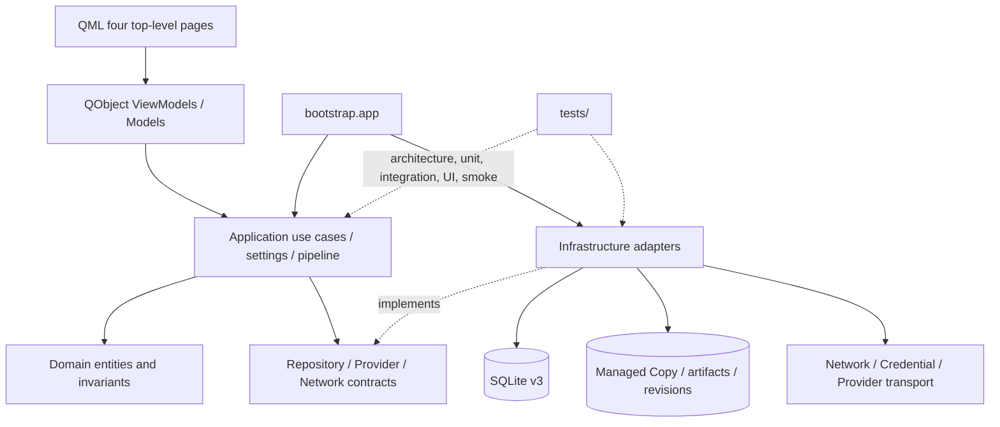
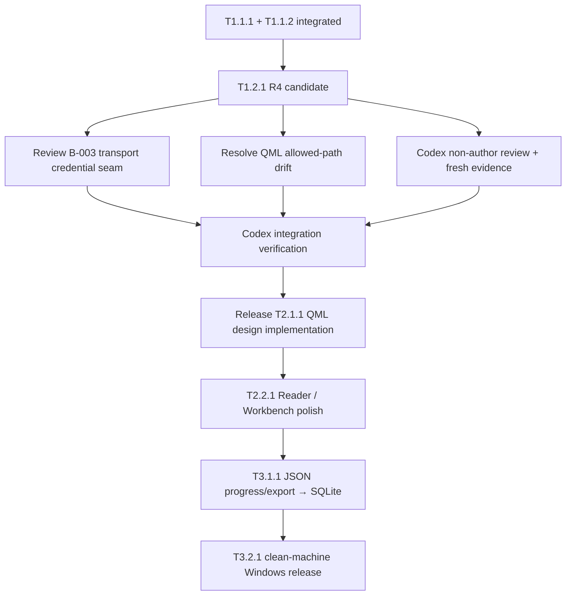

# Project Deep Audit & Control Baseline — 2026-09-22

> 本报告是修改版 V2 指令的执行证据。它记录真实代码、测试、Git、任务和
> 知识层状态；不是第二套项目状态源。计划与排期仍以
> [`doc/REBASELINE_PLAN.md`](../doc/REBASELINE_PLAN.md) 为准，实时状态以
> [`doc/STATUS.md`](../doc/STATUS.md) 为准。

## 1. Audit identity and evidence boundary

| Field | Verified value |
|---|---|
| Audit executor | Codex; executor remains replaceable |
| Audit source baseline | `master @ 4dfe9e7850c370634a293118536672e5f91680f8` |
| Repository | `G:/CODEX/New Manga` |
| Branch | `master` |
| Git common directory | `G:/CODEX/New Manga/.git` |
| Audit mode | read source/tests/Git, run safe verification, update governance documents; no product feature implementation |
| Next executor | `UNASSIGNED`; T1.2.1 product repair remains separately owned by ZCode |
| Confidence | HIGH for current master structure and tests; MEDIUM for unintegrated worktree candidates; LOW/UNKNOWN for real external-provider quality and clean-machine release |

Reality precedence used in this audit:

```text
master source + tests + Git + fresh runtime checks
        ↓
formal Task / Handoff / Review evidence
        ↓
REBASELINE_PLAN + STATUS
        ↓
RepoWiki / CodeWiki / historical maps
```

The ZCode R4 candidate is recorded separately. It is not master evidence and
does not change the integrated product state.

## 2. Existing State System Inventory

| Existing file/system | Current role | Keep | Canonical role | Duplication decision |
|---|---|---:|---|---|
| `AGENTS.md` | Common entry, safety, product boundary and Agent roles | Yes | Repository rules / preflight pointer | No replacement |
| `doc/REBASELINE_PLAN.md` | Stage, roadmap, dependencies, historical classification | Yes | Planning SSOT | Extend only when sequence or dependency changes |
| `doc/STATUS.md` | Live checkpoint, blockers, evidence and gates | Yes | Current state/dashboard SSOT | Extend with derived dashboard sections |
| `doc/tasks/*.md` | Task definition, AC, allowed paths, handoff and closure | Yes | Per-Task SSOT | No parallel task ledger |
| `doc/handoffs/**`, `doc/reviews/**`, `verification/**` | Fixed-head delivery and verification evidence | Yes | Immutable evidence by commit | Add dated evidence only |
| `doc/09_COLLABORATION.md` | Git/worktree, Task, Handoff, Review and integration protocol | Yes | Agent-neutral collaboration rules | Add minimal checkpoint/resume rule |
| `doc/AI_COORDINATION.md` | RepoWiki/CodeWiki owner and handover rules | Yes | Knowledge-layer ownership and refresh protocol | Reuse; do not create another Wiki control layer |
| `doc/11_ARCHITECTURE_MAPS.md` | Architecture/data/UI target maps | Yes | Architecture map; current As-Is and To-Be are explicitly separated | Correct stale As-Is header |
| `doc/12_ROADMAP.md` | Short roadmap navigation | Yes | Derived roadmap pointer | Keep short |
| `doc/10_CURRENT_STATE_AND_GAPS.md`, `doc/14_TAKEOVER_VERIFICATION.md` | Initial takeover snapshots | Yes | Historical evidence | Do not use as current state |
| `wiki/repowiki/**` | Zero-LLM ranked repository map | Yes | Derived code navigation | Refresh at source/mainline checkpoints |
| `wiki/codewiki/**` | Deep module documentation | Yes | Derived knowledge view | Read-only for ordinary Agents; freshness reported separately |

Decision: **REUSE + EXTEND**. No `CURRENT_STATE.md`, `PROGRESS.md`,
`PROJECT_MASTER_MAP.md`, or parallel `doc/project-map/` hierarchy is required.
The detailed V2 report is task-local verification evidence; the Plan and Status
remain the only planning/live-state authorities.

## 3. Project overview

New Manga is a Windows/Python/PySide6 QML single-user desktop application for
importing manga source material into a protected Managed Copy, editing and
reviewing Regions and text, running a recoverable translation pipeline, reading
results, and exporting artifacts. The product boundary is four top-level pages:
Bookshelf, Workbench, Reader, and Settings.

The real current lifecycle is:

```text
Requirement / D01-D08
  → contracts and architecture
  → SQLite / Managed Copy / domain foundation
  → import, region editing, pipeline and reading slices
  → current T1.2.1 Settings delivery review
  → T2.1.1 QML design implementation (not released)
  → storage convergence and packaging/release gates
```

**YOU ARE HERE:** Stage B — controlled execution, after T1.1.1 and T1.1.2
integration, with T1.2.1 R4 candidate outside master and awaiting independent
review. This is not release-ready software.

## 4. Repository map

```text
G:/CODEX/New Manga
├─ AGENTS.md                         repository entry and safety rules
├─ src/
│  ├─ bootstrap/                     production assembly and smoke entry
│  ├─ ui/                            QML pages, models and ViewModels
│  ├─ application/                  use cases, settings and pipeline services
│  ├─ domain/                       books, pages, regions, constraints, tasks
│  ├─ ports/                        repository/provider/network contracts
│  └─ infrastructure/               SQLite, filesystem, import, render, provider, transport
├─ tests/                            15 focused suites; 1077 current-main tests collected
├─ doc/                              requirements, contracts, Task and governance evidence
├─ verification/                    fixed-head verification logs and this audit
├─ wiki/repowiki/                    derived zero-LLM repository map
└─ wiki/codewiki/                    derived bilingual module knowledge
```

Current source inventory: `src` has 198 tracked Python files across
`application=66`, `bootstrap=2`, `domain=13`, `infrastructure=53`, `ports=23`,
and `ui=41`. Current tests have 107 files across 15 suites, led by
`providers=21`, `network=16`, `workbench=15`, `knowledge=11`, and `reading_export=9`.

Build/release reality: `requirements.txt` and `requirements-dev.txt` exist;
PyInstaller is a development dependency, but no product `.spec`, CI release
workflow, or clean-machine release artifact is present. This keeps T3.2.1
planned rather than complete.

## 5. Current code architecture map



Verified seams:

- `src/bootstrap/app.py` is the production composition root.
- `src/application/**` owns use cases and does not import infrastructure;
  architecture tests enforce the direction.
- `src/ports/**` carries stable repository/provider/network interfaces and typed
  errors such as `ProviderNotConfigured`, `ProviderDisabled`, and
  `MissingCredential`.
- `src/infrastructure/sqlite/**` owns schema/migrations and SQLite adapters;
  `src/infrastructure/filesystem/**` owns Managed Copy/integrity boundaries.
- `src/ui/**` consumes ViewModels and models; QML does not directly access DB,
  files, or models.
- `src/infrastructure/providers/runtime.py` is the current provider assembly
  seam; the unintegrated T1.2.1 R4 candidate changes this seam but is not a
  master fact.

## 6. Phase / Goal / Task tree

```text
M1 Alpha Core Loop Closure
└─ Stage B Controlled Execution
   ├─ T1.1.2 Region Canvas & Creator                 VERIFIED_COMPLETE
   ├─ T1.1.1 Production Text Detector                VERIFIED_COMPLETE / f56f441
   ├─ T1.2.1 Settings UI & ViewModel                 CHANGES_REQUESTED / NOT INTEGRATED
   │  └─ R4 candidate 39dbbf7 + handoff a527b85       pending Codex review; B-003 open
   ├─ T2.1.1 Apply Design F to QML                   PLANNED / not released
   ├─ T2.2.1 Reader & Workbench Polish               PLANNED
   ├─ T3.1.1 Unify Storage into SQLite               PLANNED
   └─ T3.2.1 Windows Packaging & Release Gate        PLANNED
```

Historical Task directory count: 67 Task records including the current
`T1.1.1` and `T1.2.1`; frontmatter counts are `61 done`, `4 proposed`,
`1 rejected`, and `1 changes_requested`. These counts are navigation evidence,
not a project percentage and not the current roadmap authority.

## 7. Current project dashboard

| Field | Current verified value |
|---|---|
| Current Phase | M1 — Alpha Core Loop Closure / Stage B |
| Current Goal | Close the controlled core loop and its integration gates |
| Current Main Task | No task currently executing; T1.2.1 R4 is the next main candidate |
| TaskStatus | T1.2.1 `changes_requested`; product not integrated |
| ExecutionState | `IDLE` on master; R4 author worktree is a separate candidate, not Codex-active work |
| Current Executor | Codex for this audit/control baseline |
| Branch / Worktree / HEAD | `master` / `G:\CODEX\New Manga` / `4dfe9e7` at audit start |
| Working Tree | Dirty by preserved user/agent material: `experiments/TASK-017/README.md`, `.codewiki/`, `.qoder-credits/`, `docs/`, `material/`, `wiki/codewiki/temp/` |
| Last verified integrated tasks | T1.1.2 at `5b91745`; T1.1.1 at `f56f441` |
| Latest candidate | ZCode branch `agent/zcode/T1.2.1-settings-ui-viewmodel`, worktree `G:\CODEX\New Manga.worktrees\T1.2.1-settings-ui-viewmodel`, HEAD `a527b85` |
| Safe to resume | Audit baseline: YES after the control commit and Reality Check; T1.2.1 repair: NO until scope, B-003, review and evidence gates are closed |
| Next executor | `UNASSIGNED` by default; recommended capability for T1.2.1 is ZCode implementation + Codex non-author review |

## 8. Task status and closure audit

The current Plan classifies integrated capability by evidence, not old
frontmatter. T1.1.1 and T1.1.2 have implementation, review, integration and
fresh verification evidence. T1.2.1 has a formal Task and R3 review, but no
integrated product commit.

Governance gap: the current Roadmap ID `T1.1.2` has no dedicated
`doc/tasks/T1.1.2.md`; its current evidence is carried by historical
`TASK-013`, the integration commit `5b91745`, and its verification records.
This is a traceability/documentation gap, not evidence that the implemented
Region Canvas slice must be reopened. A future documentation maintenance
slice may add a pointer or formal closure record if the project needs one;
this audit does not duplicate the historical Task.

T1.2.1 R4 reality:

- `39dbbf7` claims R3-B001/B002/B004/B005 repairs and adds focused tests.
- `a527b85` is a new Handoff, but the candidate explicitly leaves the
  production bootstrap credential-store seam (R3-B003) unimplemented and asks
  Codex to authorize it.
- The candidate also modifies `src/ui/qml/settings/SettingsView.qml`, while
  the current formal R4 Task allowed-path list forbids `src/ui/qml/**`. This is
  a scope drift requiring Codex disposition; it is not silently accepted.
- Candidate focused verification in the Python 3.12 implementation venv:
  `415 passed, 6 skipped, 1 failed`, exit 1. The failure is the known torch
  registry-readiness environment assertion; the six skips are OpenSSL-unavailable
  TLS tests. `git diff --check d978d6f..a527b85` is clean and the author
  worktree is clean.

Closure labels used here:

| Label | Meaning in this audit |
|---|---|
| `VERIFIED_COMPLETE` | Integrated head + required review + reproducible evidence |
| `IMPLEMENTED_NOT_CLOSED` | Code exists, but review/integration/required evidence is missing |
| `DOCUMENT_COMPLETE_ONLY` | Contract/design/report exists without product implementation |
| `CODE_COMPLETE_BUT_DOC_STALE` | Source moved ahead of its authoritative task/status record |
| `BLOCKED` | A required condition prevents the next gate; resolution is named |

## 9. Dependency and blocking chain



This is a **Dependency Blocking Chain**, not a schedule critical path; no
reliable effort/duration data exists. The immediate blocker is T1.2.1 review
and integration, not the number of historical Tasks.

## 10. Parallel execution analysis

| Work item | Ready now | Parallel class | Shared/conflict area | Recommended capability |
|---|---:|---|---|---|
| T1.2.1 R4 repair/review | Conditional | `DO_NOT_PARALLEL` with T2.1.1; author and reviewer must be separate | provider runtime, ViewModel, Settings QML, bootstrap seam | ZCode implementation; Codex non-author review |
| T2.1.1 production QML | No | `DO_NOT_START_YET` | four-page QML/theme and T1.2.1 Settings contract | Qoder UI/QML or ZCode; release only after T1.2.1 |
| T2.2.1 reader/workbench polish | No | `DO_NOT_START_YET` | Reader/Workbench QML and ViewModels | Qoder/ZCode after T2.1.1 |
| T3.1.1 storage convergence | Conditional | `CONDITIONAL_PARALLEL` for research/design only; production changes wait | SQLite schema/storage seam, progress/export stores | Codex architecture + DeepSeek Harness verification |
| T3.2.1 packaging/release | No | `DO_NOT_START_YET` | dependencies, PyInstaller, clean-machine environment | Codex + Qoder/DeepSeek Harness |
| RepoWiki refresh | Yes | `SAFE_PARALLEL` as derived knowledge write by Codex only | `wiki/repowiki/**`; no source write | Codex / knowledge owner |
| CodeWiki refresh | Conditional | `SAFE_PARALLEL` as derived knowledge write; do not use as task truth | `wiki/codewiki/**`; stale component metadata possible | Knowledge Refresh Owner |

No two product Agents are authorized to write the same global status/Task
source concurrently. Parallel work must use task-local evidence and return to
Codex for the mainline update.

## 11. Module maturity

| Module | Maturity | Evidence and ceiling |
|---|---:|---|
| SQLite schema/migrations and core repositories | L4 — tested | v3 schema, migration/connection/ownership tests; release/clean-machine not proven |
| Managed Copy, artifact/revision protection | L4 — tested | storage, integrity, revision and source-protection tests |
| Bookshelf/import (image/PDF/picture-MOBI) | L3/L4 — functional/tested | production adapters and tests; unsupported DRM/text-only MOBI remain typed limits |
| Region editing / canvas | L4 — tested | rectangle/polygon, persistence, revision and bootstrap seam evidence |
| Pipeline scheduling/recovery | L3/L4 — functional/tested | SQLite run ledger, pause/stop/retry/smoke tests; real model quality is outside evidence |
| Provider contracts/runtime | L2/L3 — partial | local/deterministic and fail-closed paths tested; real external endpoints and T1.2.1 settings integration remain open |
| OCR/detection/translation/inpaint real quality | L1/L2 — contract/adapter | detector implementation is integrated, but real quality/endpoint/learned inpaint evidence is not a release claim |
| QML four-page shell | L3 — functional shell | four routes and interaction tests; Graphite F tokens/theme are not in production |
| Reading/export history | L2/L3 — partial | working JSON stores; SQLite convergence is T3.1.1 |
| Backup/restore | L3 — service tested | restore gates/tests exist; production UI/bootstrap exposure is not in verified list |
| Windows packaging/release | L0/L1 — planned | no product spec/artifact or clean-machine verification |

## 12. Task ↔ Code ↔ Test traceability

| Task/capability | Code seam | Test/evidence seam | Current conclusion |
|---|---|---|---|
| T1.1.2 | `src/ui/viewmodels/workbench/region_canvas.py`, region services, `src/bootstrap/app.py` | `tests/workbench/**`, `verification/T1.1.2/**` | Integrated and verified |
| T1.1.1 | `src/infrastructure/providers/detection_doctr.py`, bootstrap detector assembly | `tests/providers/test_detection_doctr*.py`, `verification/T1.1.1/**` | Integrated; known environment full-suite failure remains separately recorded |
| T1.2.1 | `src/ui/viewmodels/settings/**`, `src/infrastructure/providers/{registry,runtime}.py`, settings QML, bootstrap transport | `tests/ui_shell/test_settings_viewmodel.py`, `tests/providers/test_provider_binding_projection.py`, R4 Handoff | Candidate only; review blocked and not integrated |
| Core persistence | `src/infrastructure/sqlite/**`, `src/ports/repositories/**` | `tests/storage/**`, `tests/core/**`, `tests/editing/**` | Strongly tested core; migration/release limits remain |
| Pipeline | `src/application/tasks/**`, `src/infrastructure/pipeline/**`, `src/infrastructure/sqlite/pipeline.py` | `tests/pipeline/**`, `tests/workbench/**`, `tests/core/**` | Functional/tested; real-provider chain quality not proven |
| QML shell | `src/ui/qml/shell/**`, page directories, matching ViewModels | `tests/ui_shell/**`, `tests/workbench/test_qml_*.py` | Shell verified; design F implementation not released |

Reverse trace rule: every new production module must be linked from a Task or
explicit integration record; a RepoWiki ranking is not a Task assignment. This
audit found no new orphan production implementation in master; the R4
candidate is intentionally tracked as an unintegrated delivery.

## 13. Requirement → design → Task → code → test closure

| Closure class | Findings |
|---|---|
| Closed with evidence | core SQLite/Managed Copy, region editing, detector integration, four-page shell foundations, pipeline persistence and recovery slices |
| Design exists; implementation partial | Graphite F visual tokens, reading/export SQLite convergence, packaging/release, real-provider quality |
| Code exists; required closure incomplete | T1.2.1 R4 candidate: B-003 production transport credential seam, independent review, integration, and allowed-path disposition |
| Historical document stale | `doc/11_ARCHITECTURE_MAPS.md` previously claimed no source/tests; this audit corrects the current As-Is header and preserves the historical snapshot |
| Evidence unavailable | clean Windows machine, paid/real remote provider runs, learned inpaint/model quality, and external endpoint latency/cost |

## 14. Testing map and fresh verification

### Master fresh checks

Environment: PowerShell; `G:\CODEX\New Manga.task-envs\T1.1.1-impl-py312\Scripts\python.exe`;
`PYTHONPATH=src`; `PYTHONDONTWRITEBYTECODE=1`.

| Command | Result | Exit |
|---|---|---:|
| `python -m pytest tests --collect-only -q -p no:cacheprovider` | `1077 tests collected` | 0 |
| `python -m pytest tests -q -rs -p no:cacheprovider` | `1070 passed, 6 skipped, 1 failed`, 1 warning | 1 |
| `python -m compileall -q src tests` | passed | 0 |
| `python -m bootstrap.app --smoke-test --data-root <fresh-temp-dir>` | passed; created fresh data root | 0 |
| `rk-map G:\CODEX\New Manga` | 873/877 files covered; 4 oversized skipped; 50 ranked entries | 0 |

The sole full-suite failure is
`tests/providers/test_registry_readiness.py::test_no_model_runtime_is_installed_in_this_environment`:
`torch` is installed in the selected venv while the historical test expects it
absent. It is an environment/evidence mismatch, not silently counted as a
product pass. The six skips are each OpenSSL-unavailable network/TLS tests.

### Candidate-only check

R4 candidate `a527b85` in the clean ZCode worktree produced focused
`415 passed, 6 skipped, 1 failed`, exit 1; same known torch assertion and
OpenSSL skips. `git diff --check d978d6f..a527b85` passed. This evidence is
not applicable to master product verification until scope review and
integration.

## 15. Technical debt and risks

- No `TODO`, `FIXME`, or `HACK` matches were found in `src/**` or `tests/**`.
  `TEMP`, `placeholder`, `mock`, and `stub` matches are mostly intentional
  test fixtures, temporary-file safety code, typed unsupported paths, or
  deterministic pipeline test doubles; they are not bulk-counted as bugs.
- R3/R4 T1.2.1 provider settings are the immediate risk: unintegrated branch,
  unresolved B-003 credential injection, and QML allowed-path drift.
- Real OCR/translation/inpaint quality, external provider behavior, model
  performance and cost remain `BLOCKED`/`NOT_RUN` where the relevant Task says so.
- Reading progress/export history remain JSON-backed; this is a planned T3.1.1
  storage gap, not a hidden SQLite failure.
- Packaging and clean-machine Windows launch remain unverified; do not call the
  product release-ready.
- Mainline has 105 linked worktrees; five are dirty. Dirty paths are inventoried
  and preserved. No worktree deletion/prune is authorized by this audit.
- RepoWiki is current after refresh (`rk-status`: `VALID (CURRENT)`). CodeWiki
  incremental generation was attempted through `rk-update`; it produced
  several validated module pages, but stopped after a connection reset and a
  prolonged no-progress interval. After removing the unvalidated partial
  pages, final `rk-status` reports the existing `GENERATED (17 Markdown
  files)` with `HEAD Freshness: STALE`; Markdown and Mermaid policy checks pass,
  while `rk-verify` fails only the stale CodeWiki metadata check. The partial
  generated output is not staged as a new baseline. This is a knowledge-tool
  limitation and does not change source/task truth.

## 16. Rolling checkpoint and resume record

| Field | Value |
|---|---|
| Checkpoint type | Project audit/control baseline |
| Start commit | `4dfe9e7` |
| Control baseline commit | `25bff3c` (`docs(audit): establish V2 project control baseline`) |
| Working directory | `G:\CODEX\New Manga` |
| Mainline state | master; preserved dirty user/agent files listed above |
| Completed steps | rules preflight; state inventory; source/test/Git/worktree audit; master fresh checks; candidate evidence; RepoWiki refresh; CodeWiki attempt and diagnostics; control-plan drafting; governance commit |
| Remaining at report drafting | final diff/status verification; CodeWiki baseline refresh remains a separately blocked knowledge-layer follow-up |
| Safe resume test | re-read `AGENTS.md`, `doc/STATUS.md`, this report; compare HEAD/branch/worktree and preserved dirty paths; run `git diff --check` |
| Next exact step | run final diff/status verification; next product executor may begin only the explicitly released T1.2.1 R4 review/repair gate |
| Product work | not started by this audit; T1.2.1 remains a separately gated candidate |

## 17. Audit conclusion

The modified V2 control objective is satisfied at the governance-design level
once this report and the linked existing documents are committed: the project
has one planning SSOT, one live-state checkpoint, fixed-head evidence, a
current As-Is architecture map, a dependency blocking chain, a parallel
execution matrix, maturity labels, task/code/test traceability, and a
replaceable-executor resume protocol. The product itself is **not** fully
complete and must not be labeled release-ready.

The deep CodeWiki refresh is explicitly not a completion prerequisite for the
control baseline: its stale metadata and mixed-policy result are recorded
above, while the current RepoWiki map and source/task evidence remain usable.

Final gate for this audit: `READY_FOR_NEXT_EXECUTOR` for future governance or
the explicitly released T1.2.1 R4 review; `NOT_READY` for T2.1.1 and any
production release work until the blockers above are closed.
