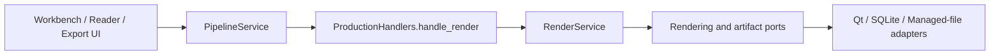

# 应用渲染 / Application Rendering

## 概述 / Overview

### 中文

`RenderService` 将已持久化的 Region 翻译文本和样式设置合成为新的 `translated` artifact。它通过端口接收布局、字体、图像合成、artifact 和 Managed Copy 能力，不调用 OCR、translation、detection 或 inpainting provider。

### English

`RenderService` combines persisted Region translations and style settings into a new `translated` artifact. It receives layout, font, image-composition, artifact, and Managed Copy capabilities through ports and does not call OCR, translation, detection, or inpainting providers.

## 模块边界 / Module Boundary

### 中文

调用链位于 Region editing/translation 之后、Reader/Workbench/Export 之前。`ProductionHandlers.handle_render` 和 bootstrap 负责装配；应用服务不直接访问 Qt、SQLite 或文件系统。

### English

The call chain is downstream of Region editing/translation and upstream of Reader, Workbench, and Export. `ProductionHandlers.handle_render` and bootstrap compose the service; the application service does not access Qt, SQLite, or the filesystem directly.

## 运行链路 / Runtime Flow

### 中文

UI 触发 Pipeline 后，handler 调用 `RenderService`；服务从 `RegionRepository` 和 `PageArtifactLocator` 读取输入，通过 `TextLayoutEngine`、`ImageCompositor` 和 `ArtifactRepositoryPort` 原子提交新 revision。

### English

After UI starts a Pipeline operation, the handler calls `RenderService`; the service reads through `RegionRepository` and `PageArtifactLocator`, then uses `TextLayoutEngine`, `ImageCompositor`, and `ArtifactRepositoryPort` to commit a new revision atomically.

## 架构 / Architecture

## 源码证据 / Source Evidence

### 中文

`RenderService` — [src/application/rendering/service.py](../../src/application/rendering/service.py)
`PageArtifactLocator` — [src/ports/rendering/ports.py](../../src/ports/rendering/ports.py)
`ProductionHandlers` — [src/infrastructure/providers/handlers.py](../../src/infrastructure/providers/handlers.py)

### English

`RenderService` — [src/application/rendering/service.py](../../src/application/rendering/service.py)
`PageArtifactLocator` — [src/ports/rendering/ports.py](../../src/ports/rendering/ports.py)
`ProductionHandlers` — [src/infrastructure/providers/handlers.py](../../src/infrastructure/providers/handlers.py)

## 当前实现状态 / Current Implementation Status

### 中文

当前实现已确认渲染边界、样式解析和 artifact 提交契约；详细实现仍以源码和测试为准。

### English

The rendering boundary, style resolution, and artifact-commit contract are confirmed in the current implementation; source and tests remain authoritative for details.
