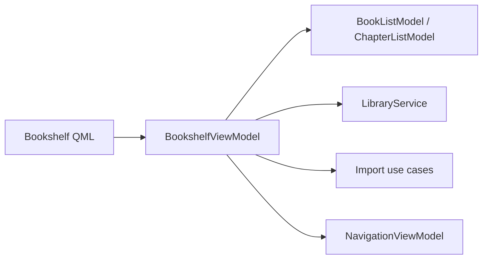

# 书架界面 / Bookshelf UI

## 概述 / Overview

### 中文

`bookshelf_ui` 是 PySide6/QML 书架边界，负责书籍和章节的展示、筛选、排序、CRUD、导入入口以及进入 Workbench/Reader 的导航上下文。

### English

`bookshelf_ui` is the PySide6/QML bookshelf boundary for book and chapter display, filtering, sorting, CRUD, import entry points, and navigation context into Workbench or Reader.

## 模块边界 / Module Boundary

### 中文

`BookshelfViewModel` 只把 application/domain 对象投影成 Qt properties、signals、slots 和 list-model roles；QML 不直接访问 SQLite、Managed Copy 或业务规则。

### English

`BookshelfViewModel` projects application/domain objects into Qt properties, signals, slots, and list-model roles; QML does not access SQLite, Managed Copy files, or business rules directly.

## 运行链路 / Runtime Flow

### 中文

QML 通过 `BookshelfViewModel` 调用 `LibraryService`、`ImportImagesUseCase`/`ImportDocumentsUseCase` 和 `NavigationViewModel`；模型负责 `BookListModel` 与 `ChapterListModel` 的行投影。

### English

QML calls `LibraryService`, `ImportImagesUseCase`/`ImportDocumentsUseCase`, and `NavigationViewModel` through `BookshelfViewModel`; models project rows through `BookListModel` and `ChapterListModel`.

## 架构 / Architecture

## 源码证据 / Source Evidence

### 中文

`BookshelfViewModel` — [src/ui/viewmodels/bookshelf/viewmodel.py](../../src/ui/viewmodels/bookshelf/viewmodel.py)
`BookListModel` / `ChapterListModel` — [src/ui/models/library/models.py](../../src/ui/models/library/models.py)
`assemble_services` — [src/bootstrap/app.py](../../src/bootstrap/app.py)

### English

`BookshelfViewModel` — [src/ui/viewmodels/bookshelf/viewmodel.py](../../src/ui/viewmodels/bookshelf/viewmodel.py)
`BookListModel` / `ChapterListModel` — [src/ui/models/library/models.py](../../src/ui/models/library/models.py)
`assemble_services` — [src/bootstrap/app.py](../../src/bootstrap/app.py)

## 当前实现状态 / Current Implementation Status

### 中文

当前代码确认四类页面入口、筛选/排序、书籍/章节操作和导入桥接；具体 QML 视觉状态以对应 `.qml` 文件为准。

### English

The current code confirms the four-page entry points, filtering/sorting, book/chapter operations, and import bridge; exact QML visual states are defined by the corresponding `.qml` files.
