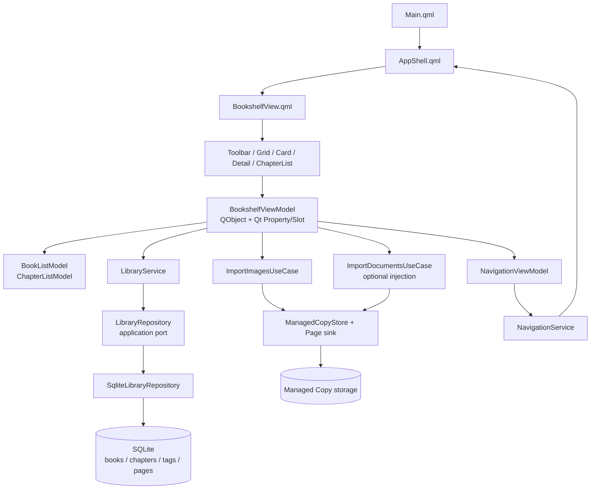
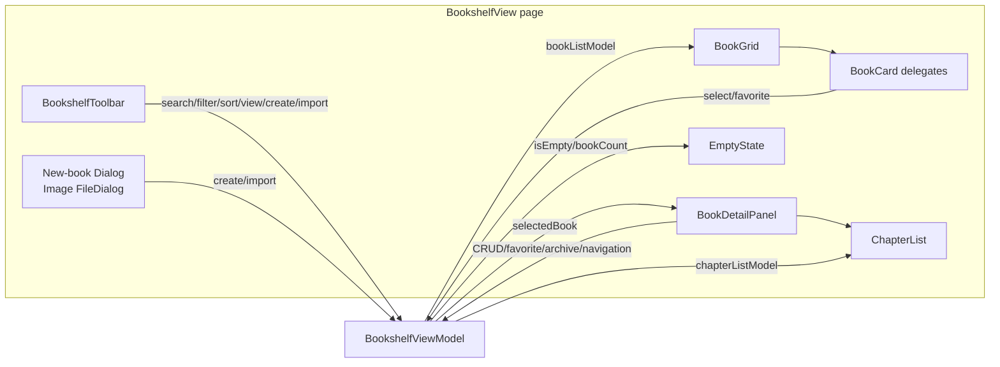
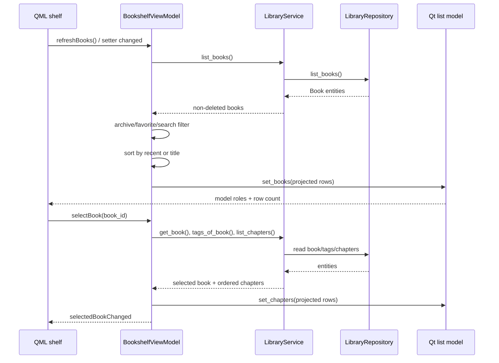
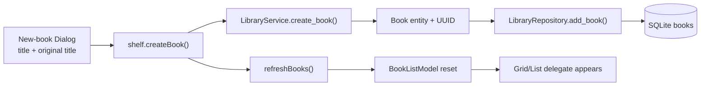
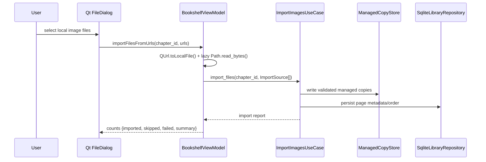
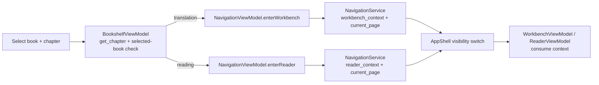

# bookshelf_ui

`bookshelf_ui` 是 New Manga 的书架页面模块。它把 PySide6/QML 的书架界面连接到 Library application services、图片/文档导入用例和顶层导航，但不直接访问 SQLite、Managed Copy 文件或处理业务规则。

本文档描述当前代码（As-Is），并把尚未落地的能力标为缺口。整体分层和四页导航约束见 [技术架构](../../doc/02_TECHNICAL_ARCHITECTURE_.md)；当前阶段与实现状态见 [STATUS](../../doc/STATUS.md) 和 [REBASELINE_PLAN](../../doc/REBASELINE_PLAN.md)。

## 1. 模块边界

### 负责

- 展示书籍列表、筛选、搜索、排序和网格/列表视图。
- 展示当前选中作品及其章节。
- 暴露新建/删除作品、收藏、归档、新建/删除章节和导入入口。
- 将选中的 `book_id + chapter_id` 交给工作台或阅读器导航。
- 把 application/domain 对象投影为 QML 可消费的 Qt properties、signals、slots 和 list-model roles。

### 不负责

- 业务真值、书籍/章节约束或事务：由 [`LibraryService`](../../src/application/library/service.py:26) 和领域实体负责。
- SQLite SQL：由 [`LibraryRepository`](../../src/application/library/ports.py:18) 与 [`SqliteLibraryRepository`](../../src/infrastructure/sqlite/library.py:20) 负责。
- 源文件写入：导入链由 Import use case 和 Managed Copy 适配器负责。
- 工作台/阅读器内容：书架只写入导航上下文；两个页面各自消费上下文。
- 翻译管线、OCR、检测、修复或渲染。

## 2. 在整体系统中的位置

生产启动由 [`assemble_services`](../../src/bootstrap/app.py:569) 创建 SQLite repository、Managed File Storage、LibraryService 和 importers，再构造 [`BookshelfViewModel`](../../src/bootstrap/app.py:876)。[`assemble_engine`](../../src/bootstrap/app.py:942) 将它发布为 QML context property `bookshelfViewModel`。



依赖方向保持为 `QML/UI → Application → Domain/Ports → Infrastructure`。书架 UI 的 Python 文件没有基础设施 import；基础设施只在 bootstrap 装配和 application port 的实现处出现。

## 3. 组件关系



### Python components

| Component | Responsibility | Key behavior |
|---|---|---|
| [`BookshelfViewModel`](../../src/ui/viewmodels/bookshelf/viewmodel.py:24) | QML-facing shelf state and commands | Holds filters, sort/view mode, selected book, import summary and two list models. Delegates persistence/import/navigation to injected collaborators. |
| [`BookListModel`](../../src/ui/models/library/models.py:85) | `QAbstractListModel` for book delegates | Publishes `bookId`, `title`, `originalTitle`, `isFavorite`, `isArchived`, `lastOpenedAt`, `progress`. |
| [`ChapterListModel`](../../src/ui/models/library/models.py:113) | `QAbstractListModel` for chapter delegates | Publishes `chapterId`, `chapterNumber`, `title`, `chapterType`, `readingDirection`, `pageCount`. |

### QML components

| Component | Role |
|---|---|
| [`BookshelfView.qml`](../../src/ui/qml/bookshelf/BookshelfView.qml:5) | Page layout, empty state, create-book dialog and image file picker. |
| [`BookshelfToolbar.qml`](../../src/ui/qml/bookshelf/BookshelfToolbar.qml:5) | Create/import buttons, search, favorite/archive filters, sort toggle and view-mode toggle. |
| [`BookGrid.qml`](../../src/ui/qml/bookshelf/BookGrid.qml:5) | Keeps both `GridView` and `ListView` mounted and toggles visibility via `viewMode`. |
| [`BookCard.qml`](../../src/ui/qml/bookshelf/BookCard.qml:5) | Display-only card/list delegate; emits selection and favorite events. |
| [`BookDetailPanel.qml`](../../src/ui/qml/bookshelf/BookDetailPanel.qml:5) | Selected-book metadata, favorite/archive controls, chapter creation and navigation actions. |
| [`ChapterList.qml`](../../src/ui/qml/bookshelf/ChapterList.qml:5) | Chapter rows, selection and row-level navigation/deletion actions. |

## 4. ViewModel contract

### Read-only Qt properties

| Property | Type | Meaning |
|---|---|---|
| `bookListModel` | `QObject` | `BookListModel` exposed to `GridView` and `ListView`. |
| `chapterListModel` | `QObject` | `ChapterListModel` exposed to `ChapterList`. |
| `bookCount` | `int` | Number of rows after current filters. |
| `isEmpty` | `bool` | True when `LibraryService.list_books()` has no non-deleted book, regardless of current archive/favorite/search filter. |
| `selectedBook` | `QVariantMap` | Detail projection plus tags; `{}` when nothing is selected. |
| `navigation` | `QObject` | The injected `NavigationViewModel`. |
| `importSummary` | `str` | Last image-import summary emitted by the direct Python import path. |

### Mutable properties

| Property | Values | Effect |
|---|---|---|
| `searchText` | arbitrary string | Case-insensitive title/original-title filter. |
| `archivedFilter` | `bool` | `false` shows non-archived books; `true` shows archived books. |
| `favoritesOnly` | `bool` | Keeps only favorite books. |
| `sortBy` | `recent`, `title` | Recent-first or case-folded title order. |
| `viewMode` | `grid`, `list` | QML visibility switch; the underlying model remains the same. |

Each filter/sort setter reapplies the complete in-memory projection. There is no server-side or SQL-side filtering in the UI module.

### QML slots and commands

| Slot | Delegated operation |
|---|---|
| `refreshBooks()` | Reloads books, emits count change, and refreshes the selected book. |
| `selectBook(book_id)` | Loads book details, tags and ordered chapters. |
| `createBook(title, original_title)` | Calls `LibraryService.create_book`, then refreshes. |
| `deleteBook(book_id)` | Soft-deletes the book through the service and clears selection if needed. |
| `setFavorite(book_id, bool)` / `setArchived(book_id, bool)` | Updates system flags through the service and refreshes. |
| `createChapter(book_id, title, chapter_number)` | Creates a chapter using inherited book defaults. |
| `deleteChapter(chapter_id)` | Soft-deletes a chapter and refreshes the selected chapter list. |
| `importFilesFromUrls(chapter_id, urls)` | Converts local URLs to lazy `ImportSource` values and invokes the image importer. |
| `importDocumentsFromUrls(chapter_id, urls)` | Same boundary for the optional document importer; returns a disabled summary when not injected. |
| `enterTranslation(chapter_id)` | Validates selected-book ownership, then calls `NavigationViewModel.enterWorkbench`. |
| `enterReading(chapter_id)` | Validates selected-book ownership, then calls `NavigationViewModel.enterReader`. |

## 5. Model projection and role contract


`BookListModel` accepts either dictionaries or entities. The ViewModel normally supplies dictionaries so QML receives stable, display-oriented values:

- `last_opened_at` is converted to ISO text when a value is present.
- `progress` is deliberately `None`, and the model displays `—`.
- `ChapterListModel` receives `chapter_type.value` and `reading_direction.value` strings.
- `page_count` is currently hard-coded to `0` in `_chapter_rows`; the shelf does not query pages for counts.

The models use a full reset for refreshes. This is simple and correct for the current shelf scale; incremental row diffs are not part of the contract.

## 6. Main data flows

### 6.1 Load, filter and select



The default archive behavior is a UI projection rule: `LibraryService.list_books()` returns every non-deleted book, and the ViewModel hides archived books unless `archivedFilter` is enabled.

### 6.2 Create a book



The QML dialog has no database or file access. Title validation is performed by the domain `Book` entity when the application service creates it.

### 6.3 Import local image files



The source path is read only by the `ImportSource` provider. The write target is the managed storage injected by bootstrap. The shelf never overwrites the user's source file.

### 6.4 Enter workbench or reader



The guard prevents a chapter belonging to another book from being entered through the current selection. Navigation preserves the context when the user switches between the four top-level pages; the pages stay instantiated and only `visible` changes in [`AppShell.qml`](../../src/ui/qml/shell/AppShell.qml:20).

## 7. Persistence and safety boundaries

The library persistence shape is a foreign-key chain `books → chapters → pages`, with tags linked through `book_tags`; the v2 schema adds the display metadata, favorite/archive flags and chapter type/direction fields. See the authoritative schema in [`schema.py`](../../src/infrastructure/sqlite/schema.py:146) and the data model documentation in [03_DATA_MODEL.md](../../doc/03_DATA_MODEL.md).

| Boundary | Current rule |
|---|---|
| Soft deletion | `LibraryService.list_books/list_chapters` and repository-backed shelf queries hide deleted entities. Delete commands update `deleted_at`; they do not erase source media. |
| Favorite/archive | Stored `Book` flags, never tags. The service updates them transactionally through the repository. |
| Tags | Read for the detail panel only. Tag creation/rename/deletion is owned by `LibraryService`; deleting a tag removes links but not books. |
| Imported pages | Page data is persisted by the import use case/repository. The shelf only displays a count placeholder and does not manage page rows. |
| Source files | QML can supply paths, but source bytes are read and copied into managed storage by the import layer. |
| Thread/connection ownership | SQLite connection lifecycle is controlled by bootstrap; the ViewModel has no connection handle. |

## 8. Failure behavior

- Unknown book/chapter IDs raise `BookNotFound` or `ChapterNotFound` from the library service.
- A chapter from a different book raises `ValueError` in `enterTranslation`/`enterReading`.
- Invalid `sortBy` or `viewMode` values raise `ValueError` before state changes.
- An unconfigured document importer returns a QML-friendly `未启用文档导入` result instead of writing anything.
- Import results are summarized as imported/skipped/failed counts; the current shelf UI has no dedicated error panel.
- The QML layer does not catch application exceptions. Callers/tests must provide the user-facing error boundary if a future design requires inline error messages.

## 9. Current UI behavior and gaps

These are implementation facts, not future acceptance claims:

- Startup opens on the bookshelf; the shell exposes exactly four top-level pages: bookshelf, workbench, reader and settings.
- Empty shelf state shows “还没有作品”; the empty-state “导入作品” button is present but disabled.
- The shelf can create/delete books and chapters, toggle favorite/archive, search, filter, sort and switch views.
- Book covers are placeholders; no cover field is projected.
- Book and detail progress display `—`; reading progress is not part of the shelf `Book` projection.
- Chapter `pageCount` is `0`; page counting is not wired into the shelf ViewModel.
- Chapter edit, page management and translation settings remain disabled placeholders.
- `importDocumentsFromUrls` exists on the ViewModel, but the current shelf `FileDialog` exposes image filters only.
- The detail panel reads the selected map with mixed key styles: the ViewModel emits `original_title`, while the QML label checks `originalTitle`. Reconcile this contract before relying on original-title display in the detail panel.
- Recent sorting and display formatting call `.isoformat()` on a non-empty `last_opened_at`; the domain and SQLite mapper currently model/store that field as text. Reconcile the representation before enabling populated recent timestamps.

The roadmap already records reading/export JSON storage, settings UI and QML theme work as separate gaps; they are outside this module's current implementation boundary. See [current status](../../doc/STATUS.md#open-gaps). The companion module-document targets are [navigation_ui](navigation_ui.md), [library](library.md), [importing](importing.md), [reader_ui](reader_ui.md) and [workbench_ui](workbench_ui.md); those files are not present in this checkout yet, so the source links above remain the current evidence.

## 10. Verification and maintenance

The repository uses `pytest.ini` with `tests` as the test root and pins PySide6 in [`requirements.txt`](../../requirements.txt) plus pytest in [`requirements-dev.txt`](../../requirements-dev.txt). The focused shelf checks are:

```powershell
Set-Location 'G:\CODEX\New Manga'
$env:PYTHONPATH = 'src'
python -m pytest tests/ui_shell/test_bookshelf_viewmodel.py tests/ui_shell/test_qml_shell.py -q -p no:cacheprovider -rs
```

Coverage is split across:

- [`test_bookshelf_viewmodel.py`](../../tests/ui_shell/test_bookshelf_viewmodel.py): roles, row projection, CRUD, empty state, filters, import delegation and shelf-to-navigation context.
- [`test_qml_shell.py`](../../tests/ui_shell/test_qml_shell.py): four-route shell, startup selection, visibility-only page switching, empty states, new-book dialog, chapter action gating and grid/list persistence.
- [`tests/library/`](../../tests/library): service and SQLite repository behavior used beneath the UI.

For a baseline-wide verification run, follow the repository's recorded environment and evidence rules in [`verification/TASK-065/run_suite.ps1`](../../verification/TASK-065/run_suite.ps1) and [09_COLLABORATION.md](../../doc/09_COLLABORATION.md). A documentation change does not change the product test baseline.

## 11. Maintenance rules for future changes

1. Add or change QML-facing state in `BookshelfViewModel` first; keep QML display-only and route commands through a slot.
2. Reuse `LibraryService` and its repository port for library mutations; do not add SQL or file access to UI code.
3. Treat model role names and selected-book map keys as a versioned boundary. Update the ViewModel, QML delegates and focused tests together.
4. Keep navigation context as `book_id + chapter_id`; do not create a new top-level route for a shelf sub-flow.
5. If page counts, progress or covers become real data, add an application-facing projection/use case and tests rather than querying page/storage objects from QML.
6. Preserve Managed Copy and soft-delete behavior; never turn the shelf's local path input into a source-file write path.
