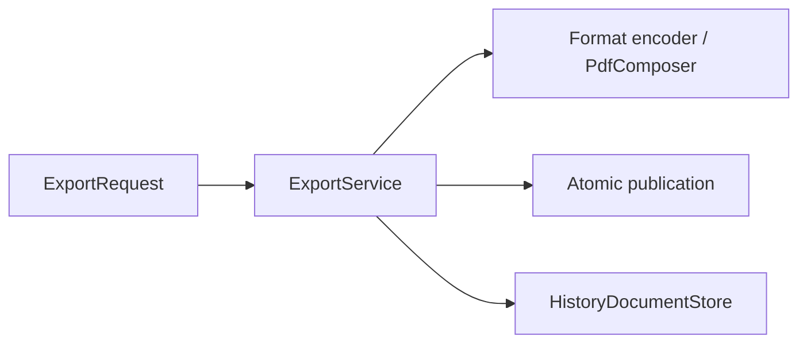

# 导出应用服务 / Export Application Service

## 概述 / Overview

### 中文

`ExportService` 从有序页面字节 provider 生成章节 artifact，执行 stale-render 与 overwrite 策略，编码配置的输出格式，原子发布目标文件，并记录可重复导出的历史。

### English

`ExportService` produces chapter artifacts from ordered page-byte providers, enforces stale-render and overwrite policy, encodes configured output formats, publishes the target atomically, and records repeatable export history.

## 模块边界 / Module Boundary

### 中文

它不发现章节、不查询 SQLite、不渲染页面，也不直接管理 QML；调用者必须先解析章节上下文和页面顺序，再提交不可变 `ExportRequest`。

### English

It does not discover chapters, query SQLite, render pages, or manage QML directly; callers resolve chapter context and page order before submitting an immutable `ExportRequest`.

## 运行链路 / Runtime Flow

### 中文

`ExportViewModel`/Reader 提供请求与 lazy page projection；`ExportService` 使用 `HistoryDocumentStore`、`PdfComposer`、Managed file publication 和 history store 完成输出。

### English

`ExportViewModel`/Reader provide the request and lazy page projection; `ExportService` uses `HistoryDocumentStore`, `PdfComposer`, managed-file publication, and the history store to produce output.

## 架构 / Architecture

## 源码证据 / Source Evidence

### 中文

`ExportService` — [src/application/export/service.py](../../src/application/export/service.py)
`PdfComposer` — [src/application/export/ports.py](../../src/application/export/ports.py)
`ExportViewModel` — [src/ui/viewmodels/export/viewmodel.py](../../src/ui/viewmodels/export/viewmodel.py)

### English

`ExportService` — [src/application/export/service.py](../../src/application/export/service.py)
`PdfComposer` — [src/application/export/ports.py](../../src/application/export/ports.py)
`ExportViewModel` — [src/ui/viewmodels/export/viewmodel.py](../../src/ui/viewmodels/export/viewmodel.py)

## 当前实现状态 / Current Implementation Status

### 中文

当前实现确认导出策略、原子发布和历史重试边界；输出格式细节以 `service.py`、ports 和测试为准。

### English

The current implementation confirms export policy, atomic publication, and history retry boundaries; output-format details are defined by `service.py`, ports, and tests.
