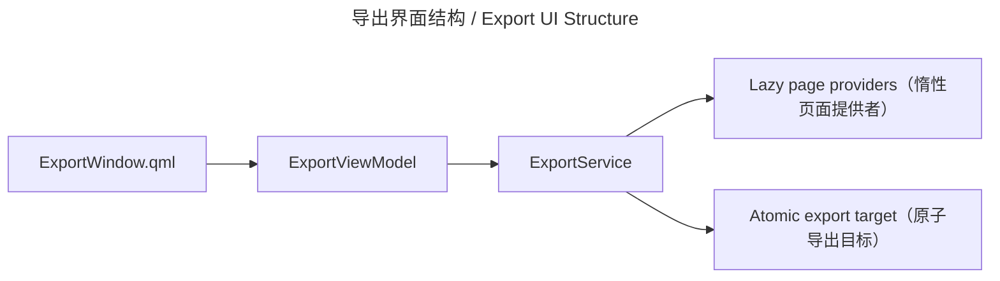

# 导出界面 / Export UI

## 概述 / Overview

### 中文

`export_ui` 是章节导出的 Qt/QML 展示边界。`ExportViewModel` 暴露范围、格式、目标路径、覆盖策略、stale 状态和终态信号，并把实际字节处理交给 `ExportService`。

### English

`export_ui` is the Qt/QML presentation boundary for chapter export. `ExportViewModel` exposes scope, format, target path, overwrite policy, stale state, and terminal signals while delegating byte handling to `ExportService`.

## 模块边界 / Module Boundary

### 中文

界面不查询 SQLite、不编码 ZIP/CBZ/PDF、不写文件也不持久化历史；它只消费 bootstrap 注入的 lazy page provider 和 application service。

### English

The UI does not query SQLite, encode ZIP/CBZ/PDF, write files, or persist history; it consumes lazy page providers and the application service injected by bootstrap.

## 运行链路 / Runtime Flow

### 中文

QML 调用 `ExportViewModel`；ViewModel 在 worker thread 中调用 `ExportService.export()` 或 `repeat()`，再以 Qt signal 发布成功、失败或取消。

### English

QML calls `ExportViewModel`; the ViewModel invokes `ExportService.export()` or `repeat()` on a worker thread and publishes success, failure, or cancellation through Qt signals.

## 架构 / Architecture

## 源码证据 / Source Evidence

### 中文

`ExportViewModel` — [src/ui/viewmodels/export/viewmodel.py](../../src/ui/viewmodels/export/viewmodel.py)
`ExportService` — [src/application/export/service.py](../../src/application/export/service.py)
QML roots — [src/ui/qml](../../src/ui/qml)

### English

`ExportViewModel` — [src/ui/viewmodels/export/viewmodel.py](../../src/ui/viewmodels/export/viewmodel.py)
`ExportService` — [src/application/export/service.py](../../src/application/export/service.py)
QML roots — [src/ui/qml](../../src/ui/qml)

## 当前实现状态 / Current Implementation Status

### 中文

当前实现确认导出窗口与 ViewModel 的桥接、stale/missing translated 警告和异步终态；完整导出规则位于 `export` 应用模块。

### English

The current implementation confirms the export-window/ViewModel bridge, stale or missing translated warnings, and asynchronous terminal states; complete export rules belong to the `export` application module.
