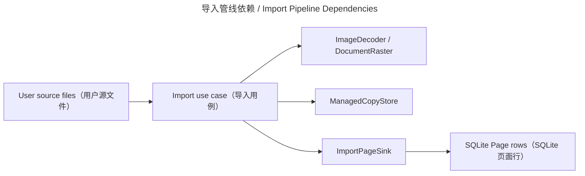

# 媒体导入 / Media Importing

## 概述 / Overview

### 中文

`importing` 把用户选择的本地图片或文档转换为持久化的 chapter `Page`。应用层负责顺序、去重、取消、失败记账，以及“Managed Copy 成功后才提交 Page”的安全纪律。

### English

`importing` converts user-selected local images or documents into durable chapter `Page` records. The application layer owns ordering, deduplication, cancellation, failure accounting, and the rule that a Page is committed only after its Managed Copy exists.

## 模块边界 / Module Boundary

### 中文

导入链不改写用户源文件、不直接执行 SQL，也不负责 OCR、translation、detection、inpainting 或 rendering。

### English

The import chain never edits user source files, does not execute SQL directly, and does not own OCR, translation, detection, inpainting, or rendering.

## 运行链路 / Runtime Flow

### 中文

`BookshelfViewModel` 调用 `ImportImagesUseCase` 或 `ImportDocumentsUseCase`；use case 通过 `ImageDecoder`/`DocumentRaster`、`ManagedCopyStore` 和 `ImportPageSink` 进入基础设施。

### English

`BookshelfViewModel` calls `ImportImagesUseCase` or `ImportDocumentsUseCase`; the use cases enter infrastructure through `ImageDecoder`/`DocumentRaster`, `ManagedCopyStore`, and `ImportPageSink`.

## 架构 / Architecture

## 源码证据 / Source Evidence

### 中文

`ImportImagesUseCase` — [src/application/importing/images/service.py](../../src/application/importing/images/service.py)
`ImportDocumentsUseCase` — [src/application/importing/documents/service.py](../../src/application/importing/documents/service.py)
`ManagedCopyStoreAdapter` — [src/infrastructure/importing.py](../../src/infrastructure/importing.py)

### English

`ImportImagesUseCase` — [src/application/importing/images/service.py](../../src/application/importing/images/service.py)
`ImportDocumentsUseCase` — [src/application/importing/documents/service.py](../../src/application/importing/documents/service.py)
`ManagedCopyStoreAdapter` — [src/infrastructure/importing.py](../../src/infrastructure/importing.py)

## 当前实现状态 / Current Implementation Status

### 中文

当前实现确认图片导入、PDF 光栅化和显式注入的 picture-MOBI 路径共享 Managed Copy 与 Page sink 边界；格式支持以适配器和测试为准。

### English

The current implementation confirms that image import, PDF rasterization, and explicitly injected picture-MOBI paths share the Managed Copy and Page-sink boundaries; format support is defined by adapters and tests.
