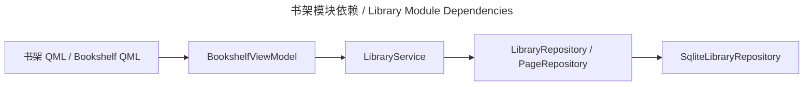

# 书库与目录 / Library

## 概述 / Overview

### 中文

`library` 维护 `Book → Chapter → Page` 元数据、Tag 关联、收藏/归档和软删除语义，并为书架、导入、阅读器和工作台提供稳定的 ID 上下文。

### English

`library` maintains `Book → Chapter → Page` metadata, tag associations, favorite/archive state, and soft-delete semantics while providing stable ID context to bookshelf, import, reader, and workbench flows.

## 模块边界 / Module Boundary

### 中文

`LibraryService` 只依赖 `LibraryRepository`、`PageRepository` 等应用端口；SQLite、连接、迁移和文件存储由基础设施及 bootstrap 装配。

### English

`LibraryService` depends on application ports such as `LibraryRepository` and `PageRepository`; SQLite, connections, migrations, and file storage are composed by infrastructure and bootstrap.

## 运行链路 / Runtime Flow

### 中文

书架 ViewModel 投影书籍/章节模型并调用服务；导入 use case 通过 Page 端口写入页面；Reader/Workbench 消费相同的章节和页面上下文。

### English

The bookshelf ViewModel projects book/chapter models and calls the service; import use cases write pages through the Page port; Reader and Workbench consume the same chapter and page context.

## 架构 / Architecture

## 源码证据 / Source Evidence

### 中文

`LibraryService` — [src/application/library/service.py](../../src/application/library/service.py)
`LibraryRepository` / `PageRepository` — [src/application/library/ports.py](../../src/application/library/ports.py)
`SqliteLibraryRepository` — [src/infrastructure/sqlite/library.py](../../src/infrastructure/sqlite/library.py)

### English

`LibraryService` — [src/application/library/service.py](../../src/application/library/service.py)
`LibraryRepository` / `PageRepository` — [src/application/library/ports.py](../../src/application/library/ports.py)
`SqliteLibraryRepository` — [src/infrastructure/sqlite/library.py](../../src/infrastructure/sqlite/library.py)

## 当前实现状态 / Current Implementation Status

### 中文

当前实现确认 CRUD、Tag、排序、软删除和书架投影；`Book`/`Chapter`/`Page` 的持久化字段以 domain、schema 和 repository 实现为准。

### English

The current implementation confirms CRUD, tags, ordering, soft deletion, and bookshelf projection; persisted `Book`/`Chapter`/`Page` fields are defined by the domain, schema, and repository implementation.
