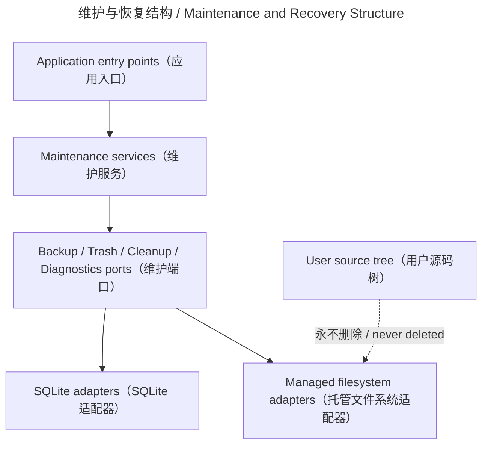

# 维护与恢复 / Maintenance and Recovery

## 概述 / Overview

### 中文

`maintenance_and_recovery` 是可靠性边界，负责数据库备份/覆盖恢复、Page trash 与恢复、可重建缓存清理、受限诊断报告以及无目标 pipeline run 的回收。

### English

`maintenance_and_recovery` is the reliability boundary for database backup/restore, Page trash and restore, rebuildable-cache cleanup, bounded diagnostics reports, and reclamation of target-less pipeline runs.

## 模块边界 / Module Boundary

### 中文

用户源文件位于 managed root 之外，维护删除不得触碰；Managed Copy、生成 revision、cache、manifest、log 和 SQLite 才能通过受保护服务或适配器变更。

### English

User source files remain outside the managed root and are never maintenance deletion targets; Managed Copies, generated revisions, caches, manifests, logs, and SQLite may change only through guarded services or adapters.

## 运行链路 / Runtime Flow

### 中文

应用服务调用维护 ports；基础设施提供 SQLite、filesystem、cache inventory 和 bounded log store。当前 `assemble_engine` 未注册 maintenance ViewModel。

### English

Application services call maintenance ports; infrastructure supplies SQLite, filesystem, cache-inventory, and bounded-log adapters. The current `assemble_engine` does not register a maintenance ViewModel.

## 架构 / Architecture

## 源码证据 / Source Evidence

### 中文

`BackupLedger` — [src/application/maintenance/backup.py](../../src/application/maintenance/backup.py)
`TrashService` — [src/application/maintenance/trash.py](../../src/application/maintenance/trash.py)
`assemble_services` — [src/bootstrap/app.py](../../src/bootstrap/app.py)

### English

`BackupLedger` — [src/application/maintenance/backup.py](../../src/application/maintenance/backup.py)
`TrashService` — [src/application/maintenance/trash.py](../../src/application/maintenance/trash.py)
`assemble_services` — [src/bootstrap/app.py](../../src/bootstrap/app.py)

## 当前实现状态 / Current Implementation Status

### 中文

当前实现确认备份、trash、cleanup、diagnostics 的内部服务边界；是否有用户可见入口必须以当前 bootstrap/QML 代码确认。

### English

The current implementation confirms internal backup, trash, cleanup, and diagnostics service boundaries; any user-visible entry point must be confirmed from current bootstrap and QML code.
