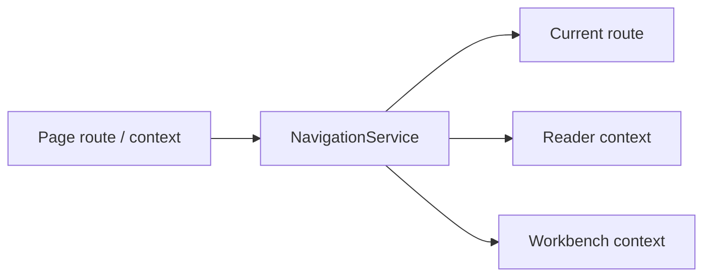

# 导航状态服务 / Navigation

## 概述 / Overview

### 中文

`navigation` 是 Qt-free 的应用层状态持有者，管理 `bookshelf`、`workbench`、`reader`、`settings` 四个 route，以及跨页面传递的 Book/Chapter/Page 临时 context。

### English

`navigation` is a Qt-free application-layer state holder for the four routes `bookshelf`, `workbench`, `reader`, and `settings`, plus transient Book/Chapter/Page context passed between page owners.

## 模块边界 / Module Boundary

### 中文

它只验证 route 和保存 context，不加载 domain object、不访问 SQLite/Managed File，也不实现 history、nested route 或跨会话恢复。

### English

It validates routes and stores context only; it does not load domain objects, access SQLite/Managed Files, or implement history, nested routes, or cross-session restoration.

## 运行链路 / Runtime Flow

### 中文

Bookshelf 写入 Workbench/Reader context；`NavigationService` 发布状态；`NavigationViewModel` 在 UI 层做 Qt 适配。

### English

Bookshelf writes Workbench/Reader context; `NavigationService` publishes state; `NavigationViewModel` adapts it to Qt at the UI layer.

## 架构 / Architecture

## 源码证据 / Source Evidence

### 中文

`NavigationService` — [src/application/navigation/service.py](../../src/application/navigation/service.py)
`NavigationViewModel` — [src/ui/viewmodels/navigation/viewmodel.py](../../src/ui/viewmodels/navigation/viewmodel.py)

### English

`NavigationService` — [src/application/navigation/service.py](../../src/application/navigation/service.py)
`NavigationViewModel` — [src/ui/viewmodels/navigation/viewmodel.py](../../src/ui/viewmodels/navigation/viewmodel.py)

## 当前实现状态 / Current Implementation Status

### 中文

当前实现确认未知 route 会在状态改变前被拒绝，页面切换不会清空未变更的 context；接收方仍负责加载并验证真实 domain data。

### English

The current implementation confirms that unknown routes are rejected before state changes and that route switches preserve unchanged context; receiving modules still load and validate real domain data.
