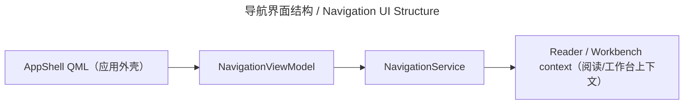

# 导航界面 / Navigation UI

## 概述 / Overview

### 中文

`navigation_ui` 是四个一级页面的 QML 导航边界：Bookshelf、Workbench、Reader 和 Settings。它通过 `NavigationViewModel` 暴露 route、临时 Book/Chapter/Page context 和 Workbench activity badge。

### English

`navigation_ui` is the QML navigation boundary for the four top-level pages: Bookshelf, Workbench, Reader, and Settings. It exposes route state, transient Book/Chapter/Page context, and a Workbench activity badge through `NavigationViewModel`.

## 模块边界 / Module Boundary

### 中文

ViewModel 只适配 Qt properties、signals、slots；`NavigationService` 才拥有状态转移规则。该模块不查询 library、不执行 pipeline、不访问数据库或文件。

### English

The ViewModel only adapts Qt properties, signals, and slots; `NavigationService` owns transition rules. This module does not query the library, run pipelines, or access databases/files.

## 运行链路 / Runtime Flow

### 中文

QML shell 调用 `NavigationViewModel`；ViewModel 转发到 `NavigationService`，再以 context signals 通知 Reader/Workbench 装配边界。

### English

The QML shell calls `NavigationViewModel`; the ViewModel delegates to `NavigationService` and emits context signals consumed by Reader/Workbench composition seams.

## 架构 / Architecture

## 源码证据 / Source Evidence

### 中文

`NavigationViewModel` — [src/ui/viewmodels/navigation/viewmodel.py](../../src/ui/viewmodels/navigation/viewmodel.py)
`NavigationService` — [src/application/navigation/service.py](../../src/application/navigation/service.py)
`assemble_engine` — [src/bootstrap/app.py](../../src/bootstrap/app.py)

### English

`NavigationViewModel` — [src/ui/viewmodels/navigation/viewmodel.py](../../src/ui/viewmodels/navigation/viewmodel.py)
`NavigationService` — [src/application/navigation/service.py](../../src/application/navigation/service.py)
`assemble_engine` — [src/bootstrap/app.py](../../src/bootstrap/app.py)

## 当前实现状态 / Current Implementation Status

### 中文

当前实现确认四个 route、Workbench badge 和 Reader/Workbench context bridge；页面自身业务仍由各页面模块负责。

### English

The current implementation confirms the four routes, Workbench badge, and Reader/Workbench context bridge; page-specific behavior remains in each page module.
