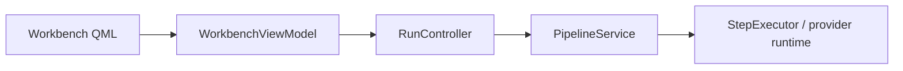

# 流水线编排 / Pipeline Orchestration

## 概述 / Overview

### 中文

`pipeline_orchestration` 将用户命令和 Page/Region scope 转换为冻结、可顺序执行的计划，使用 revision/Lock guard 提交结果，并暴露进度、失败、暂停、恢复和重试状态。

### English

`pipeline_orchestration` turns user commands and Page/Region scopes into frozen ordered plans, commits results through revision/Lock guards, and exposes progress, failure, pause, recovery, and retry state.

## 模块边界 / Module Boundary

### 中文

`PipelineService` 不直接执行 OCR、translation、inpainting、rendering、SQL、文件 I/O 或 QML；这些职责由 ports、domain 和 infrastructure adapter 提供。

### English

`PipelineService` does not directly perform OCR, translation, inpainting, rendering, SQL, file I/O, or QML work; ports, domain rules, and infrastructure adapters provide those responsibilities.

## 运行链路 / Runtime Flow

### 中文

Workbench ViewModel 通过 `RunController` 调用 `PipelineService`；服务规划 run、驱动 `StepExecutor`，并将结果交给 translation/rendering/provider runtime。

### English

The Workbench ViewModel calls `PipelineService` through `RunController`; the service plans runs, drives `StepExecutor`, and hands results to translation/rendering/provider runtime.

## 架构 / Architecture

## 源码证据 / Source Evidence

### 中文

`PipelineService` — [src/application/tasks/service.py](../../src/application/tasks/service.py)
`RunController` — [src/ui/viewmodels/workbench/run_controller.py](../../src/ui/viewmodels/workbench/run_controller.py)
`ProductionStepExecutor` — [src/infrastructure/pipeline/executor.py](../../src/infrastructure/pipeline/executor.py)

### English

`PipelineService` — [src/application/tasks/service.py](../../src/application/tasks/service.py)
`RunController` — [src/ui/viewmodels/workbench/run_controller.py](../../src/ui/viewmodels/workbench/run_controller.py)
`ProductionStepExecutor` — [src/infrastructure/pipeline/executor.py](../../src/infrastructure/pipeline/executor.py)

## 当前实现状态 / Current Implementation Status

### 中文

当前实现确认 run 生命周期、step 顺序、控制命令和恢复状态的应用层边界；真实 provider 能力必须以 adapter 和测试为准。

### English

The current implementation confirms the application boundary for run lifecycle, step ordering, control commands, and recovery state; real provider capabilities must be confirmed by adapters and tests.
