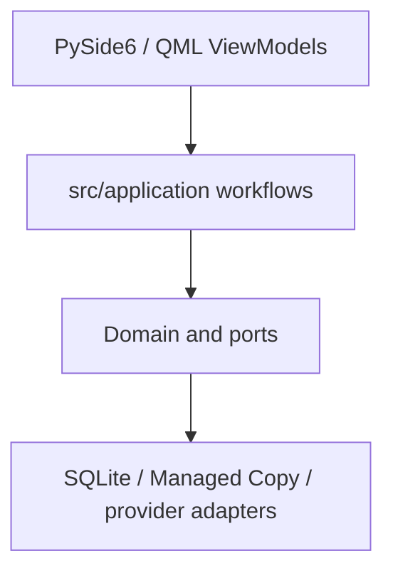

# 产品工作流应用服务 / Product Workflow Application Services

## 概述 / Overview

### 中文

该模块索引描述 `src/application` 中的用户工作流：library/import、Region editing、reading/export、navigation、settings/provider/network，以及 maintenance/recovery。

### English

This index describes the user workflows in `src/application`: library/import, Region editing, reading/export, navigation, settings/provider/network, and maintenance/recovery.

## 模块边界 / Module Boundary

### 中文

应用层协调用户操作并保持 QML 不接触数据库、文件系统、provider 和 pipeline 实现；pipeline、rendering、translation 与 infrastructure 是相邻边界。

### English

The application layer coordinates user operations while keeping QML away from database, filesystem, provider, and pipeline implementations; pipeline, rendering, translation, and infrastructure remain adjacent boundaries.

## 运行链路 / Runtime Flow

### 中文

Presentation ViewModel 调用 application service；service 依赖 ports/domain；bootstrap 把 application 对象与 SQLite、Managed Copy、provider adapter 组合。

### English

Presentation ViewModels call application services; services depend on ports/domain; bootstrap composes application objects with SQLite, Managed Copy, and provider adapters.

## 架构 / Architecture

## 源码证据 / Source Evidence

### 中文

Application package — [src/application](../../src/application)
Composition root — [src/bootstrap/app.py](../../src/bootstrap/app.py)
Application ports — [src/ports](../../src/ports)

### English

Application package — [src/application](../../src/application)
Composition root — [src/bootstrap/app.py](../../src/bootstrap/app.py)
Application ports — [src/ports](../../src/ports)

## 当前实现状态 / Current Implementation Status

### 中文

这是当前应用层的导航索引，不代表 roadmap 中尚未实现的能力已经存在；实现事实必须回到各 service、port、test 和 bootstrap。

### English

This is a navigation index for the current application layer and does not turn roadmap-only capabilities into implemented features; implementation facts must be verified in services, ports, tests, and bootstrap.
