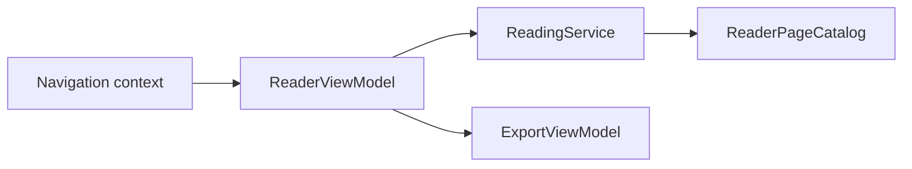

# 阅读器界面 / Reader UI

## 概述 / Overview

### 中文

`reader_ui` 是打开章节的 QML 阅读表面，把 `ReadingService` 和只读 `ReaderPageCatalog` 适配成 `ReaderView.qml` 消费的 properties、signals 和 slots，并提供 Webtoon tile 与导出桥接。

### English

`reader_ui` is the QML reading surface for an open chapter. It adapts `ReadingService` and the read-only `ReaderPageCatalog` into properties, signals, and slots consumed by `ReaderView.qml`, with Webtoon tiling and export seams.

## 模块边界 / Module Boundary

### 中文

QML 不直接访问数据库、文件或 provider；chapter context 来自导航，页面读取、progress、translated status 和导出由注入的服务/adapter 完成。

### English

QML does not access databases, files, or providers directly; chapter context comes from navigation, while page loading, progress, translated status, and export are provided by injected services/adapters.

## 运行链路 / Runtime Flow

### 中文

`ReaderViewModel` 接收导航 context，调用 `ReadingService`，选择 paged 或 Webtoon 投影，并按需创建 `ExportViewModel`。

### English

`ReaderViewModel` receives navigation context, calls `ReadingService`, selects paged or Webtoon projections, and lazily creates `ExportViewModel` when needed.

## 架构 / Architecture

## 源码证据 / Source Evidence

### 中文

`ReaderViewModel` — [src/ui/viewmodels/reader/viewmodel.py](../../src/ui/viewmodels/reader/viewmodel.py)
`ReadingService` — [src/application/reading/service.py](../../src/application/reading/service.py)
QML roots — [src/ui/qml](../../src/ui/qml)

### English

`ReaderViewModel` — [src/ui/viewmodels/reader/viewmodel.py](../../src/ui/viewmodels/reader/viewmodel.py)
`ReadingService` — [src/application/reading/service.py](../../src/application/reading/service.py)
QML roots — [src/ui/qml](../../src/ui/qml)

## 当前实现状态 / Current Implementation Status

### 中文

当前实现确认 reader state、mode/resume/restart、heartbeat reading time、missing/stale translated feedback 和 tile URL seam；具体 QML 交互以 `.qml` 源码为准。

### English

The current implementation confirms reader state, mode/resume/restart, heartbeat reading time, missing/stale translated feedback, and the tile-URL seam; exact QML interaction is defined by the `.qml` source.
