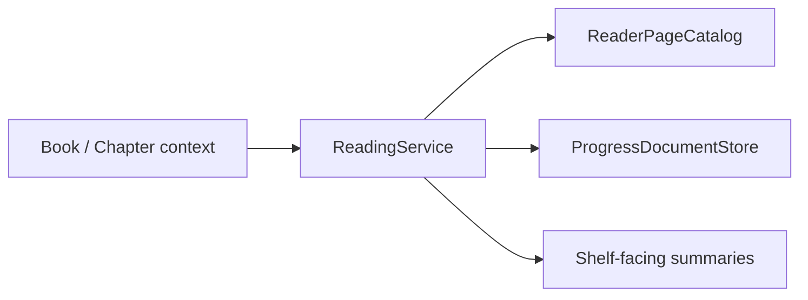

# 阅读会话 / Reading

## 概述 / Overview

### 中文

`reading` 是应用层阅读会话模块，将章节页面投影转换为可恢复 session，支持 Original/Translated、RTL/LTR paged、Webtoon scroll、阅读时间、shelf summary 和 missing/stale translated feedback。

### English

`reading` is the application-layer reader-session module. It turns a chapter page projection into a resumable session with Original/Translated modes, RTL/LTR paging, Webtoon scroll, reading time, shelf summaries, and missing/stale translated feedback.

## 模块边界 / Module Boundary

### 中文

它位于 Qt 和 infrastructure 之下，依赖只读 `ReaderPageCatalog` 与 progress store；不负责路由、QML、导入、Region editing 或 export policy。

### English

It sits below Qt and infrastructure and depends on the read-only `ReaderPageCatalog` and progress store; it does not own routing, QML, importing, Region editing, or export policy.

## 运行链路 / Runtime Flow

### 中文

`ReadingService` 从 catalog 加载章节，维护当前 page/mode/direction，按 progress-affecting action 持久化进度，并生成章节/书籍 summary。

### English

`ReadingService` loads a chapter from the catalog, maintains current page/mode/direction, persists progress after progress-affecting actions, and produces chapter/book summaries.

## 架构 / Architecture

## 源码证据 / Source Evidence

### 中文

`ReadingService` — [src/application/reading/service.py](../../src/application/reading/service.py)
`ReaderPageCatalog` / `ProgressDocumentStore` — [src/application/reading/ports.py](../../src/application/reading/ports.py)
`ReaderViewModel` consumer — [src/ui/viewmodels/reader/viewmodel.py](../../src/ui/viewmodels/reader/viewmodel.py)

### English

`ReadingService` — [src/application/reading/service.py](../../src/application/reading/service.py)
`ReaderPageCatalog` / `ProgressDocumentStore` — [src/application/reading/ports.py](../../src/application/reading/ports.py)
`ReaderViewModel` consumer — [src/ui/viewmodels/reader/viewmodel.py](../../src/ui/viewmodels/reader/viewmodel.py)

## 当前实现状态 / Current Implementation Status

### 中文

当前实现确认 paged 与 webtoon 方向不变量、稳定 `page_id` 恢复和 translated artifact 状态提示；路径解析由生产装配提供。

### English

The current implementation confirms paged/webtoon direction invariants, stable `page_id` restoration, and translated-artifact status feedback; path resolution is supplied by production composition.
