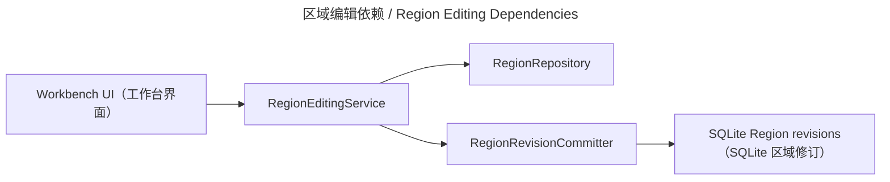

# 区域编辑 / Region Editing

## 概述 / Overview

### 中文

`region_editing` 管理 Page Region 的 geometry、reading order、OCR text、machine translation、manual translation、review、Lock、软删除和不可变 revision history。

### English

`region_editing` manages Page Region geometry, reading order, OCR text, machine translation, manual translation, review state, locks, soft deletion, and immutable revision history.

## 模块边界 / Module Boundary

### 中文

它是 Workbench UI 与 Region persistence adapter 之间的写边界；不负责 QML hit testing、provider 网络调用、pipeline planning、reading、export 或用户源文件。

### English

It is the write boundary between Workbench UI and the Region persistence adapter; it does not own QML hit testing, provider calls, pipeline planning, reading, export, or user source files.

## 运行链路 / Runtime Flow

### 中文

Workbench 调用 `RegionEditingService`；服务通过 `RegionRepository`/`RegionRevisionCommitter` 读取快照、执行 Lock/revision guard 并提交新 revision。

### English

Workbench calls `RegionEditingService`; the service reads snapshots through `RegionRepository`/`RegionRevisionCommitter`, applies lock/revision guards, and commits a new revision.

## 架构 / Architecture

## 源码证据 / Source Evidence

### 中文

`RegionEditingService` — [src/application/editing/service.py](../../src/application/editing/service.py)
Editing ports — [src/application/editing/ports.py](../../src/application/editing/ports.py)
`RegionCanvasError` bridge — [src/ui/viewmodels/workbench/region_canvas.py](../../src/ui/viewmodels/workbench/region_canvas.py)

### English

`RegionEditingService` — [src/application/editing/service.py](../../src/application/editing/service.py)
Editing ports — [src/application/editing/ports.py](../../src/application/editing/ports.py)
`RegionCanvasError` bridge — [src/ui/viewmodels/workbench/region_canvas.py](../../src/ui/viewmodels/workbench/region_canvas.py)

## 当前实现状态 / Current Implementation Status

### 中文

当前实现确认 create/list/read/merge/split/reorder、manual translation protection、OCR retranslation hint 和历史恢复边界；真实 SQLite 行为以 adapter/test 为准。

### English

The current implementation confirms create/list/read/merge/split/reorder, manual-translation protection, OCR retranslation hints, and history-restore boundaries; SQLite behavior is defined by the adapter and tests.
