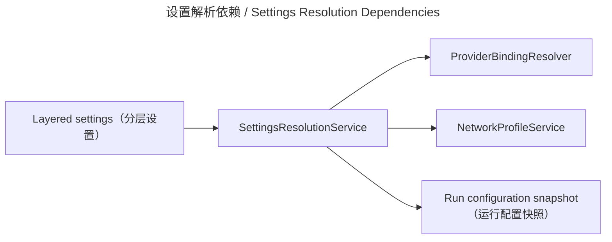

# 设置与配置 / Settings and Configuration

## 概述 / Overview

### 中文

`settings_and_configuration` 解析有效设置、provider binding、网络安全和 pipeline defaults，把分层选择冻结成可重现的 run configuration。

### English

`settings_and_configuration` resolves effective settings, provider bindings, network safety, and pipeline defaults, freezing layered choices into reproducible run configuration.

## 模块边界 / Module Boundary

### 中文

普通设置按 `task > chapter > book > global` 选择；provider 必须按 capability/scope 明确解析；危险网络变更、credential reference 和 TLS 策略受保护。

### English

Ordinary settings resolve by `task > chapter > book > global`; providers are resolved explicitly by capability/scope; dangerous network changes, credential references, and TLS policy are guarded.

## 运行链路 / Runtime Flow

### 中文

UI 或 bootstrap 提供输入；`SettingsResolutionService`、`ProviderBindingResolver`、`NetworkProfileService` 和 `PipelineDefaultsService` 生成有效值与 snapshot，pipeline 在 run 时消费。

### English

UI or bootstrap supplies inputs; `SettingsResolutionService`, `ProviderBindingResolver`, `NetworkProfileService`, and `PipelineDefaultsService` produce effective values and a snapshot consumed by the pipeline at run time.

## 架构 / Architecture

## 源码证据 / Source Evidence

### 中文

`SettingsResolutionService` — [src/application/settings/resolution.py](../../src/application/settings/resolution.py)
Provider binding — [src/application/settings/bindings.py](../../src/application/settings/bindings.py)
Network policy — [src/application/settings/network.py](../../src/application/settings/network.py)

### English

`SettingsResolutionService` — [src/application/settings/resolution.py](../../src/application/settings/resolution.py)
Provider binding — [src/application/settings/bindings.py](../../src/application/settings/bindings.py)
Network policy — [src/application/settings/network.py](../../src/application/settings/network.py)

## 当前实现状态 / Current Implementation Status

### 中文

当前实现确认配置解析、安全 gate、credential reference 与 restart validation；Settings UI/完整 ViewModel 是否存在必须直接核对当前 QML/bootstrap。

### English

The current implementation confirms configuration resolution, safety gates, credential references, and restart validation; the existence of a full Settings UI/ViewModel must be checked directly in current QML/bootstrap.
