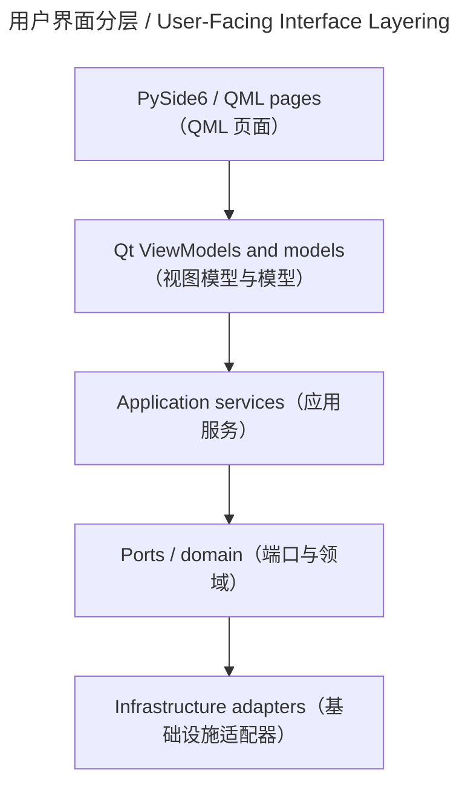

# 用户界面层 / User-Facing Interface

## 概述 / Overview

### 中文

`user_facing_interface` 是 PySide6/QML presentation layer，通过 ViewModel 和 model 暴露用户状态，同时禁止 QML 直接访问 database、filesystem、provider 和 pipeline 实现。

### English

`user_facing_interface` is the PySide6/QML presentation layer. It exposes user-facing state through ViewModels and models while keeping QML away from database, filesystem, provider, and pipeline implementations.

## 模块边界 / Module Boundary

### 中文

边界包括 Bookshelf、Workbench、Reader、Export 和四路导航；具体业务仍由 `src/application` 服务和 ports 持有。

### English

The boundary includes Bookshelf, Workbench, Reader, Export, and four-route navigation; business rules remain in `src/application` services and ports.

## 运行链路 / Runtime Flow

### 中文

QML 页面调用对应 ViewModel；ViewModel 将 domain/application projection 转为 Qt properties/signals/slots/list-model roles，再把命令转给应用层。

### English

QML pages call their ViewModels; ViewModels turn domain/application projections into Qt properties, signals, slots, and list-model roles, then delegate commands to application services.

## 架构 / Architecture

## 源码证据 / Source Evidence

### 中文

UI root — [src/ui](../../src/ui)
QML tree — [src/ui/qml](../../src/ui/qml)
ViewModel tree — [src/ui/viewmodels](../../src/ui/viewmodels)

### English

UI root — [src/ui](../../src/ui)
QML tree — [src/ui/qml](../../src/ui/qml)
ViewModel tree — [src/ui/viewmodels](../../src/ui/viewmodels)

## 当前实现状态 / Current Implementation Status

### 中文

当前实现确认 presentation 目录与四页面约束；Settings 页面能力不能从 roadmap 单独推断，必须以实际 QML/ViewModel 源码为准。

### English

The current implementation confirms the presentation layout and four-page constraint; Settings capability must not be inferred from roadmap text and must be verified in actual QML/ViewModel source.
