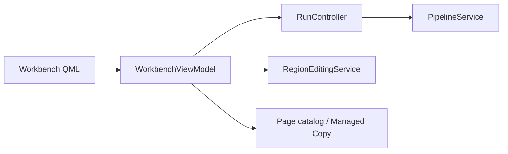

# 工作台界面 / Workbench UI

## 概述 / Overview

### 中文

`workbench_ui` 把 PySide6/QML 工作台连接到 `PipelineService`、`RegionEditingService`、Managed Copy page catalog 和导航 context，提供 Page 列表、Viewer、Region overlay、Inspector、批处理命令和任务进度。

### English

`workbench_ui` connects the PySide6/QML workbench to `PipelineService`, `RegionEditingService`, the Managed Copy page catalog, and navigation context. It provides page lists, viewer, Region overlay, inspector, batch commands, and task progress.

## 模块边界 / Module Boundary

### 中文

UI 负责 projection、坐标转换、未保存确认、恢复闸门和 GUI thread 边界；pipeline 规划/执行、Region revision/Lock、数据库、文件和 provider 仍由下游服务负责。

### English

The UI owns projection, coordinate conversion, unsaved-change confirmation, recovery gates, and GUI-thread boundaries; pipeline planning/execution, Region revisions/locks, database, files, and providers remain downstream responsibilities.

## 运行链路 / Runtime Flow

### 中文

`WorkbenchViewModel` 通过 `RunController` 调用 `PipelineService`，通过注入 service 保存 Region，并消费 page catalog/image URL；`NavigationViewModel` 只负责 route/context。

### English

`WorkbenchViewModel` calls `PipelineService` through `RunController`, saves Regions through injected services, and consumes page-catalog/image URLs; `NavigationViewModel` owns only route/context.

## 架构 / Architecture

## 源码证据 / Source Evidence

### 中文

`WorkbenchViewModel` — [src/ui/viewmodels/workbench/viewmodel.py](../../src/ui/viewmodels/workbench/viewmodel.py)
`RunController` — [src/ui/viewmodels/workbench/run_controller.py](../../src/ui/viewmodels/workbench/run_controller.py)
`RegionCanvasError` — [src/ui/viewmodels/workbench/region_canvas.py](../../src/ui/viewmodels/workbench/region_canvas.py)

### English

`WorkbenchViewModel` — [src/ui/viewmodels/workbench/viewmodel.py](../../src/ui/viewmodels/workbench/viewmodel.py)
`RunController` — [src/ui/viewmodels/workbench/run_controller.py](../../src/ui/viewmodels/workbench/run_controller.py)
`RegionCanvasError` — [src/ui/viewmodels/workbench/region_canvas.py](../../src/ui/viewmodels/workbench/region_canvas.py)

## 当前实现状态 / Current Implementation Status

### 中文

当前实现确认 Page/Region projection、pipeline 控制、geometry typed errors、Inspector dirty state 和退出 drain；具体可用命令以 ViewModel/QML property/slot 为准。

### English

The current implementation confirms page/Region projection, pipeline controls, typed geometry errors, inspector dirty state, and shutdown drain; exact commands are defined by ViewModel/QML properties and slots.
