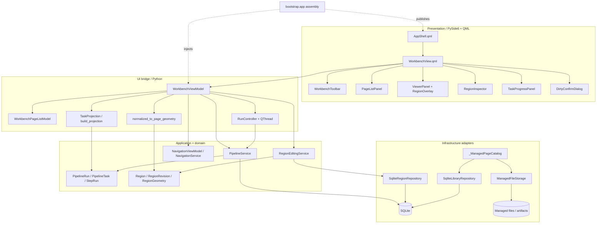
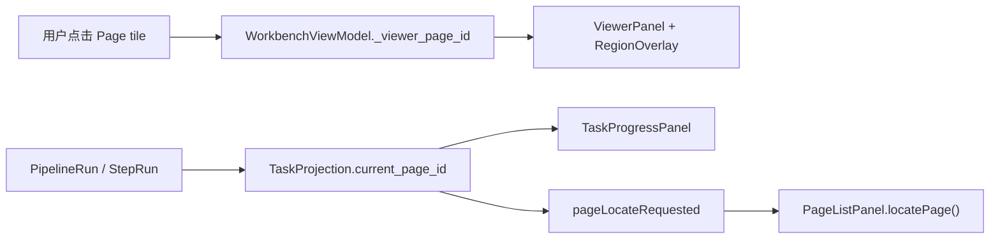
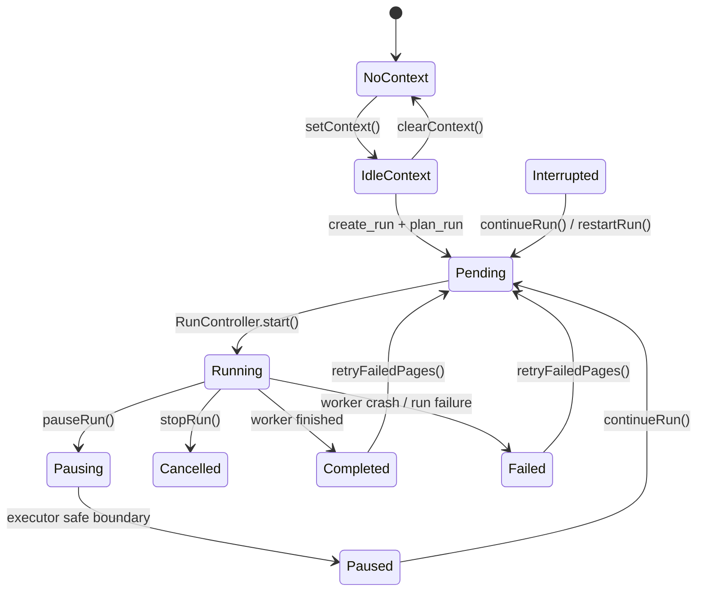
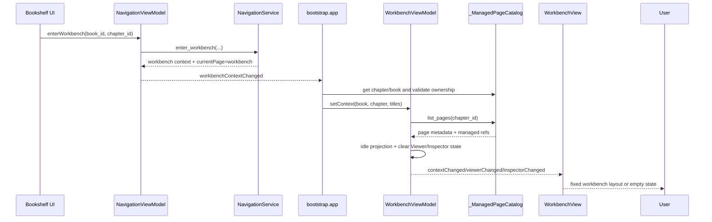
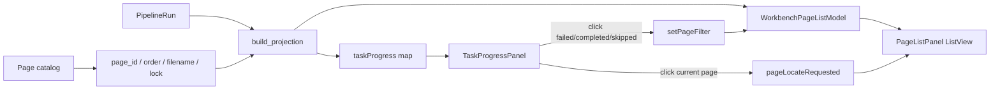
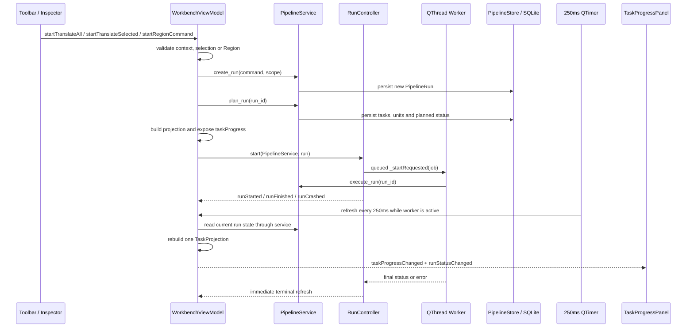
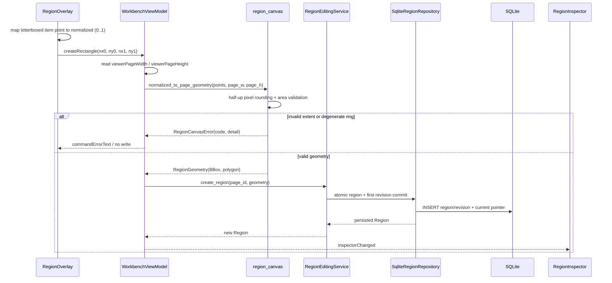
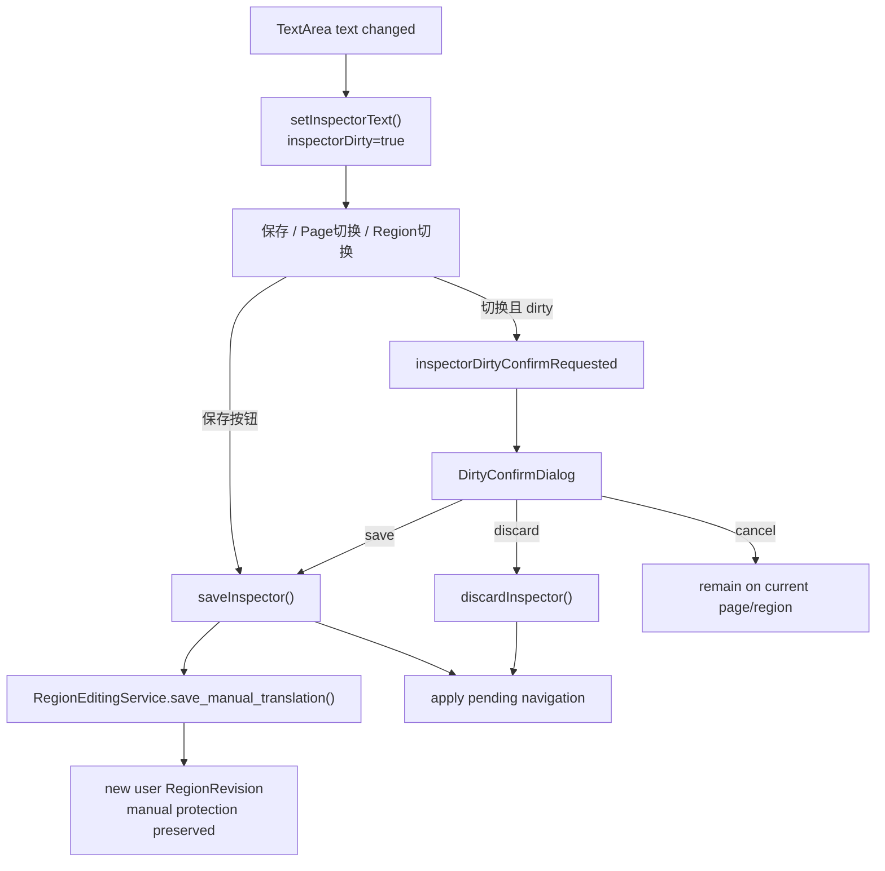

# workbench_ui

`workbench_ui` 是 New Manga 的工作台页面模块。它把 PySide6/QML 工作台连接到
Pipeline application service、Region editing service、Managed Copy page catalog 和
导航上下文，提供 Page 列表、Viewer、Region Overlay、Inspector、批处理命令和固定任务
进度面板。

本文档描述当前代码（As-Is），不是目标设计的实现承诺。整体分层、四个一级页面和
“QML 不直接访问数据库、文件或 Provider”约束见 [02_TECHNICAL_ARCHITECTURE](../../doc/02_TECHNICAL_ARCHITECTURE_.md)。
工作台的 UI 映射见 [05_UI_MAPPING](../../doc/05_UI_MAPPING.md)，当前实现状态和缺口见
[STATUS](../../doc/STATUS.md) 与 [REBASELINE_PLAN](../../doc/REBASELINE_PLAN.md)。

## 1. 模块边界

### 负责

- 接收 `book_id + chapter_id` 工作台上下文，并加载章节 Page catalog。
- 管理 Viewer 当前 Page、Page 多选、筛选和 Viewer mode。
- 把一个 `PipelineRun` 投影为 Page 状态、统计、当前 Page、当前 Step 和控制按钮能力。
- 通过 `PipelineService` 创建、规划、运行、暂停、停止、继续、重启和重试任务。
- 将同步 Pipeline 执行移出 Qt GUI thread，并在完成、崩溃或控制确认时刷新 UI。
- 展示和编辑当前 Page 的 Region；保存人工译文和删除 Region 均通过注入的 application
  service 完成。
- 将 QML 的 normalized 坐标转换为 page-pixel `RegionGeometry`，并以 typed error
  将几何拒绝反馈给 QML。
- 处理 Inspector 未保存状态的导航确认、命令错误展示、恢复闸门和应用退出 drain。

### 不负责

- Pipeline 的规划规则、Step 执行、Provider 调用、重试和 Run 持久化；这些属于
  [`PipelineService`](../../src/application/tasks/service.py:188) 及其下游模块，详见
  [pipeline_orchestration](pipeline_orchestration.md)（若该 companion 文档已生成）。
- Region Revision、Lock、current/pinned Revision 或 SQLite transaction 规则；这些由
  [`RegionEditingService`](../../src/application/editing/service.py:151)、Region port 和
  SQLite adapter 负责，详见 [region_editing](region_editing.md)（若该 companion 文档已生成）。
- 页面、章节、Managed Copy 的创建和导入；工作台只消费 page catalog 和 image URL。
- 阅读进度、阅读方向、Webtoon reader 行为和导出历史；这些分别由 Reader/Export 模块
  负责，见 [reader_ui](reader_ui.md) 与 [export_ui](export_ui.md)（若相应 companion
  文档已生成）。
- 一级导航状态；工作台调用注入的 [`NavigationViewModel`](../../src/ui/viewmodels/navigation/viewmodel.py:17)，
  不自行切换路由。
- 数据库 SQL、文件读写、Provider 实例或模型初始化。所有这些均由 bootstrap/application
  或 infrastructure 层装配。

## 2. 在整体系统中的位置

生产启动由 [`assemble_services`](../../src/bootstrap/app.py:569) 创建 SQLite、Managed
Storage、Pipeline、Region editing 和 page catalog，再构造 `WorkbenchViewModel`。
[`assemble_engine`](../../src/bootstrap/app.py:942) 将它发布为 QML context property
`workbenchViewModel`。顶层 [`AppShell.qml`](../../src/ui/qml/shell/AppShell.qml:1) 保持
四个一级页面实例存在，只切换可见性；因此离开工作台不会自动停止 Pipeline run。



依赖方向保持为 `QML/UI → Application → Domain/Ports → Infrastructure Adapters`。工作台
UI bridge 只依赖 application/domain 类型和 duck-typed catalog seam；具体 SQLite、文件
存储和 Provider 绑定只在 bootstrap 或 application/infrastructure 组合处出现。

## 3. 组件关系

### 3.1 Python 组件

| Component | Responsibility | Key boundary |
|---|---|---|
| [`WorkbenchViewModel`](../../src/ui/viewmodels/workbench/viewmodel.py:65) | 工作台唯一 QML-facing state holder | 持有上下文、Viewer/Inspector/run 状态；把 QML slot 转为 service 调用；不持有 DB connection。 |
| [`WorkbenchPageListModel`](../../src/ui/models/tasks/page_list_model.py:37) | Page tile 的 `QAbstractListModel` | 只消费 `TaskProjection`，维护过滤和本地选择；不计算任务状态。 |
| [`TaskProjection`](../../src/ui/models/tasks/projection.py:89) | Run → UI 的纯数据投影 | 同时提供 Page rows、统计、focus、step flow 和按钮矩阵，避免 PageList 与 ProgressPanel 分叉。 |
| [`RegionCanvasError`](../../src/ui/viewmodels/workbench/region_canvas.py:29) / `normalized_to_page_geometry` | UI 坐标到领域几何的验证 seam | 统一 page 尺寸、半上取整、矩形/多边形和退化几何错误。 |
| [`RunController`](../../src/ui/viewmodels/workbench/run_controller.py:52) | Pipeline worker 生命周期和 admission seam | 每个 run 创建独立 `QThread`；控制请求写入 run flags；负责恢复闸门和退出 drain。 |

### 3.2 QML 组件

| Component | Role | Delegated operations |
|---|---|---|
| [`WorkbenchView.qml`](../../src/ui/qml/workbench/WorkbenchView.qml:1) | 固定工作台布局和 ViewModel 绑定 | 组合工具栏、PageList、Viewer、Inspector、ProgressPanel 和 dirty dialog。 |
| [`WorkbenchToolbar.qml`](../../src/ui/qml/workbench/WorkbenchToolbar.qml:1) | 上下文、页导航、Viewer mode、批处理入口 | 只发出 signal；上一页/下一页和命令由 VM 执行。 |
| [`PageListPanel.qml`](../../src/ui/qml/workbench/PageListPanel.qml:1) | 虚拟化 Page tile、状态、Lock 和多选 | 使用 `pageListModel` roles；单击/Control/Shift 选择通过 signal 返回 VM。 |
| [`ViewerPanel.qml`](../../src/ui/qml/workbench/ViewerPanel.qml:1) | Original/Clean/Translated/Compare 展示 | 只消费 VM URL；原图 pane 挂 RegionOverlay。 |
| [`RegionOverlay.qml`](../../src/ui/qml/workbench/RegionOverlay.qml:1) | 页面坐标上的矩形/多边形绘制交互 | 只将 normalized points 发送给 VM；不做 page-pixel rounding 或持久化。 |
| [`RegionInspector.qml`](../../src/ui/qml/workbench/RegionInspector.qml:1) | Region 列表、人工译文编辑和单 Region 命令 | 输入修改通过 `setInspectorText` 标记 dirty；保存/放弃/命令转发给 VM。 |
| [`TaskProgressPanel.qml`](../../src/ui/qml/workbench/TaskProgressPanel.qml:1) | 固定底部任务进度和控制面板 | 只显示 `taskProgress` projection；统计点击会驱动 PageList filter。 |
| [`DirtyConfirmDialog.qml`](../../src/ui/qml/workbench/DirtyConfirmDialog.qml:1) | Save/Discard/Cancel 对话框 | 由 `inspectorDirtyConfirmRequested` 打开，通过 `resolveDirtyConfirm` 恢复导航。 |

### 3.3 装配组件

生产装配中，`WorkbenchViewModel` 的主要注入关系如下：

| Injection | Production binding | Purpose |
|---|---|---|
| `pipeline` | `PipelineService` from `build_production_pipeline` | Run creation, planning, execution and control. |
| `page_catalog` | `_ManagedPageCatalog` | Chapter pages, managed original/artifact URLs, image state and dimensions. |
| `region_catalog` | `RegionEditingService` | List/get Regions for the Inspector. |
| `translation_editor` | `RegionEditingService` | Manual translation revision commit. |
| `region_creator` | `RegionEditingService` | First Region Revision + current pointer creation. |
| `region_deleter` | `RegionEditingService` | Controlled soft deletion. |
| `navigation` | `NavigationViewModel` | Workbench activity badge and context handoff. |

测试使用相同的 seam 注入 fake catalog/service；因此 ViewModel 不需要为了测试
`SqliteConnection` 或真实文件系统。

## 4. 状态模型和单一真值

### 4.1 工作台上下文

`setContext(book_id, chapter_id, book_title, chapter_title)` 是上下文切换入口。它会：

1. 清除当前 Viewer Page 和 Inspector Region/dirty 状态。
2. 通过 `page_catalog.list_pages(chapter_id)` 构建 `_pages` 内存索引。
3. 生成 idle `TaskProjection`，把所有 Page 标为 `waiting`。
4. 通过 `contextChanged`、`viewerChanged` 和 `inspectorChanged` 通知 QML。

没有章节上下文时 `WorkbenchView.qml` 显示空状态；`workbenchPickContext` 当前只是保留
的禁用入口，实际上下文来自书架/导航流程。

### 4.2 Viewer Page 与 Pipeline focus 分离

`viewerPageId` 表示用户正在查看的 Page；`TaskProjection.current_page_id` 表示 Pipeline
当前或最近 focus 的 Page。二者可以不同：用户可以阅读另一个 Page，而任务面板仍显示
后台正在处理的 Page。



### 4.3 TaskProjection 是进度单一真值

每次刷新只创建一个 `TaskProjection`：

```text
PipelineRun + page metadata
        │
        ▼
build_projection()
        ├── TaskProjection.rows ──► WorkbenchPageListModel
        └── TaskProjection fields ► WorkbenchViewModel.taskProgress ► TaskProgressPanel
```

Page 状态分类优先级为 `failed > processing > blocked > completed > skipped > waiting`。
进度百分比使用 `terminal_step_units / planned_step_units`，不是“已完成页 / 总页数”。
控制按钮能力也从 Run status 和失败计数生成：

| Run status | 可用控制 |
|---|---|
| `pending` / `running` | pause、stop |
| `paused` | stop、continue |
| `blocked` | stop |
| `interrupted` | continue、restart、abandon |
| `completed_with_failures` 且存在失败页 | retry failed pages |
| 其他 terminal 状态 | 无继续控制 |

`WorkbenchPageListModel` 只做三件事：接收 projection、按 `all/failed/completed/skipped`
过滤、维护当前章节内的 single/Control/Shift 多选。过滤只影响可见 rows，不改变统计。

### 4.4 Inspector dirty 状态

Inspector 同时保存 `saved_text` 和 `text`。第一次文本变化把
`hasDirtyEditor` 设为 `true`；保存通过 `save_manual_translation` 创建人工 Revision，
放弃则恢复内存中的已保存文本。Page 或 Region 切换必须经过 `_navigate`；dirty 时只
发信号，不立即切换。

### 4.5 Run 生命周期状态

ViewModel 的 `_run` 是当前显示的 Run；`RunController._active_run` 是当前实际执行的
Run。Run 完成后 controller 不再 active，但 VM 保留 `_run` 和 terminal projection，因而
用户仍能看到结果、失败统计和重试入口。



## 5. 主要数据流和交互流程

### 5.1 书架进入工作台



书架负责选择和导航上下文，工作台负责消费上下文。两者的边界和导入行为见
[bookshelf_ui](bookshelf_ui.md)。

### 5.2 Page 列表、筛选和定位



Page model roles：

| Role | Source | Meaning |
|---|---|---|
| `pageId` | page projection | Page identity. |
| `pageOrder` | catalog metadata | Chapter order. |
| `filename` | catalog metadata | Display filename. |
| `status` | `TaskProjection` | waiting/processing/completed/failed/skipped/blocked. |
| `isLocked` | catalog metadata | Page lock overlay。它不是 run status。 |
| `isPipelineCurrent` | projection focus | Pipeline focus indicator。 |
| `isSelected` | model-local set | Viewer/batch selection。 |
| `errorCode` | projection | Failed/blocked task diagnosis。 |

### 5.3 启动和执行一个 Pipeline run



`PipelineService.execute_run` 是同步循环；`RunController` 通过 `QThread` 承担执行，避免
Page switching、scrolling 和设置页面被阻塞。暂停/停止不是强制杀线程，而是设置
`PipelineRun.pause_requested` / `cancel_requested`，由 executor 在安全边界读取。

### 5.4 Region 绘制和持久化



坐标规则：

- QML 只传 normalized coordinates；灰色 letterbox 区域的 pointer 被拒绝，不会被夹到
  页面边缘。
- Python 使用 `floor(axis * size + 0.5)` 半上取整；不能使用 Python 的 half-to-even
  `round` 作为等价实现。
- 两个点解释为任意拖拽方向的 axis-aligned rectangle；三个或更多点解释为保留顺序的
  polygon ring。
- `page_w/page_h <= 0`、点数不足、零面积/共线/重复角点等情况在构造领域对象前被拒绝。
- 领域写入仅通过 `RegionEditingService`；UI 不调用 `SqliteRegionRepository`。

当前 `RegionOverlay` 绘制已有 Region 时使用存储 geometry 的 `bbox`；polygon ring 会
随 Revision 持久化，但当前 QML 绘制路径不是完整 polygon 填充/编辑器。

### 5.5 Inspector 人工译文和 dirty 导航



`resolveDirtyConfirm` 只接受 `save`、`discard`、`cancel` 这类 UI decision；真正的保存
规则仍在 editing service。删除当前 Region 会清除 Inspector selection；repository 负责
soft delete，下一次 `list_regions` 不再返回已删除 row。

### 5.6 Viewer artifact 读取

`ViewerPanel` 支持 `original`、`clean`、`translated`、`compare` 四种 mode。VM 通过
注入的 page catalog 解析 image URL；生产 catalog 只返回 Managed Copy 内的资源引用。
`compare` 同时显示原图和译图；Region Overlay 只挂在 original pane，因为 Region 几何
以原图 page-pixel 空间为准，生成 artifact 不保证拥有完全相同的尺寸。

没有可用 artifact 时，QML 显示“该模式暂无产物”或“译图尚未产出”，不会伪造成功图片。
当前工作台 Page tile 的 thumbnail 也是占位图；真实缩略图加载不属于本模块现有实现。

## 6. 线程、恢复和数据安全

### 6.1 Worker 线程边界

`RunController.start()` 是 worker 的唯一出生点：

1. 创建 `QThread` 和 `_Worker`，移动 worker 到线程。
2. 通过 `_startRequested` signal 将执行 job 排队到 worker event loop。
3. `_Worker.execute()` 调用同步的 `PipelineService.execute_run`。
4. `finishedRun`/`crashed` 通过 queued signal 回到 GUI thread。
5. VM 停止 timer、重新构造 projection 并把结果暴露给 QML。

这样所有 VM 的启动路径（首次启动、continue、restart、retry）都穿过同一个 admission
点，不在每个按钮 handler 复制恢复检查。

### 6.2 Restore latch

`WorkbenchViewModel.beginRestore()` 只有在没有 active worker 时才成功；成功后：

- VM 设置 `_restore_in_progress`。
- Controller 设置 `_admission_closed`。
- 任何后续 `RunController.start()` 都抛 `RestoreLatchClosedError`，不会创建 worker。
- `restoreGate()` 用 `finally` 调用 `endRestore()`，即使 restore body 抛异常也不会永久
  卡住任务启动。

恢复调用方还必须在覆盖 SQLite 前确认 worker 已 drain 且没有 transaction。工作台自身
不持有连接，也不执行数据库替换。

### 6.3 应用退出

```mermaid
sequenceDiagram
    participant App as bootstrap shutdown
    participant VM as WorkbenchViewModel
    participant RC as RunController
    participant Worker as Pipeline worker
    participant Conn as ThreadRoutedConnection

    App->>VM: shutdown(wait_ms=5000)
    VM->>VM: stop progress timer; request cancel if needed
    VM->>RC: shutdown()
    RC->>Worker: cancel flag + thread quit/wait
    alt worker drained
        RC-->>VM: True
        VM-->>App: True
        App->>Conn: close()
    else wait budget expired
        RC-->>VM: False
        VM-->>App: False
        App-->>App: keep connection open and report stderr
    end
```

`bootstrap.app._shutdown_services` 只有在 `WorkbenchViewModel.shutdown()` 返回 `True`
时关闭 connection；超时不 force-kill 仍可能写库的 worker。这保护了最后的 run/revision
写入，并与启动时 recover interrupted runs 的策略配合。

### 6.4 安全边界

| Asset/state | Workbench rule |
|---|---|
| 用户源文件 | Viewer 只读 Managed Copy URL；没有 source-file write path。 |
| Region/translation | 通过 editing service 创建 Revision；不在 QML 直接改 domain 或 DB。 |
| Lock/current/pinned Revision | UI 只展示 service projection；Pipeline/Editing service 决定是否允许写入。 |
| Pipeline run | 控制请求走 PipelineService 或 run flags；不由 QML 直接改任务表。 |
| Credentials/provider data | Workbench 不读取密钥；Provider/Settings 由 bootstrap/application 负责。 |
| SQLite connection | UI/VM 不持有连接；worker drain 完成前 bootstrap 不关闭连接。 |

## 7. 错误和空状态

### 空状态

- 没有 `workbenchViewModel`：`WorkbenchView` 保持可加载的空状态，避免 QML null dereference。
- 有 VM 但没有 chapter context：显示“尚未选择作品 / 章节”，固定工作台布局不可见。
- 有上下文但没有 Viewer Page：Viewer 显示“在左侧选择一个 Page”。
- 没有 Run：固定 `TaskProgressPanel` 显示“当前无运行任务”。
- 没有 clean/translated artifact：显示缺失产物提示，不把空 URL 当成功。

### 命令错误

`WorkbenchViewModel._record_command_error` 是统一错误 sink：

- `PipelineError`、缺失选区、未绑定 creator/deleter、RegionCanvasError 和 worker crash
  都转成 `commandErrorText`。
- 文本带有 `[stage/code] detail`，便于诊断；旧 `commandError` signal 仍发出 bare detail
  兼容既有监听者。
- `WorkbenchView.qml` 的 `commandErrorBar` 显示文本，并提供复制和 dismiss。
- 错误发生时不会把无效几何、未选择目标或未配置 worker 变成一次静默写入。

## 8. 当前实现状态和已知缺口

以下是当前代码事实，不是 roadmap 的完成声明：

- T1.1.2 Region Canvas & Creator 已接入：矩形/多边形创建、canonical page-coordinate
  conversion、SQLite Region/Revision persistence、删除、Inspector sync 和 production
  creator/deleter wiring 已验证；来源文件不被写入。
- 生产 `detector` 当前仍为 `None`；没有可用 detector 时，page-level detection 会以
  `PROVIDER_NOT_CONFIGURED` 失败关闭。这是 pipeline/provider 装配缺口，不是 Workbench
  UI 自己的 fallback。
- `clean`/`translated` artifact 是否存在由下游产物链决定；工作台只显示状态并消费 URL。
- PageList 的 thumbnail 仍是占位块，真实缩略图和更细的 artifact preview 不在当前 UI slice。
- Workbench palette 在 QML 中仍是硬编码颜色；共享 Graphite F token/theme layer 仍是
  后续阶段范围。
- 进度刷新采用 250 ms timer 和关键事件即时刷新；Page model projection refresh 使用
  full reset，当前目标规模下保持实现简单，未做增量 row diff。
- `rowIndexOf` 是可见 rows 的线性查找；如果 PageList 达到需要大规模索引的容量，再引入
  key-to-row index，而不是在每个 QML 调用方复制扫描。
- reading progress/export history 仍由其他模块的 JSON store 负责，不能把 Workbench 的
  run projection 误认为统一 SQLite history。

roadmap、依赖顺序和上述缺口以 [REBASELINE_PLAN](../../doc/REBASELINE_PLAN.md) 为准；不要
从旧 TASK-013 文件或聊天记录推断当前 Task 状态。

## 9. 验证和维护

### 9.1 测试覆盖

聚焦测试位于 `tests/workbench`，覆盖：

| Area | Evidence |
|---|---|
| ViewModel context、selection、commands、progress、dirty guard、image mode、Region CRUD | [`test_workbench_viewmodel.py`](../../tests/workbench/test_workbench_viewmodel.py) |
| Projection 分类、计数、focus、step flow、按钮矩阵 | [`test_projection.py`](../../tests/workbench/test_projection.py) |
| Qt model roles、筛选、selection 保留和 row lookup | [`test_page_list_model.py`](../../tests/workbench/test_page_list_model.py) |
| Geometry rounding、退化拒绝和 page extent error | [`test_region_canvas.py`](../../tests/workbench/test_region_canvas.py) |
| Real QML mounting、固定区域、mode、filter、dirty dialog、overlay mapping | [`test_qml_workbench.py`](../../tests/workbench/test_qml_workbench.py) |
| Worker thread、real SQLite coexistence、startup recovery | [`test_run_thread_e2e.py`](../../tests/workbench/test_run_thread_e2e.py) |
| Restore latch、nested gate、所有 run admission paths | [`test_restore_gate.py`](../../tests/workbench/test_restore_gate.py) |
| Bootstrap context-property injection、production catalog/editing wiring | [`test_bootstrap.py`](../../tests/core/test_bootstrap.py) |

仓库的 [`pytest.ini`](../../pytest.ini) 将 `tests` 设为 test root；运行依赖由
[`requirements.txt`](../../requirements.txt)（PySide6 Essentials 6.11.2 等）和
[`requirements-dev.txt`](../../requirements-dev.txt)（pytest 9.1.1 等）声明。

工作台聚焦检查：

```powershell
Set-Location 'G:\CODEX\New Manga'
$env:PYTHONPATH = 'src'
python -m pytest tests/workbench tests/core/test_bootstrap.py -q -p no:cacheprovider -rs
```

按项目证据规则执行基线验证时，应使用记录 shell、解释器、HEAD、exit code 和 skip 原因
的 [`verification/TASK-065/run_suite.ps1`](../../verification/TASK-065/run_suite.ps1)，并
遵守 [09_COLLABORATION](../../doc/09_COLLABORATION.md) 的证据要求。

### 9.2 维护规则

1. 新增 QML 状态先在 `WorkbenchViewModel` 定义 property/signal/slot，再由 QML 绑定；不要
   把业务分支塞进 `WorkbenchView.qml`。
2. PageList 和 TaskProgressPanel 必须继续消费同一个 `TaskProjection`；不要在 QML 重新
   计算状态、计数或按钮 enablement。
3. Pipeline 命令必须通过 `PipelineService`，Region 写入必须通过 `RegionEditingService`；
   不要把 repository、SQLite 或 filesystem import 加到 UI layer。
4. Viewer/Overlay 的几何常量只保留一套 page extent 来源；normalized coordinates 是
   UI seam，page-pixel rounding 和 geometry rejection 留在 Python。
5. 新增 worker admission path 时必须复用 `RunController.start()`，同时保留 restore latch
   和 shutdown drain 约束。
6. 修改 model role、QVariantMap key 或 signal 参数时，同时更新对应 QML delegate 和
   `tests/workbench` contract tests。
7. 工作台功能继续放在固定 Panel/Dialog 中；不要新增一级 route，四个一级页面约束见
   [05_UI_MAPPING](../../doc/05_UI_MAPPING.md)。

## 10. 相关文档和源码入口

### Companion module docs

- [bookshelf_ui](bookshelf_ui.md)：书籍/章节选择、导入和进入工作台的导航前置。
- [navigation_ui](navigation_ui.md)：四页导航、Workbench context 和 activity badge。
- [pipeline_orchestration](pipeline_orchestration.md)：Run/Task/Step 规划、执行、重试和
  持久化（若该 companion 文档已生成）。
- [region_editing](region_editing.md)：Region domain、Revision、Lock 和 repository seam
  （若该 companion 文档已生成）。
- [reader_ui](reader_ui.md)：共享 page catalog、artifact URL 和 Reader 消费路径（若该
  companion 文档已生成）。
- [runtime_composition_and_verification](runtime_composition_and_verification.md)：bootstrap、
  连接归属、启动/退出和验证环境（若该 companion 文档已生成）。

### Primary source files

- [`WorkbenchViewModel`](../../src/ui/viewmodels/workbench/viewmodel.py:65)
- [`WorkbenchPageListModel`](../../src/ui/models/tasks/page_list_model.py:37)
- [`TaskProjection`](../../src/ui/models/tasks/projection.py:89)
- [`RunController`](../../src/ui/viewmodels/workbench/run_controller.py:52)
- [`RegionCanvasError`](../../src/ui/viewmodels/workbench/region_canvas.py:29)
- [`WorkbenchView.qml`](../../src/ui/qml/workbench/WorkbenchView.qml:1)
- [`assemble_services`](../../src/bootstrap/app.py:569)
- [`assemble_engine`](../../src/bootstrap/app.py:942)
